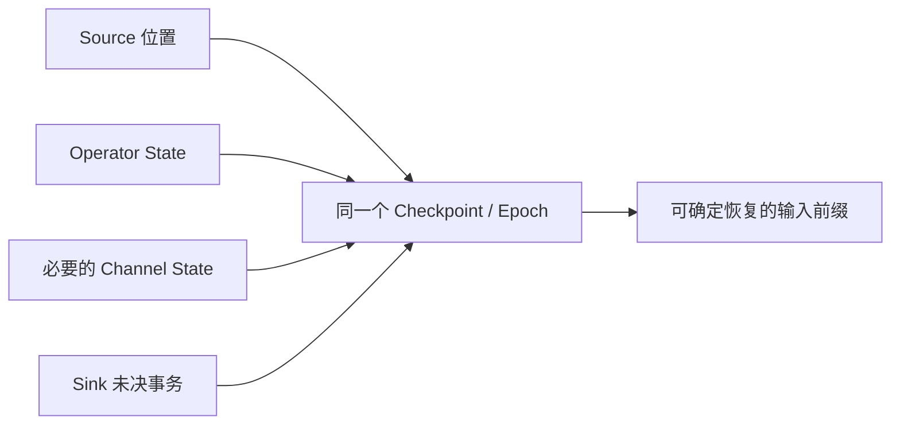
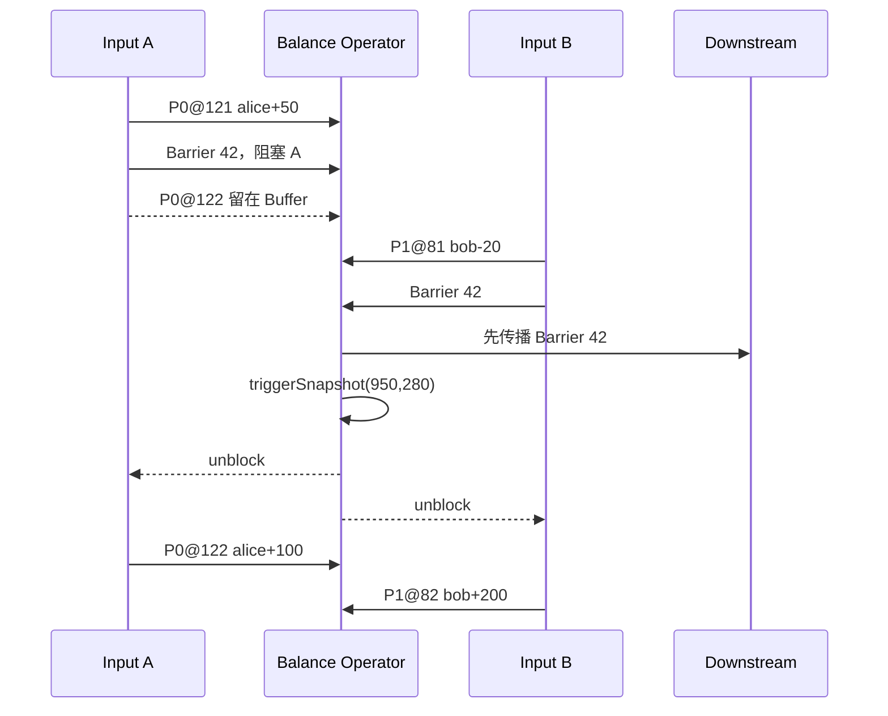
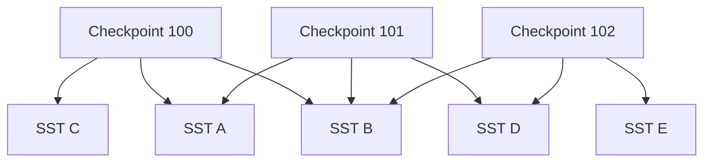
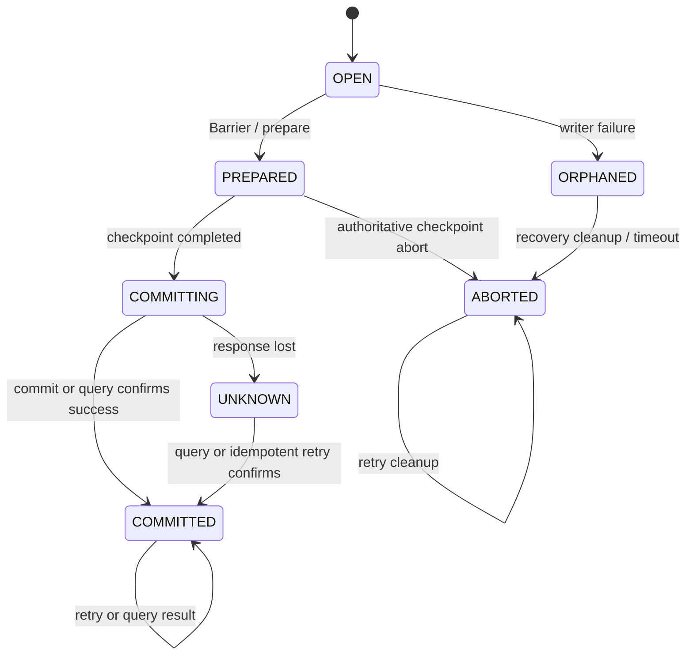
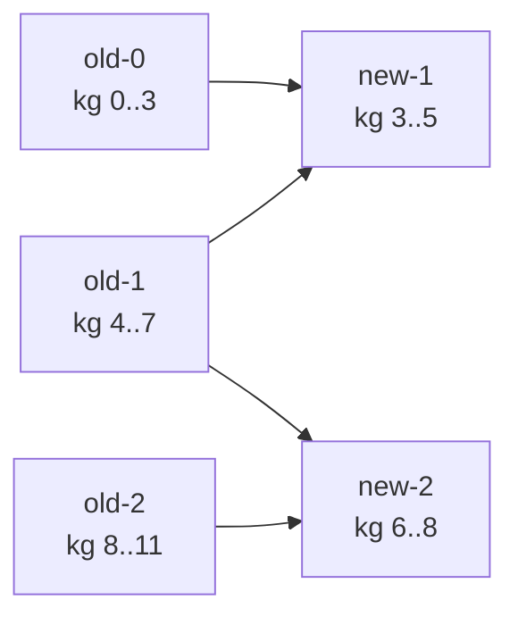

很多文章用一句话概括 Flink Checkpoint：Barrier 随数据流传播，算子保存状态，失败后从最近一次快照恢复。这句话没有错，但它跳过了真正困难的部分：**Source Offset、多个输入通道、算子状态以及 Sink 的外部副作用，怎样共同表示同一个逻辑时刻？**

本文精读 2017 年论文 [State Management in Apache Flink: Consistent Stateful Distributed Stream Processing](https://www.vldb.org/pvldb/vol10/p1718-carbone.pdf)。它不是逐句翻译，也不罗列配置项。全文用同一个例子贯穿：两个 Kafka 分区输入一个有状态聚合算子，结果写入事务 Sink。我们会逐条记录检查 Barrier 到达时状态怎样变化，失败后哪些记录重放，以及一个外部事务究竟应该提交还是回滚。

阅读时需要分清三类内容：

- **论文事实**：来自论文 §3.2、Algorithm 1、状态后端与生产实验；
- **现代 Flink**：以 Apache Flink 2.3 文档为版本基线；
- **工程推论**：从上述机制推导到 Connector 和 SeaTunnel/Zeta 设计，不代表论文原文结论。

先给出全文结论：

> Checkpoint 不是“保存一批对象”，而是为一次确定的输入前缀建立可重新进入的执行世界。Source 位置、算子状态、必要的通道状态和 Sink 提交必须对这个输入前缀给出相容答案。

## 一、一致性问题：恢复点必须解释同一段历史

### 1.1 单独正确的状态，组合起来可能错误

假设账户 `alice` 在 Checkpoint 41 中的余额状态是 900，Kafka 下一条待读 Offset 是 121。随后 Offset 121 到来一笔 `+50`：

```text
Checkpoint 41:
  nextOffset = 121
  balance(alice) = 900

处理 P0@121(+50) 后:
  nextOffset = 122
  balance(alice) = 950
```

一个合法恢复点只能选择前后两个组合之一：

| Source 恢复位置 | 算子状态 | 恢复后结果 |
| --- | ---: | --- |
| 121 | 900 | 重放 `+50`，得到 950，正确 |
| 122 | 950 | 不再重放，保持 950，正确 |
| 121 | 950 | 重放后得到 1000，重复更新 |
| 122 | 900 | 不重放，永久丢失 50 |

因此，问题不是 Offset 和状态有没有分别保存成功，而是它们是否属于同一个输入前缀。对于完整数据流，这个恢复合同至少涉及四部分：



- **Source 位置**决定恢复后从哪里重放；
- **Operator State**必须恰好包含该位置之前记录的状态影响；
- **Channel State**解释已经离开上游但尚未进入下游状态的记录；
- **Sink 事务**解释哪些输出已经进入最终外部可见状态。

这里的“一致时刻”不是要求所有机器在同一毫秒暂停，而是要求因果关系闭合：快照里不能只有结果没有原因，也不能把同一原因既放进状态、又放进待重放输入。

### 1.2 为什么外部数据库不能自动解决问题

把算子状态放进外部数据库，可以解决状态字节的可靠存储，却不能自动回答“这个数据库版本对应哪个 Kafka Offset、哪个下游事务”。如果每条记录都同时更新状态表、提交 Offset、写目标系统，系统仍需要一个跨越这些参与者的提交协议；否则失败窗口只是从内存搬到了多个外部系统之间。

数据库可以是 State Backend 或 Sink，但 **Epoch 的归属关系仍由流处理运行时协调**。这正是论文把 Managed State、Snapshot Protocol 与外部提交放进同一架构讨论的原因。

## 二、Managed State：运行时究竟管理什么

### 2.1 Keyed State、Operator State 与隐藏状态

Managed State 的价值不在于 API 名字，而在于运行时知道状态的逻辑所有权、序列化方式以及恢复时如何重分配。

| 状态 | 逻辑所有权 | 典型内容 | 扩缩容时怎样处理 |
| --- | --- | --- | --- |
| Keyed State | 业务 key | 余额、窗口、去重集合、定时器 | 按 key-group 重新分配 |
| Operator State | 算子并行实例 | Source Split、分区 Offset、局部模型分片 | 按 union/list 等规则重新分配 |
| 外部未决状态 | 事务或请求 ID | Pending Transaction、Committable | 必须由 Connector 协议显式恢复 |

`ValueState`、`ListState`、`MapState` 等只是 Keyed State 的访问接口。关键在于同一个 key 的状态不绑定当前线程或机器，而是先属于一个稳定逻辑分片，再由当前并行实例承载。

相反，普通成员字段、静态 Map、Connector 后台线程里的 Buffer，如果没有进入 Managed State 或另一个明确的恢复协议，运行时并不知道它们存在。它们可能参与业务结果，却不会自动出现在 Checkpoint 中。

### 2.2 key-group 为什么是扩缩容的基础

Flink 不直接把每个业务 key 写进 Checkpoint 调度元数据，而是先把 key 映射到固定数量的 key-group。`maxParallelism` 决定 key-group 总数，当前 `parallelism` 只决定这些组怎样分给 Subtask。

扩缩容时，系统移动的是 key-group range 及其 State Handle，而不是重新扫描每个业务 key 决定归属。只要 `maxParallelism` 和 key 序列化/哈希语义稳定，同一个 key 就能找到原状态。第 8.1 节会用 `M=12、P=3→4` 的例子展示一个新 Subtask 怎样从多个旧 Handle 拼出自己的状态。

### 2.3 “被托管”不等于永远兼容

Checkpoint 还依赖三类身份：

1. **Operator UID**：恢复时把旧状态映射回哪个逻辑算子；
2. **State Name**：在算子内部找到哪份状态；
3. **Serializer Snapshot**：判断旧字节能否由新代码读取或迁移。

自动生成的算子 ID 会随 Job Graph 变化，任意修改 UID、状态名、key 类型或序列化格式，都可能让状态无法恢复。Managed State 提供迁移机制，但不承诺任意代码升级天然兼容。

## 三、论文的 Snapshot Model 与三个显式假设

### 3.1 Epoch、Marker 与 Barrier

论文把连续输入划分为逻辑 Epoch。为了避免编号偏一位，本文统一采用下面的定义：

> **Checkpoint N 包含 Barrier N 之前的记录及其状态影响；Barrier N 之后的记录不属于 Checkpoint N。**

论文称这个控制消息为 `Marker`，现代 Flink 文档通常称为 `Checkpoint Barrier`。本文复述 Algorithm 1 时使用 Marker，其余场景使用 Barrier。

Source 收到协调器触发后，在同一个有序边界记录读取位置并向输出注入 Barrier。Barrier 与业务记录经过同一数据通道传播，不是一个可以越过任意记录的旁路 RPC。论文 Algorithm 1 对普通 Task 的抽象调用顺序在第 4.3 节单独展开，不把这里的 Source 描述外推成所有现代实现的固定方法次序。

### 3.2 三个假设不能省略

论文 §3.2.2 的协议建立在 fail-recovery、deterministic process model 上，并明确列出三项假设：

1. **输入可持久重放。** Source 能从某个逻辑位置重新消费，例如 Kafka Offset 或文件位置。
2. **Task 间通道可靠、FIFO，并且可以阻塞或恢复。** 通道阻塞期间，在途消息由系统缓冲，必要时 spill 到磁盘。
3. **Task 能控制输入通道并向输出发送消息。** Task 可以触发输入的 block/unblock，并向输出发送记录或控制消息。

紧接着，论文另行说明 Marker 与普通记录由调用用户算子的同一底层线程顺序处理。这不是第三项假设的改写，而是 Algorithm 1 的本地执行顺序条件。

如果 FIFO 不成立，旧记录可能在 Barrier 之后到达；如果 Source 不可重放，回滚后无法补回 Checkpoint 之后的数据；如果用户逻辑依赖未记录的随机数、系统时间或不可重放外部调用，即使状态和 Offset 一致，重放结果也未必相同。

## 四、Barrier Alignment：逐条记录推演一致切面

### 4.1 单输入为什么简单

单输入通道中出现：

```text
r1 -> r2 -> r3 -> Barrier 42 -> r4
```

由于 FIFO，看到 `Barrier 42` 时，`r1..r3` 已经完成本地处理，`r4` 尚未进入算子。此时固定本地状态版本，就得到了该通道上 Checkpoint 42 的输入前缀。

多输入算子不同：一个输入先越过边界，另一个输入还在旧 Epoch。如果继续同时消费，状态会混入两个输入前缀。

### 4.2 一个双输入账户聚合的完整时间线

继续使用本文的账户状态。Checkpoint 41 中 `alice=900、bob=300`，两个输入接下来分别出现：

```text
Input A: P0@121 alice +50, Barrier 42, P0@122 alice +100
Input B: P1@81  bob   -20, Barrier 42, P1@82  bob   +200
```

合法的 Checkpoint 42 应是 `alice=950、bob=280`，不包含 Barrier 后的 `+100` 和 `+200`。假设 A 的 Barrier 先到：

| 步骤 | 到达事件 | 算子动作 | 已阻塞输入 | 在线状态 | Checkpoint 42 |
| ---: | --- | --- | --- | --- | --- |
| 0 | 从 CP41 开始 | 恢复旧状态 | 无 | `(900,300)` | 尚未触发 |
| 1 | `A:P0@121 alice+50` | 更新 alice | 无 | `(950,300)` | 尚未触发 |
| 2 | `A:Barrier42` | 阻塞 A | A | `(950,300)` | 等待 B |
| 3 | `A:P0@122 alice+100` | 进入 A Buffer，不调用用户函数 | A | `(950,300)` | 等待 B |
| 4 | `B:P1@81 bob-20` | 继续处理 B | A | `(950,280)` | 等待 B |
| 5 | `B:Barrier42` | 输入前缀闭合 | A、B | `(950,280)` | 切面已确定 |
| 6 | 论文顺序：传播 Barrier → `triggerSnapshot()` → unblock | 固定稳定视图后恢复输入 | 无 | `(950,280)` | 快照为 `(950,280)` |
| 7 | 处理 `P0@122`、`P1@82` | 更新下一 Epoch | 无 | `(1050,480)` | 快照保持不变 |



如果不对齐，`P0@122 alice+100` 可能在 B 的 Barrier 到达前进入状态，使快照中的 alice 变成 1050；但 CP42 的 Source 位置仍会从 P0@122 开始。恢复后这条 `+100` 再执行一次，alice 变成错误的 1150。这正是论文中“关闭 Alignment”只提供 at-least-once 的原因。

### 4.3 Algorithm 1 到底做了什么

下面是论文 Algorithm 1 的等价伪代码，保留了关键顺序：

```text
onMarker(marker, input):
  if input != NIL:
    blocked.add(input)
    input.block()

  if blocked == allInputs:
    for output in outputs:
      output.send(marker)

    triggerSnapshot()

    for input in allInputs:
      input.unblock()
    blocked.clear()
```

论文的抽象顺序是：**阻塞到达 Marker 的输入 → 全部到齐 → 向下游发送 Marker → 触发本地快照 → 解除输入。** `triggerSnapshot()` 仍可能包含同步建立稳定视图的开销；可以异步的是随后把该视图复制、压缩并写入持久存储的物化阶段。

论文先发送 Marker 再触发本地快照，是为了让下游传播和本地物化并行。这个顺序用于解释论文协议，不应被当成现代 Flink 每种算子、Source 和 Backend 的公开调用契约。

### 4.4 为什么 DAG 中通常不用保存普通在途数据

对一个已对齐的多输入算子：

- 每条输入的 Barrier 之前记录都已处理，因为通道 FIFO；
- 先到 Barrier 的通道被阻塞，所以其 Barrier 之后记录没有进入状态；
- 最后一个 Barrier 到达后，所有输入前缀同时闭合；
- 同一线程中，旧 Epoch 记录产生的输出先于下游 Marker 发送。

因此，本地状态恰好对应所有输入在 Barrier 42 之前的前缀。普通 DAG 区域不必再把这些记录作为 Channel State 重复保存。

有环拓扑是例外：旧 Epoch 记录可能在环中长期流转。论文通过 `IterationHead/IterationTail` 只记录环内必要的在途记录，Marker 绕环返回后再停止日志。这个设计的重点不是某个已经具有版本背景的迭代 API，而是：**一致切面无法排除的在途消息，必须成为快照的一部分。**

### 4.5 从本地状态到 Completed Checkpoint

单个算子固定状态，不代表 Checkpoint 已经可以恢复；单个 Task 返回 State Handle/ACK，也只说明该 Task 的物化结果可用。Coordinator 收齐计划内所有参与者的 ACK，并把 Pending Checkpoint 原子地转换为 Completed 后，它才是合法恢复点。

不同 Task 的 Barrier 传播、对齐、同步快照和异步物化会流水重叠，所以 End-to-End Duration 不是把每个指标简单相加。全局耗时由跨 Task 的关键路径和最慢 Subtask 决定。只有 Coordinator 已确认的 Completed Checkpoint 才能作为恢复点；部分 Task 已 ACK 的半成品不能与旧 Checkpoint 拼接。

## 五、什么时候必须保存 Channel State

Aligned Checkpoint 在 DAG 中通过阻塞输入排除了普通在途数据；这不是说分布式快照永远不需要 Channel State，而是 Flink 利用 FIFO 数据流结构把保存范围降到了最小。

四种容易混淆的模式可以放在一张表中理解：

| 模式 | Operator State | Channel State | 恢复语义 |
| --- | --- | --- | --- |
| 论文的 aligned snapshot | 只含 Barrier 前更新 | 普通 DAG 通常不需要；环内单独记录 | exactly-once State |
| 论文中关闭 Alignment | 可能混入 Barrier 后更新 | 不保存 | at-least-once |
| 现代 unaligned checkpoint | 保持一致状态切面 | 保存被 Barrier 越过的在途 Buffer | exactly-once State |
| 有环图的局部 Channel Log | 保持一致状态切面 | 只记录环中无法排除的旧 Epoch 消息 | exactly-once State |

### 5.1 论文的“关闭对齐”为什么会退化

继续使用上一节的例子。如果 A 收到 Barrier 42 后仍处理 `P0@122 alice+100`，而 B 的旧 Epoch 记录尚未结束，那么快照可能包含这条记录的状态影响。恢复后，Source A 又会从 P0@122 重放；由于快照没有描述它已经混入状态，运行时无法消除第二次更新。

这是一种主动放宽一致性的模式：少等待，但允许恢复重放造成重复状态更新。

### 5.2 现代 Unaligned Checkpoint 用 I/O 换等待时间

Unaligned Checkpoint 不是“更名后的关闭对齐”。当第一个 Barrier 到达一个被背压的算子时，Barrier 可以越过部分排队数据继续传播，但这些被越过的输入/输出 Buffer 会作为 Channel State 写入 Checkpoint。恢复时，运行时先恢复相应在途数据，再继续普通输入处理，因此状态语义仍可保持 exactly-once。

它改变的是成本位置：

```text
aligned:   等待慢通道追上 Barrier
unaligned: 保存并恢复 Barrier 越过的 Channel State
```

所以 unaligned 主要针对“Barrier 被拥堵数据长期阻挡”。如果瓶颈是单条用户函数执行几分钟、Checkpoint Storage 限流或状态物化 I/O 已饱和，它不会凭空消除瓶颈，反而可能因为额外 Channel State 增加写入量。

以 Flink 2.3 文档为基线，还应保留这些边界：

- unaligned 只用于 `EXACTLY_ONCE` Checkpoint Mode；
- 当前不支持多个 unaligned checkpoint 并发执行；
- configured alignment timeout 按 Checkpoint 触发后的已用时间判断是否从 aligned 切换，而不是只计算某一个输入的局部等待；
- pointwise、broadcast 等相应连接上会禁用 unaligned 路径，不能笼统表述成“所有连接都保存 Channel State”；
- Barrier 无法抢占正在执行的单条记录；
- 恢复时原有的 Watermark 与在途数据隐式顺序保证可能不再成立，部分算子可能得到不同结果，并非 Watermark 完全不可用；
- Savepoint 始终采用 aligned 方式。

选择 unaligned 之前，至少要同时查看 Barrier 传播/Alignment 时间、Channel State 大小和 Checkpoint Storage 余量。它是背压下的一种工程折中，不是全局更优模式。

## 六、状态怎样物化：Backend、Storage 与增量 SST

### 6.1 Barrier 决定 when，Backend 决定 how

Snapshot Protocol 只决定“Checkpoint 42 对应哪个逻辑状态版本”。State Backend 负责：

- 在线状态怎样组织和访问；
- 怎样固定一个不会被后续记录污染的 point-in-time view；
- 怎样把该视图转换成可恢复的 State Handle。

现代 Flink 自 1.13 起又把 Checkpoint Storage 从 State Backend 职责中明确拆出：

| 概念 | 回答的问题 | 例子 |
| --- | --- | --- |
| State Backend | 任务运行时状态放哪里、怎样读写与快照 | JVM Heap、Embedded RocksDB、ForSt |
| Checkpoint Storage | 快照字节和元数据持久化到哪里 | JobManager Heap、文件系统、对象存储 |

例如运行时状态在本地 Embedded RocksDB，而 Checkpoint 写到 S3，并不表示每次 `state.get()` 都远程访问 S3。论文中的 External State Backend 也不是 Checkpoint Storage 的旧名称：前者指运行期间状态访问由外部 KV/数据库承载。

### 6.2 同步阶段只固定稳定视图

如果对齐之后一直阻塞任务，直到数百 GB 状态全部上传完毕，周期性 Checkpoint 就会变成周期性停机。正确分层是：

```text
同步阶段：确定 Checkpoint N 的稳定状态视图
异步阶段：压缩、复制并把该视图写入持久存储
```

解除输入后，在线状态已经可以继续处理下一个 Epoch，后台线程仍在物化旧视图。Backend 因此不能只把一个可变 Map 引用交给后台线程；它必须使用 Copy-on-Write、不可变版本、RocksDB Snapshot 或等价机制，确保后台看到的始终是 Barrier 时刻的内容。

异步不等于免费。上传仍会与前台竞争 CPU、磁盘、网络、对象存储请求额度以及 RocksDB Compaction 资源。Checkpoint 很慢时要区分：Barrier 没到、稳定视图建立慢，还是异步 I/O 慢。

### 6.3 增量 Checkpoint 的真实对象是共享文件

RocksDB 的 SST 文件不可变，天然适合作为复用单位。假设第一次增量 Checkpoint 建立完整基线：

```text
C100 = {A, B, C}
C101 = {A, B, D}
C102 = {B, D, E}
```

创建 C101 时，A、B 已在共享存储中，通常只需上传新文件 D 和新的元数据；但恢复 C101 必须读取 `A+B+D`，不能只拿 D。



删除 C100 时，C 可以在没有其他引用后清理；A、B 仍被 C101 引用，不能一起删除。共享状态的生命周期必须跟随 Checkpoint 引用关系，而不是简单删除某个目录。

Compaction 还会把旧 SST 合并成新 SST。即使逻辑状态变化不大，新生成文件也可能需要重新上传。因此：

- 第一份增量 Checkpoint 需要建立基线；
- `Checkpointed Data Size` 在增量模式下表示本次 delta，不是完整逻辑状态大小；
- 增量快照减少的是重复上传，不保证恢复永远更快；
- 恢复快慢取决于文件数量、网络、CPU、IOPS 和本地 Backend 初始化；
- 异步快照、增量快照、本地恢复是不同优化，不能当成一个开关。

Flink 2.3 文档还列出 HashMap、Embedded RocksDB，并将面向存算分离的 ForSt 标记为 experimental。论文告诉我们为什么 Backend 可以替换；具体选型仍应以版本文档和自己的状态访问模式压测为准。

## 七、故障恢复与端到端 Exactly-Once：用一个事务走完所有窗口

### 7.1 Completed Checkpoint 保存的是一个恢复元组

回到本文的账户例子。假设 Checkpoint 41 已完成：

```text
Source:
  P0.nextOffset = 121
  P1.nextOffset = 81

Operator State:
  balance(alice) = 900
  balance(bob)   = 300

Sink:
  transactions through T41 = COMMITTED
```

这里 `nextOffset=121` 明确表示下一条要读 121，之前的记录已经包含在该状态中。随后任务处理两条记录：

```text
P0@121: alice +50  -> alice=950
P1@81:  bob   -20  -> bob=280
```

Checkpoint 42 的正常路径如下：

| 阶段 | Source | Operator | Sink | CP42 |
| --- | --- | --- | --- | --- |
| 处理完成 | next=`(122,82)` | `(alice=950,bob=280)` | T42=OPEN | 尚未触发 |
| Barrier 传播 | 保存 next=`(122,82)` | 固定状态视图 | T42 接收边界 | IN_PROGRESS |
| Sink prepare | 不变 | 异步物化 | T42=PREPARED，句柄进入状态 | IN_PROGRESS |
| 全部 ACK | State Handle 已汇集 | State Handle 已汇集 | T42 仍为 PREPARED | READY_TO_COMPLETE，尚不可恢复 |
| Coordinator 确认完成 | 恢复元数据可用 | 恢复元数据可用 | 获得提交许可 | COMPLETED，可作为恢复点 |
| 外部提交 | 从 122/82 继续 | 继续处理 | 幂等 commit T42 | COMPLETED |

因此 CP42 不是三个互不相关的文件，而是一个逻辑元组：

```text
CP42 = {
  sourceProgress: (P0=122, P1=82),
  operatorState:  (alice=950, bob=280),
  pendingSink:    T42,
  metadata:       handles + completion decision
}
```

只有 Coordinator 已确定 Completed 的元组才能恢复。TaskManager 磁盘上即使已经存在某些状态文件，如果 Completed Checkpoint 的元数据和 State Handle 不可用，它们也不是一个合法恢复点；这就是 JobManager/控制面高可用同样重要的原因。

### 7.2 Sink 需要的是可恢复状态机，不是一次 flush

一个抽象事务至少有这些状态：



下面是**概念伪代码，不对应某个 Flink API 的固定方法签名**：

```java
onCheckpointBarrier(long checkpointId) {
    awaitOrFenceInflightRequests();
    TransactionHandle h = target.prepare(currentTransaction);
    pending.put(checkpointId, h); // pending 随本次状态一起持久化
    currentTransaction = target.begin(nextStableTransactionId());
}

onCheckpointCompleted(long checkpointId) {
    pending.upTo(checkpointId)
           .forEach(target::commitIdempotentlyOrQueryResult);
    // 只有确认 COMMITTED 后才能删除 pending；UNKNOWN 必须保留稳定身份
}

onCheckpointAborted(long checkpointId) {
    pending.exact(checkpointId)
           .forEach(target::abortIdempotently);
}
```

这里有三个不可省略的要求：

1. Pending Transaction 必须跟 Checkpoint 一起恢复；
2. commit 和 abort 必须幂等，或者能按稳定事务 ID 查询结果；
3. 新执行必须 fence 旧 Writer，防止失败实例在恢复后继续写。

`flush()` 只表示把 Buffer 送到外部系统或等待异步请求完成，不自动等于事务进入最终外部可见状态。只有当成功结果在 Source Progress 被确认前可判定，或 Pending Request 身份能够恢复并重试时，flush 才能参与建立可靠的 at-least-once；端到端 exactly-once 仍取决于外部提交协议。

### 7.3 五个失败窗口怎样收敛

| 故障位置 | 合法恢复点 | Source/Operator 恢复 | 外部事务必须怎样处理 |
| --- | --- | --- | --- |
| CP42 触发前 | CP41 | 恢复状态 `(900,300)`，Source 从 `(121,81)` 开始重放 | 中止或 fence 当前 OPEN 事务 |
| T42 已 PREPARED，CP42 未完成 | CP41 | 两条记录重新执行 | T42 不得可见；abort、超时清理或 fence |
| CP42 已完成，完成通知丢失 | CP42 | 恢复状态 `(950,280)`，Source 从 `(122,82)` 继续 | 恢复 Pending T42，并补做幂等 commit |
| commit T42 成功、响应丢失 | CP42 | 不重放已包含记录 | 重试时查询或返回同一 COMMITTED 结果 |
| CP42 后处理新数据时失败 | CP42 | 回滚新在线状态并重放 | 隔离新事务，把重放写入新的有效事务 |

最危险的是“外部 commit 成功、响应丢失”。调用方看到超时，并不知道应该重试还是回滚；但外部系统已经做出协议上的最终提交决定。稳定事务 ID、结果查询和幂等 commit 是解决模糊结果的必要条件。

完成通知也不应被假设为“每个 Checkpoint 恰好一次到达”。并发 Checkpoint 可能让较新的完成点覆盖较旧点，通知链路也可能失败。提交实现应遵守 subsuming 语义：确认完成 N 时，能够安全处理所有不大于 N 且仍待提交的结果。

论文的 Snapshot Notification、旧 `TwoPhaseCommitSinkFunction` 风格的 completion callback、现代 Sink V2 的 Writer/Committable/Committer，是不同年代和 API 的实现方式。它们共享的是状态机不变量，而不是同一条固定 Java 调用链。

### 7.4 Exactly-once 指效果，不是 CPU 只执行一次

如果 CP42 完成后又处理了 P0@122，随后 CP43 未完成就失败，系统会恢复 CP42 并再次执行 P0@122。记录物理上执行了两次，但第一次更新的在线状态被回滚，第一次外部事务也没有成为有效提交，所以最终效果可以等价于一次。

幂等 Upsert 也能吸收重放，但条件比“有主键”严格：主键必须稳定，写入值必须确定，而且旧重放不能覆盖更新版本。常见做法是在目标行中带上单调 Epoch/版本，使用条件更新拒绝版本回退。

反过来，如果用户函数读取未记录的系统时间、随机数或不可重放外部服务，第二次执行可能产生不同结果。Checkpoint 保护的是纳入协议的状态，不会自动把任意副作用变成确定性操作。

## 八、Rescale、Savepoint 与现代运行时职责

### 8.1 Rescale 实际上怎样读取旧 State Handle

前面已经说明 key-group 把逻辑分片与物理并行度解耦。连续 range 的计算可以抽象为：

```text
start(i) = ceil(i * M / P)
end(i)   = ceil((i + 1) * M / P) - 1

M = maxParallelism
P = 当前 parallelism
i = subtask index
```

假设 `M=12`，旧并行度为 3：

```text
old-0 -> [0..3]
old-1 -> [4..7]
old-2 -> [8..11]
```

扩容到 4 后，新 `subtask-1` 负责 `[3..5]`。恢复器必须从 old-0 的 State Handle 读取 key-group 3，再从 old-1 读取 4、5；它不能把“old-1 的整个本地数据库”简单复制过来。

下图只展示发生跨旧 Handle 读取的两个中间范围，省略没有交叉的 new-0 和 new-3：



Operator State 不能按 key-group 处理。Source Split、分区元数据等通常使用 list/union 等 redistribution contract；Pending Transaction 则需要稳定事务身份和明确的接管规则。把状态永久绑定到 `taskIndex`，会让 Failover 和 Rescale 都失去逻辑归属。

### 8.2 Checkpoint 与 Savepoint 共用基础设施，但合同不同

| 维度 | Checkpoint | Savepoint |
| --- | --- | --- |
| 主要目的 | 自动故障恢复 | 计划内停止、升级、迁移、改并行度 |
| 所有权 | 通常由 Flink 管理和清理 | 用户显式创建、持有、删除 |
| 格式取向 | State Backend 原生、高效，可增量 | 默认 canonical；也可选择 native |
| Alignment | 可 aligned 或符合条件时 unaligned | 始终 aligned |
| Job Graph 变更 | 不应假定任意兼容 | 仍受 UID、状态映射和 Serializer 约束 |

“能从快照启动”不等于“升级一定安全”。计划变更前至少检查 Operator UID、State Name、Serializer 兼容性、`maxParallelism` 和 Connector Pending State。Native Savepoint 往往创建/恢复更快，但可移植性与允许的变更范围要按具体版本能力矩阵判断。

### 8.3 论文概念到现代 Flink 只能映射职责

下面的类名用于理解 Flink 2.x 一代运行时，不是稳定用户 API，也不是论文伪代码的逐行调用栈：

| 论文概念 | 现代运行时的大致职责落点 | 不变量 |
| --- | --- | --- |
| 集中触发 Epoch | `CheckpointCoordinator` | 分配 ID、跟踪 Pending、形成 Completed |
| Marker | `CheckpointBarrier` | 在数据流中表达同一 Checkpoint 边界 |
| blocked input set | Barrier Handler / Input Gate 内部逻辑 | aligned 时阻止新 Epoch 记录进入用户状态 |
| `triggerSnapshot()` | StreamTask、Operator snapshot、State Backend | 固定 Operator/Keyed/Timer 等状态版本 |
| 异步物化 | Snapshot Future、State Handle、Checkpoint Storage | 后台写入不能污染稳定视图 |
| 外部提交 | Writer/Committable/Committer 或版本对应的回调 | 提交决策必须跟 Completed Checkpoint 相容 |

现代 Source State 也不一定是一个 `long offset`。它可能包含 Enumerator 状态、已发现和已分配 Split、每个 Split 的读取位置以及 CDC Snapshot/Log 切换阶段。论文的 Source Offset 是恢复进度的最小模型，不应把 Connector 接口简化成一个 getter。

## 九、King 生产数据：论文到底证明了什么

论文使用 King 的 Rule-Based Event Aggregator（RBEA）展示真实大状态作业。查询规则广播到 Query Processor，事件按用户 ID 分区，算子维护每个用户状态，再把聚合结果写向数据库或 Kafka。

### 9.1 实验中真正公开的数据

| 项目 | 论文披露值 |
| --- | --- |
| 业务规模 | 超过 3.5 亿月活用户、超过 300 亿事件/天 |
| 集群 | 共享 YARN，18 台物理机 |
| 单机 | 32 Cores、378 GB RAM、SSD + HDD |
| Flink | 1.2.0 |
| 运行状态 | 本地 SSD 上的 RocksDB |
| Checkpoint Storage | HDD 支撑的 HDFS |
| 观察对象 | 5 个生产部署 |
| 状态规模实验 | 并行度 70，约 100–500 GB 全局状态 |
| 平均 Alignment Delay | 每次完整快照约 1.3 秒 |

最容易出现的错误解读是“500 GB 状态 1.3 秒就上传完”。论文测得的是平均 **Alignment Delay**，不是全部 SST 写入 HDFS、ACK 和全局确认的 End-to-End Duration。低 Alignment 说明异步快照可以把大部分物化成本移出前台一致性切面，不说明存储 I/O 没有成本。

论文还观察到：在其部署范围内，状态变大没有让 Alignment 显著增长；并行度和拓扑连接增加会带来一定对齐开销，但结果不是简单线性关系。这证明架构在真实生产中可行，却不是对所有云环境的通用 Benchmark。

实验没有给出大规模恢复 P99、对象存储尾延迟、严重持续背压下的 aligned 表现，也不可能覆盖后来出现的 unaligned、现代 Sink API 和 ForSt。今天仍需按自己的拓扑与存储压测。

### 9.2 Checkpoint 变慢时看哪一层

| 观测 | 更可能的瓶颈 | 优先验证 |
| --- | --- | --- |
| Start Delay/Barrier 传播高 | 上游持续背压、长链路、慢 Source | Backpressure 图、各 Subtask 首个 Barrier 时间 |
| Alignment 高 | 多输入速率差、热点、Barrier 被旧记录阻挡 | 输入间 Barrier 到达差、热点 key、Buffer |
| Sync Duration 高 | Serializer、Copy-on-Write、GC、同步 Backend 工作 | Task Thread、GC、快照创建火焰图 |
| Async Duration 高 | 本地盘、网络、对象存储或限流 | 上传吞吐、请求延迟、失败重试 |
| 增量 delta 突增 | 状态高更新率或 RocksDB Compaction | SST 生成/复用、Compaction 指标 |
| Unaligned Channel State 很大 | 背压积压被转成快照 I/O | 输入/输出 Buffer、Storage 余量 |
| Checkpoint 快、Restore 慢 | 文件多、下载慢、Backend 初始化或重放量大 | Restore 指标、文件数量、Source Lag |

Timeout 从 10 分钟改到 30 分钟只能减少超时失败，不能解释为什么关键路径需要 20 分钟。应先定位 Barrier、Sync、Async、Storage 或 Restore 中的哪一段变慢，再选择扩容、Buffer Debloating、增量、unaligned 或存储调优。

## 十、对 SeaTunnel/Zeta 与 Connector 的工程推论

本节是从论文不变量推导出的设计检查表，不把 Flink 内部类名等同于 SeaTunnel 某个版本的 API。具体接口仍应以对应 SeaTunnel commit 为准。

### 10.1 跨越 Checkpoint 边界的东西必须有去处

并不是引擎队列、Sink Buffer 和所有异步请求都必须原样序列化进 Checkpoint。正确要求是：

> 任何跨越快照边界的状态或副作用，都必须可恢复、可重放、可撤销、可 fence，或可通过幂等/事务消除重复。

| 未决内容 | 可接受策略举例 | 不能接受的状态 |
| --- | --- | --- |
| Source 已发出、下游未处理的记录 | aligned 时依靠 FIFO+Barrier；unaligned 时保存 Channel State；或从 Source 重放 | Offset 已前移，但记录实际发在 Barrier 后且无 Channel State |
| 引擎内部队列 | drain/fence 到边界、保存队列，或让 Source 重放 | 恢复后既不重放也不恢复 |
| Sink 异步请求 | Barrier 时等待、保存请求身份，或按幂等键重试 | 后台线程继续写，失败无法回传 |
| Sink Buffer | snapshot、flush+可重试，或事务 prepare | Buffer 丢失但 Source 已跳过对应输入 |
| Pending Transaction | 持久化稳定事务 ID，由新 Committer 接管 | 绑定旧 Worker 临时编号，Failover 后无人认领 |

Source Progress 的不变量也不是“记录已经越过所有 Buffer”。在 aligned 模式下，Barrier 前记录可以仍在下游网络中；正确性来自：**保存的位置描述了 Barrier 前已经按序发出的精确输入前缀**，下游 FIFO 和 Alignment 会保证它们先于 Barrier 被处理。Unaligned 才会把必要的在途 Buffer 纳入快照。

### 10.2 后台线程必须服从 Epoch Fence

我在[之前关于 Engine-Level FlushSignal 的文章]()中讨论过，为什么 Connector 自己启动定时线程会带来并发和异常传播问题。从 Checkpoint 角度看，还必须回答：

- 请求属于哪个 Epoch，Barrier 到来时是否还允许产生新请求；
- 已完成但未发射的结果保存在哪里，异步异常怎样回到 Task 生命周期；
- cancel/fail 后旧线程怎样失效，新 Writer 怎样 fence 旧 Writer；
- 重试使用什么稳定幂等键或事务 ID。

一个安全的边界通常包含 `freeze/drain -> snapshot pending -> handoff -> resume`，而不是在主线程保存一个 Buffer 后，让后台线程继续无约束地修改同一对象。

把第 7.2 节的事务状态机落到 SeaTunnel 时，还要增加两个引擎级约束。第一，事务身份不能只依赖当前 `workerId/taskIndex`，否则 Rescale 或 Failover 后可能重复创建事务，或让 PREPARED 事务失去接管者。第二，多 Writer 分别提交不自动等于跨分区原子可见；最终保证取决于外部系统以及是否存在引擎级的全局提交协调。

### 10.3 E2E 测试要控制协议阶段，而不是控制时间

最有价值的测试不是任务正常结束后比较一次行数，而是在第 7.3 节的模糊窗口精确停住系统。例如验证“外部 commit 已成功，但响应丢失”：

```java
// 概念测试代码：服务端在持久提交后、返回 ACK 前暂停
commitServer.pauseAt(AFTER_DURABLE_COMMIT_BEFORE_ACK);

job.triggerCheckpoint(42);
commitServer.awaitPaused(42); // commit 已落盘，ACK 尚未返回
job.killCommitOwner();       // 具体可能是 Writer、Committer 或 Coordinator

job.restartFromLatestCompletedCheckpoint();
commitServer.resume();

assertThat(commitServer.commitAttempts(42)).isGreaterThanOrEqualTo(2);
assertThat(commitServer.logicalCommitCount(42)).isEqualTo(1);
assertThat(target.rows()).containsExactlyInAnyOrderElementsOf(expectedRows);
```

如果测试用 `Thread.sleep(5000)` 猜测“应该已经 commit”，它既容易 flaky，也无法证明失败发生在目标窗口。更可靠的测试使用 latch、Hook、可控代理或事务测试服务端，并对每个阶段做确定性断言：

| 故障 Hook | 必须断言 |
| --- | --- |
| 部分 Task ACK 后失败 | 未完成 Checkpoint 绝不成为恢复点 |
| prepare 后、Completed 前失败 | 外部结果不可见，重放后无重复 |
| Completed 后通知丢失 | Pending Transaction 被恢复并补交 |
| commit 成功、ACK 丢失 | 可重试至少两次，逻辑提交恰好一次 |

这些测试验证的是协议不变量，而不是某次 CI 恰好通过。对于 Connector 稳定性，这比增加重试次数或放宽超时更有价值。

## 十一、结论：把 Checkpoint 看成可重新进入的世界

这篇论文最重要的贡献，不是某个 State API，也不是一个 Barrier 流程图，而是把状态归属、全局一致切面、异步物化、恢复重放和外部提交放进了同一个协议。

全文可以压缩成三条：

1. **一致性对象是输入前缀及其全部状态影响，不是若干独立状态文件。** Source、Operator、必要 Channel State 和 Sink 必须解释同一段历史。
2. **大状态系统的关键是把“确定逻辑切面”与“物化大量字节”解耦。** Barrier/Alignment 解决 when，Backend/Storage 解决 how；增量 SST 再减少重复传输。
3. **端到端 exactly-once 的最后边界在外部提交。** 记录可以被重放，但 Pending Transaction、稳定事务身份、幂等 commit 和 fencing 必须让外部效果收敛到一次。

```text
可重放 Source
  -> Barrier 定义输入前缀
  -> Alignment 或 Channel State 建立一致切面
  -> Backend 固定并物化状态版本
  -> Coordinator 确认 Completed Checkpoint
  -> 恢复时回滚状态并重放
  -> Sink 协议提交唯一外部结果
```

论文使用的是 Flink 1.2.0 时代的实现，今天的 Source/Sink API、State Backend 和 unaligned checkpoint 已经演进；但只要系统还需要在失败后继续处理无界输入，这条一致性链路就不会过时。

## 参考资料

1. Paris Carbone et al., [State Management in Apache Flink: Consistent Stateful Distributed Stream Processing](https://www.vldb.org/pvldb/vol10/p1718-carbone.pdf), PVLDB 10(12), 2017.
2. Apache Flink 2.3, [Checkpointing](https://nightlies.apache.org/flink/flink-docs-release-2.3/docs/dev/datastream/fault-tolerance/checkpointing/).
3. Apache Flink 2.3, [Checkpointing under backpressure](https://nightlies.apache.org/flink/flink-docs-release-2.3/docs/ops/state/checkpointing_under_backpressure/).
4. Apache Flink 2.3, [State Backends](https://nightlies.apache.org/flink/flink-docs-release-2.3/docs/ops/state/state_backends/).
5. Apache Flink 2.3, [Checkpoints vs. Savepoints](https://nightlies.apache.org/flink/flink-docs-release-2.3/docs/ops/state/checkpoints_vs_savepoints/).
6. Apache Flink 2.3, [Tuning Checkpoints and Large State](https://nightlies.apache.org/flink/flink-docs-release-2.3/docs/ops/state/large_state_tuning/).
7. Apache Flink 2.3, [Fault Tolerance Guarantees of Data Sources and Sinks](https://nightlies.apache.org/flink/flink-docs-release-2.3/docs/connectors/datastream/guarantees/).
8. Apache Flink 2.3, [Deprecated API List](https://nightlies.apache.org/flink/flink-docs-release-2.3/api/java/deprecated-list.html).
9. Apache Flink 2.3, [CheckpointListener API](https://nightlies.apache.org/flink/flink-docs-release-2.3/api/java/org/apache/flink/api/common/state/CheckpointListener.html).
10. Apache Flink 2.3, [SupportsCommitter API](https://nightlies.apache.org/flink/flink-docs-release-2.3/api/java/org/apache/flink/api/connector/sink2/SupportsCommitter.html).
