如果只从 API 层面理解 Flink 的状态管理，很容易把它看成几组 `ValueState`、`ListState` 和 Checkpoint 配置；但真正决定 Flink 能否长期运行的，并不是某个 State API，而是一条贯穿整个数据流的系统协议：

```text
可重放 Source
  -> 有序数据通道
  -> Barrier / Epoch
  -> 算子一致状态
  -> State Backend 物化
  -> 全局 Checkpoint 完成
  -> Sink 提交外部副作用
```

2017 年的论文 [State Management in Apache Flink: Consistent Stateful Distributed Stream Processing](https://www.vldb.org/pvldb/vol10/p1718-carbone.pdf)，第一次系统描述了 Flink 如何把 Managed State、分布式快照、状态后端、故障恢复、扩缩容和端到端输出语义组织到同一套架构中。

这篇文章不是论文的逐句翻译，也不是某个 Flink 版本的 API 手册。我的目标是把论文背后的系统逻辑完整展开，并回答几个更接近工程实践的问题：

- 为什么“把状态写入外部数据库”不能自动解决流处理一致性？
- Barrier 到底保证了什么，它为什么不需要暂停整个作业？
- 多输入算子为什么要对齐，FIFO 通道在正确性证明里扮演什么角色？
- 为什么状态达到几百 GB 后，Checkpoint 仍然有机会保持较低的前台停顿？
- Flink 内部 exactly-once 与端到端 exactly-once 有什么区别？
- 2017 年论文里的 aligned snapshot，与今天的 unaligned checkpoint 是什么关系？
- 这些设计对 SeaTunnel 这类数据集成引擎和连接器框架有什么启发？

先给出本文最重要的结论：

> Flink 的核心能力不是“定期备份状态”，而是让 Source 位置、算子状态、数据通道边界和 Sink 提交共享同一个 Epoch。只有这几个部分对同一个逻辑时刻达成一致，失败后的重放才不会让系统状态失去解释。

## 一、问题起点：有状态流处理到底难在哪里

### 1.1 无状态计算的恢复很简单

先看一个无状态算子：

```text
input record -> map(record) -> output record
```

如果这个算子失败，只要重新启动并重放输入即可。相同输入经过确定性逻辑，可以再次得到相同输出。算子自己没有需要恢复的历史信息。

但真实流处理任务很少完全无状态。窗口、聚合、去重、CEP、维表更新、CDC 进度、机器学习模型以及规则匹配，都需要保存“到目前为止已经看到了什么”。例如：

```text
用户 A 已累计消费 980 元
用户 A 又产生一笔 50 元订单
新状态应为 1030 元
```

如果处理完 50 元订单后状态已经更新为 1030，但 Source Offset 还停留在这条订单之前，那么失败恢复后订单会被再次处理，状态变成 1080。反过来，如果 Source Offset 已经提交，而状态仍是 980，恢复后这条订单不会重放，结果又会少 50 元。

因此，恢复点至少要同时描述：

| 组成部分 | 它回答的问题 |
| --- | --- |
| Source 进度 | 恢复后从哪条输入继续读取？ |
| 算子状态 | 重放开始之前，聚合、窗口、去重集合处于什么状态？ |
| 通道中的在途数据 | 哪些记录已经离开上游，但还没有被下游纳入状态？ |
| Sink 外部副作用 | 哪些输出已经对数据库、文件系统或消息队列可见？ |

单独看其中任何一项都可能是“正确保存”的，但四者组合起来未必构成一个合法的全局执行状态。

### 1.2 一致快照不是“所有机器同一毫秒拍照”

分布式系统里没有一个天然可靠的全局时钟，也不能假设所有 Task 能在同一个物理时刻暂停。所谓一致快照，真正关心的是因果关系：

- 如果快照中已经包含了某条记录产生的下游状态，就不能遗漏产生这条记录所依赖的上游状态。
- 如果上游认为一条记录已经发送，而下游状态还没有处理它，那么快照必须把这条记录作为在途数据保存，或者选择一个不包含这次发送的更早切面。
- 不能出现“结果已经存在，但原因不存在”的全局状态。

这也是 Chandy-Lamport 分布式快照所解决的经典问题。一个分布式计算的完整状态，不仅包括进程内部状态，也包括通道中的消息。

Flink 的特殊之处在于：流处理拓扑通常是从 Source 流向 Sink 的弱连通数据流图，大部分区域没有环。它可以利用这种结构，通过 Barrier 对齐选择一个几乎不需要记录在途数据的一致切面，而不必照搬通用分布式快照协议的全部成本。

### 1.3 为什么外部数据库不能替代运行时协议

一个直觉方案是：把每个算子的状态都写入外部数据库，依赖数据库事务保证一致性。这个方案并非完全不可行，论文也讨论了外部状态后端；但外部数据库本身不能替代流处理运行时协议，原因有四个。

第一，数据库事务只知道数据库内部的读写，不天然知道 Kafka Offset、算子输入边界和下游 Sink 事务属于哪个流处理 Epoch。

第二，如果每条记录都远程读写状态，网络、序列化和事务协调会进入热路径。数据库可能从“可靠存储”变成整个流水线的吞吐瓶颈。

第三，扩缩容并不只是数据库扩容。流处理引擎必须知道新的并行实例分别接管哪些 key、哪些 Source 分区以及哪些 Operator State。

第四，外部输出依然存在半提交问题。即使状态事务成功，下游数据库写入、文件 rename 或消息发送也可能处于另一个失败边界。

所以更准确的说法是：

> 外部数据库可以成为状态的物理实现或输出目标，但“哪个状态版本与哪个输入位置属于同一次全局提交”仍然需要流处理运行时协调。

## 二、Flink 如何描述状态：Managed State、Keyed State 与 Operator State

### 2.1 从逻辑图到物理执行图

论文把一个 Flink 作业表示成有向图 `G = (T, E)`：

- `T` 是计算节点，例如 map、filter、window、fold；
- `E` 是数据订阅关系，例如 forward、shuffle、keyBy。

逻辑算子经过 chaining 等优化后，会被映射为真正部署到 TaskManager 上的物理 Task。状态也必须从“逻辑算子拥有的状态”映射到“某个物理并行实例实际持有的状态分片”。

这一步看似普通，却决定了恢复和扩缩容能否成立。如果状态只和当前 Task 实例绑定，那么 Task 数量一变，系统就不知道怎样重新分配旧状态。

### 2.2 Keyed State：状态跟随 key，而不是跟随线程

Keyed State 适用于已经 `keyBy` 的数据流。相同 key 的记录进入同一个逻辑分区，该 key 对应的状态也由同一个并行实例管理。

典型例子包括：

- 每个用户的累计金额；
- 每台设备的最后心跳时间；
- 每个订单的去重标记；
- 每个 key 的窗口元素和触发器；
- 每个账户的规则匹配上下文。

论文列举了几种常见状态抽象：

| 状态类型 | 适合表达什么 | 为什么不直接放进普通 Map |
| --- | --- | --- |
| `ValueState` | 每个 key 的单值状态 | 运行时知道它属于哪个 key，并能参与快照与重分配 |
| `ListState` | 每个 key 的追加集合 | 可以由 Backend 采用适合列表的存储方式 |
| `ReducingState` | 可增量聚合的状态 | 避免把全部历史元素保存在用户对象中 |
| `MapState` | 每个 key 下的二级映射 | 单项查询不必反序列化整个自定义 Map |

这里最重要的不是 API 数量，而是“声明”。只有被运行时识别为 Managed State 的数据，才能自动进入 Checkpoint、恢复、扩缩容和版本兼容流程。藏在静态字段、普通成员变量或 Connector 后台线程里的状态，运行时并不知道如何保护。

### 2.3 Operator State：状态属于算子并行实例

并不是所有状态都能自然地按业务 key 划分。Kafka Source 持有的分区 Offset、本地模型分片、Connector 的 split 元数据，都更接近某个算子实例的局部状态，这类状态属于 Operator State。

Operator State 在扩缩容时必须定义重新分配语义。可以把它理解为：

- 状态被拆成多个更细粒度条目；
- 恢复时按 round-robin 等方式分给新的并行实例；
- 某些 union 类型状态会先合并，再让每个并行实例看到完整集合。

这和 Keyed State 的差异非常关键：Keyed State 的归属由 key-group 决定；Operator State 的归属由状态自身的 redistribution pattern 决定。

### 2.4 key-group：把 key 空间与当前并行度解耦

如果直接使用 `hash(key) % parallelism` 决定状态归属，那么并行度从 4 改成 6 时，大量 key 的目标 Task 都会变化，而且旧快照没有一个稳定的中间分区单位可供重新分配。

Flink 引入 key-group，把映射拆成两层：

```text
业务 key
  -> hash(key) % maxParallelism
  -> key-group
  -> 当前并行实例负责的连续 key-group range
```

论文给出的核心映射可以简化为：

```text
keyGroup = hash(key) mod maxParallelism
```

`maxParallelism` 决定 key-group 总数，当前 `parallelism` 决定这些 key-group 如何切成连续范围并分配给 Task。

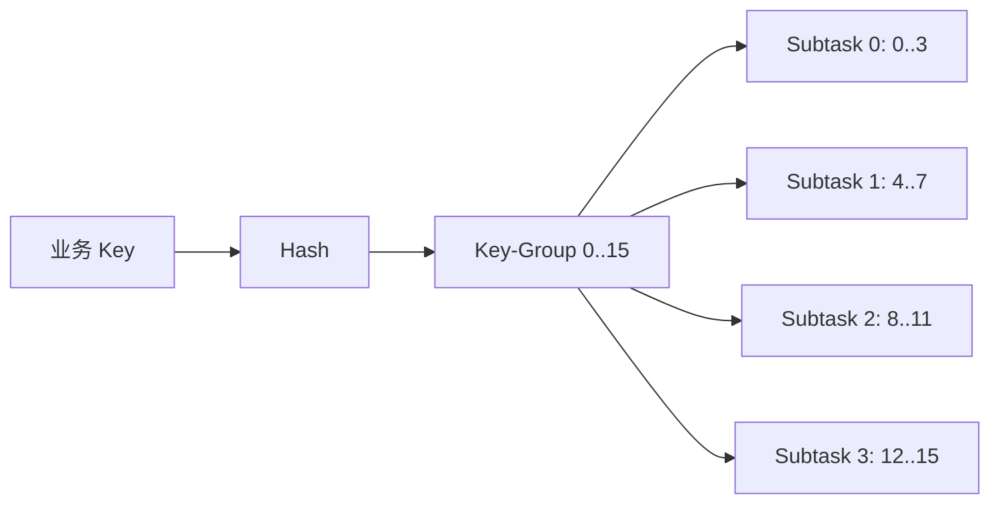

假设 `maxParallelism = 16`，当前并行度为 4，那么每个 Subtask 大致负责 4 个连续 key-group。扩容到 6 后，不需要重新定义 key 的永久身份，只需把 16 个 key-group 重新切分：

| 并行度 | 分配示意 |
| --- | --- |
| 4 | `0..3`、`4..7`、`8..11`、`12..15` |
| 6 | `0..2`、`3..5`、`6..7`、`8..10`、`11..13`、`14..15` |

key-group 是扩缩容时迁移的原子单位。它在两个极端之间取得平衡：

- 如果粒度细到每个 key，快照索引和远程小读会非常多；
- 如果粒度粗到每个 Task，扩缩容时又需要扫描大量与自己无关的状态。

连续 key-group range 还有一个现实好处：从分布式文件系统恢复时可以尽量顺序读取，减少随机 seek。

### 2.5 状态“被托管”不等于状态格式永远兼容

运行时可以保存和重新分配状态，但它不能替业务代码自动解决所有 Schema 变化。真实升级还需要：

- 稳定的算子身份，避免恢复时找不到旧状态对应的新算子；
- 能识别旧版本数据的 Serializer；
- 对新增、删除、重命名状态给出明确迁移策略；
- 在升级前用 Savepoint 做恢复演练。

因此，Managed State 解决的是“状态进入系统协议”的问题，不代表任意代码修改都能无条件恢复。

## 三、全局快照问题：Flink 到底要捕获哪个时刻

### 3.1 Epoch 是数据流中的逻辑边界

Flink 把连续执行划分成一系列逻辑 Epoch。Epoch 不是业务窗口，也不依赖 Event Time；它是运行时为了快照而创建的边界。

可以把输入流想象成：

```text
... records of epoch 40 ... | Barrier 41 | ... records of epoch 41 ...
```

Barrier 不携带业务数据，它表示：

> 在这条通道上，Barrier 之前的记录属于旧 Epoch，之后的记录属于新 Epoch。

Source 是这个边界的起点。协调器触发 Checkpoint 后，各个 Source 记录自己的读取位置，并把同一个 Checkpoint Barrier 注入所有输出分区。Barrier 随正常数据通道向下游传播。

术语上，论文使用 `Marker`，现代 Flink 文档通常称其为 `Checkpoint Barrier`。本文在复述论文伪代码和算法步骤时使用 Marker，其余场景统一使用 Barrier；它们在这里指向同一类快照边界控制消息。

### 3.2 论文算法依赖的三个前提

论文没有把算法描述成无条件成立，而是在算法之前明确给出三个系统假设。其中前两个约束输入与数据通道，第三个约束 Task 对通道、输出和本地状态的控制能力。论文随后又单独说明了 Marker 与普通记录的执行顺序；这两部分需要区分开来。

#### 前提一：Source 可重放

输入必须被外部系统可靠记录并可按逻辑位置重新读取，例如 Kafka Partition Offset、文件位置或其他持久化日志序号。

如果 Source 是不可重放的即时输入，恢复到旧状态后就没有办法重新得到快照之后丢失的记录。

#### 前提二：Task 间通道可靠、保持 FIFO，并且可以阻塞或恢复

同一通道上，先发送的记录必须先到达。否则 Barrier 先到、旧记录后到，Barrier 就无法作为 Epoch 分界线。

通道被阻塞时，在途消息必须由系统缓冲，必要时可以 spill 到磁盘，并在通道恢复后继续交付。如果 FIFO 不成立，旧 Epoch 的记录可能在 Barrier 之后到达，Barrier 就无法定义一致的逻辑切面。

#### 前提三：Task 能控制输入通道并向输出通道发送消息

Task 必须能够主动触发输入通道的阻塞与恢复操作，并向输出通道发送普通记录或控制消息。这是论文明确列出的第三项系统假设，也是后续 Barrier Alignment 能成立的执行基础。

当某条输入先收到 Barrier 时，Task 暂停继续消费该输入；后续新 Epoch 数据可以暂存在网络缓冲区，必要时 spill 到磁盘。等其他输入的 Barrier 到齐后，Task 才解除阻塞。

#### 额外的执行顺序说明：Marker 与记录由同一线程顺序处理

在算法说明中，论文进一步强调：Marker 和普通记录由调用用户算子的同一底层线程顺序处理。这不是第三项系统假设的原文重述，而是对本地执行顺序的额外约束。

这意味着 Barrier 不是一个完全独立、可以任意穿越业务处理的后台通知。它与记录的相对顺序就是正确性的一部分。

## 四、Barrier 对齐：DAG 中的一致快照是怎样形成的

### 4.1 单输入算子为什么不需要复杂对齐

对单输入算子来说，FIFO 已经给出了清晰边界：

```text
r1 -> r2 -> r3 -> Barrier 42 -> r4 -> r5
```

当算子看到 `Barrier 42` 时，`r1..r3` 必然已经处理完成，`r4..r5` 必然还没有越过 Barrier。此时取得本地状态，就是该输入通道上 Epoch 42 对应的一致状态。

算子随后把 Barrier 发给下游，让同一个边界继续传播。

### 4.2 多输入算子为什么必须等待所有 Barrier

Join、CoProcess 或多上游 Union 会同时消费多条输入。假设输入 A 很快，输入 B 因背压较慢：

```text
Input A: a1 a2 | Barrier 42 | a3 a4
Input B: b1 b2 b3 b4 ... | Barrier 42 | b5
```

如果算子在 A 的 Barrier 到达后仍继续消费 A 的 `a3/a4`，同时还在处理 B 的旧 Epoch `b3/b4`，状态中就会混入两个 Epoch。此时拍下的状态不能对应一个清晰的全局切面。

Flink 的做法是：

1. A 的 Barrier 先到，阻塞 A；
2. 继续处理 B 中 Barrier 之前的旧记录；
3. B 的 Barrier 到达后，所有输入完成对齐；
4. 向所有输出发送 Barrier，并触发本地状态快照；
5. 解除 A、B 的阻塞，继续处理新 Epoch。

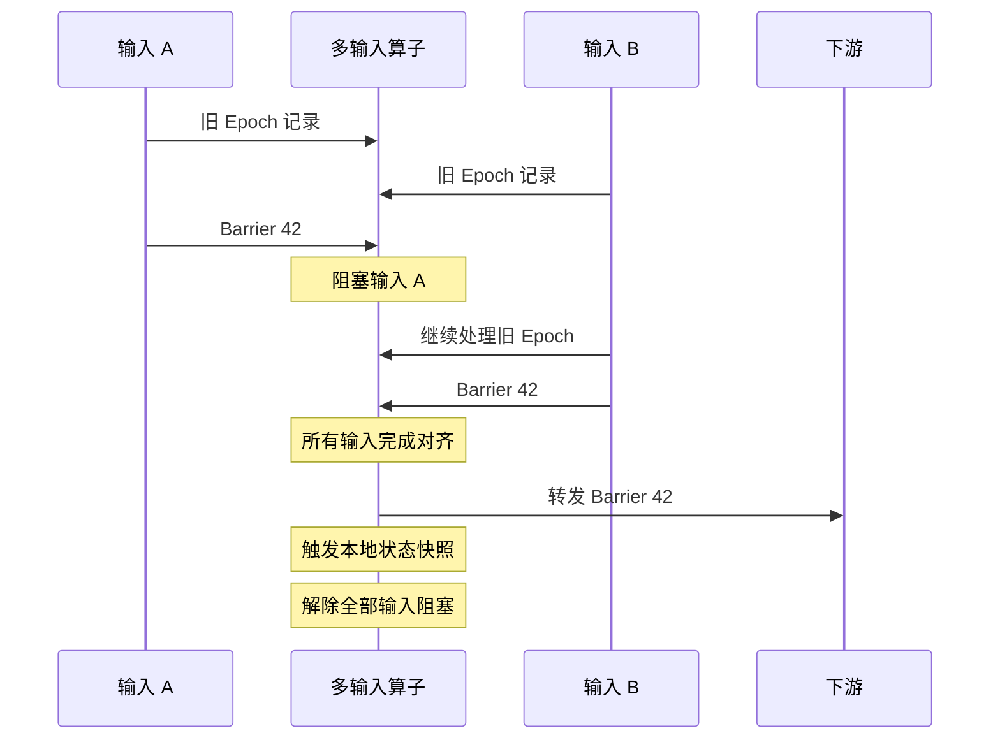

论文中的核心伪代码可以改写为：

```text
onMarker(input):
    blocked.add(input)
    input.block()

    if blocked == allInputs:
        for output in outputs:
            output.send(marker)

        triggerSnapshot()

        for input in allInputs:
            input.unblock()

        blocked.clear()
```

这里有一个容易忽略的细节：论文先向下游传播 Marker，再调用本地 `triggerSnapshot()`。这两个动作在同一处理线程的逻辑边界上连续发生，而状态的物理写入可以在后台异步进行，因此下游 Barrier 传播和本地快照物化能够并行。

不过，这是论文算法为了说明一致性边界给出的抽象调用顺序，不应据此推断现代 Flink 内部所有算子、Source 和 Backend 都必须暴露完全相同的具体调用次序。工程实现可以演进，但必须保持 Marker 与记录的有序关系以及快照切面的语义。

### 4.3 对齐为什么能省掉大部分通道状态

完成对齐时：

- 每条输入的旧 Epoch 记录都已经被该算子处理；
- 每条输入的新 Epoch 记录都还被挡在 Barrier 之后；
- 因此算子不需要把普通 DAG 边上的在途记录纳入快照。

这就是 Flink 与通用 Chandy-Lamport 快照的一个关键差异。它利用数据流方向和输入对齐，把快照压缩为算子 Managed State、Source 位置以及必要的元数据，而不是无差别记录所有网络缓冲区。

### 4.4 正确性可以怎样直观理解

可以用三个局部事实拼出全局一致性：

1. **FIFO 保证边界可靠。** Barrier 之前的旧记录不可能跑到 Barrier 后面。
2. **对齐阻止 Epoch 混合。** 先到 Barrier 的输入不能提前进入新 Epoch。
3. **Barrier 沿拓扑逐级传播。** 每个算子选择的局部切面可以连接成同一个全局切面。

因此，Flink 不需要在同一物理时刻冻结所有 Task。每个 Task 可以在 Barrier 到达自己的时刻完成局部切面，只要这些切面在因果关系上彼此兼容。

### 4.5 一次 Checkpoint 什么时候才算真正完成

“某个算子看到了 Barrier”与“全局 Checkpoint 已经可恢复”之间还有多个阶段：

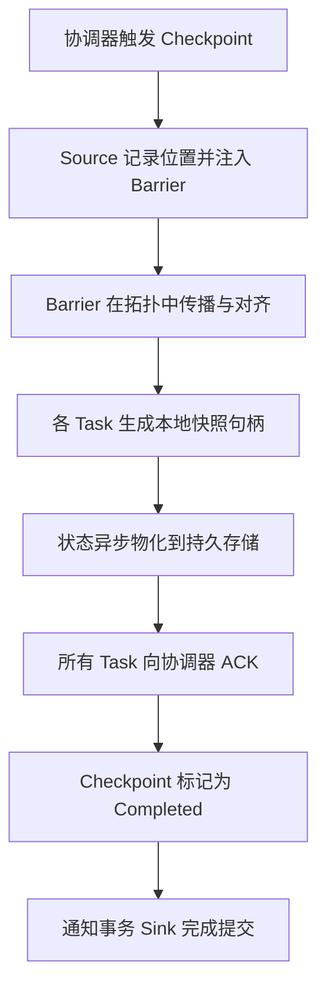

| 事件 | 已经能保证什么 | 仍然不能保证什么 |
| --- | --- | --- |
| 单个算子对齐完成 | 该算子确定了本地一致切面 | 其他 Task 可能尚未收到 Barrier |
| 单个 Task 快照成功 | 该 Task 的状态句柄可用 | 其他 Task 仍可能失败，导致全局 Checkpoint 放弃 |
| 全部 Task ACK | 协调器拥有完整快照元数据 | Sink 的外部事务可能仍待最终提交 |
| Completed 通知完成 | 该 Epoch 可作为恢复点，参与 Sink 提交协议 | 外部系统最终语义仍取决于 Sink 实现 |

如果某个 Task 在 Checkpoint 过程中失败，未完成的 Checkpoint 会被丢弃。作业恢复到最近一个已经完成的 Checkpoint，而不是尝试拼接一份半成品。

### 4.6 Alignment 的成本到底是什么

对齐不是全局停机，但它也不是免费操作。先收到 Barrier 的输入会暂时停止被消费，新记录积压在网络缓冲区，反压可能继续向上游传播。

对齐时间主要受以下因素影响：

- 多条输入的速度差；
- 下游背压导致 Barrier 被旧记录排在后面；
- Shuffle 层数；
- 并行度和网络连接数量；
- 数据倾斜、热点 key、单条记录处理过慢；
- 网络缓冲区大小与 spill 行为。

因此，Checkpoint 总耗时必须按阶段拆开看，但不能把所有指标机械地串行相加：不同 Task 的 Barrier 传播、Alignment、同步快照和异步物化会流水重叠，全局 End-to-End Duration 最终由关键路径和最慢 Subtask 决定。

```text
Checkpoint End-to-End Duration 的诊断维度
  - Barrier 触发与传播等待
  - 各输入的 Alignment
  - 同步快照阶段
  - 异步物化阶段
  - ACK 与全局确认

全局耗时 ≈ 跨 Task 重叠执行后的最长关键路径
```

状态很大却 Alignment 很短，通常说明瓶颈在异步 I/O；状态不大但 Alignment 很长，通常应先查背压、输入倾斜和 Barrier 传播路径。

## 五、至少一次、论文中的“关闭对齐”与现代 Unaligned Checkpoint

### 5.1 论文中的关闭对齐意味着什么

论文指出，如果应用允许更弱的一致性，可以关闭 Alignment。算子收到某条输入的 Marker 后不阻塞该输入，于是快照可能同时包含旧 Epoch 和新 Epoch 的状态影响。

恢复到这个快照后，新 Epoch 记录还会被 Source 重放，部分状态更新可能再次发生，所以语义变成 at-least-once。

这个选择的逻辑是：用可能重复处理换取几乎没有对齐等待。

### 5.2 现代 Unaligned Checkpoint 不是“关闭对齐”的同义词

Flink 1.11 开始支持 unaligned checkpoint。它同样试图避免 Barrier 在背压数据后面长时间排队，但正确性基础完全不同：

- 论文中的无对齐 at-least-once：不保存越过边界的在途数据，允许恢复后重复更新。
- 现代 unaligned checkpoint：把网络 Buffer 中的在途数据纳入 Checkpoint，让 Barrier 可以越过这些 Buffer，目标仍然是 exactly-once。

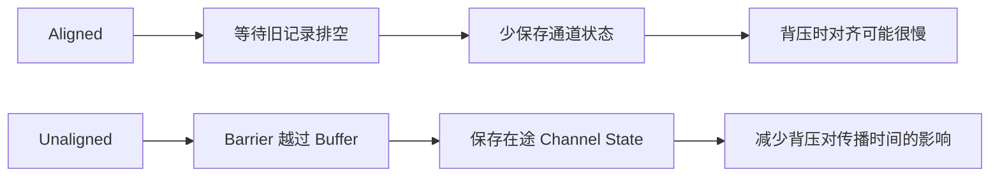

Unaligned checkpoint 的代价也很明确：

- 需要向 Checkpoint Storage 写入更多在途数据；
- 快照可能更大，恢复时也要恢复 Channel State；
- 如果瓶颈本来就是远端存储 I/O，unaligned 可能进一步增加压力；
- 当前不支持并发的 unaligned checkpoint；
- 恢复时 Watermark 与在途数据的顺序保证会发生变化，并不是说 Watermark 完全不可用；
- Barrier 无法抢占正在执行的单条记录，长时间用户函数仍可能拖住 Checkpoint；
- 某些 pointwise、broadcast 等连接不会保存 Channel State，适用边界需要按所用版本核对。

现代 Flink 还支持 aligned checkpoint timeout：Checkpoint 先按 aligned 方式执行，如果等待超过阈值，再切换为 unaligned。这让系统可以在正常情况下保留较小快照，在严重背压时避免 Barrier 无限等待。

## 六、有环数据流：为什么普通对齐不够

### 6.1 环中可能永远存在旧 Epoch 记录

普通 DAG 中，Barrier 从 Source 单向向下游传播，旧记录最终会被消费干净。但在有环拓扑中，一条记录可以在环内不断流转。即使外部输入已经跨过 Barrier，环里仍可能存在旧 Epoch 的记录。

如果只保存算子状态而忽略这些记录，恢复后的系统就少了一部分本应继续参与计算的数据，快照并不完整。

### 6.2 论文的处理方式：只记录环内必要的在途数据

论文使用 `IterationHead` 和 `IterationTail` 处理显式迭代。两者位于同一个物理实例中，通过本地缓冲区实现回环。

简化流程如下：

1. `IterationHead` 收到运行时 Marker；
2. 它把 Marker 发送进环，并开始记录环内返回的在途记录；
3. 环内其他 Task 仍按普通方式对齐；
4. Marker 经 `IterationTail` 返回到 `IterationHead`；
5. `IterationHead` 停止记录，并把这段 Channel Log 纳入快照。

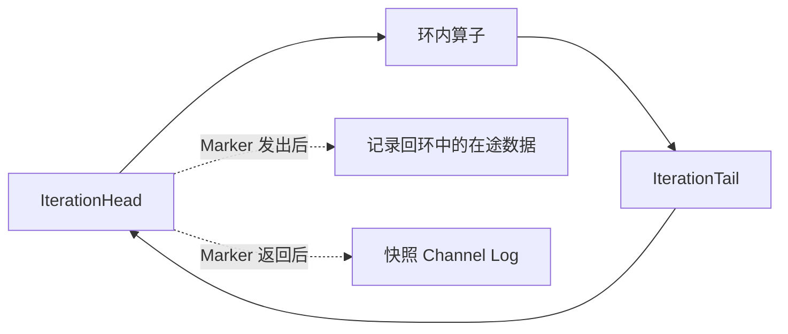

这个设计体现了论文一贯的取舍：只在一致性真正要求的环上记录通道状态，普通 DAG 区域仍然避免保存全部在途数据。

需要注意，这一节具有明显的 2017 年实现语境。它更适合帮助我们理解“为什么有环图需要通道状态”，不应直接当作今天 Flink 迭代 API 的使用指南。

## 七、状态后端：把“何时形成快照”与“如何保存状态”解耦

### 7.1 快照协议只决定 when，不应该绑定 how

Barrier 协议回答的是：**哪一个逻辑时刻的状态属于 Checkpoint N。**

State Backend 回答的是：

- 状态在任务运行期间怎样组织；
- 每次读写发生在 JVM Heap、本地嵌入式 KV，还是其他存储；
- 怎样取得该逻辑时刻的稳定视图；
- 怎样把稳定视图转换成可持久化的 State Handle；
- 恢复时怎样重新装载状态。

这两个问题必须分层。如果快照算法强依赖某一种数据库，那么每次替换 Backend 都要重写一致性协议；如果 Backend 自己决定全局提交时刻，又会让各算子无法对齐到同一个 Epoch。

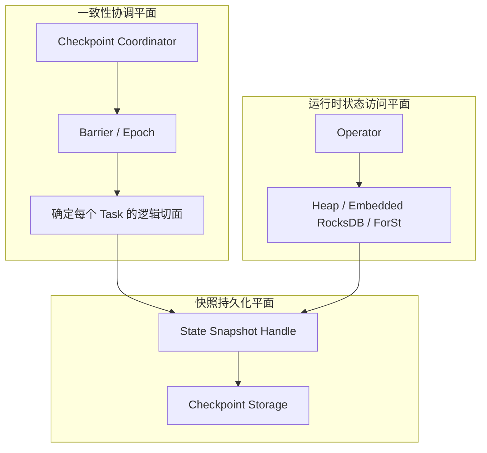

这正是论文中最有生命力的架构思想之一：Snapshot Protocol 只规定何时取得一致视图，Backend 可以独立决定如何复制、压缩、复用和恢复状态。

### 7.2 Local State Backend 的优势与代价

论文把本地状态后端分为内存状态和嵌入式 RocksDB 一类的 out-of-core 状态。

它们的共同特点是：每条记录的状态访问通常发生在 Task 所在节点，不需要为每次 `get/update` 执行分布式事务。只有在 Checkpoint 时，稳定状态视图才被写入 HDFS 等持久存储。

这种设计的优势是热路径短：

```text
Record
  -> Operator
  -> Local State Backend
  -> 更新本地状态
```

但本地状态不是可靠的唯一副本。TaskManager 磁盘损坏或实例被替换后，系统仍要依赖远端完成的 Checkpoint 恢复。

### 7.3 论文中的 External State Backend 是另一种运行模型

论文还讨论了 External State Backend：状态的在线访问直接由外部数据库或 KV 系统承载。

如果外部数据库不支持 MVCC，可以为每个 Epoch 维护 WAL，把一次全局 Checkpoint 组织成分布式两阶段提交：

1. Task 在本地 WAL 中记录当前 Epoch 的状态变更；
2. `triggerSnapshot()` 时预提交；
3. 全局 Checkpoint 完成后由协调器推动最终提交；
4. Checkpoint 失败则丢弃或回滚该 Epoch 的变更。

如果数据库支持 MVCC，则可以把状态更新关联到不同版本，并让全局 Checkpoint 完成推进可见版本。

这种方案恢复时可能不需要下载大状态，但代价是在线状态访问、版本管理和外部系统可用性进入运行时关键路径。

这里必须避免一个现代术语误区：

> 论文的 External State Backend 不等于今天的 Checkpoint Storage。前者是“运行期间的状态访问由外部系统承载”，后者只是“快照字节最终写到哪里”。

现代 Flink 自 1.13 起把 State Backend 与 Checkpoint Storage 的职责明确分开。例如：

```yaml
state.backend.type: rocksdb
execution.checkpointing.storage: filesystem
execution.checkpointing.dir: s3://my-bucket/flink-checkpoints
```

这表示运行时状态保存在 TaskManager 的 Embedded RocksDB，而快照文件持久化到 S3；它不表示每次状态访问都远程访问 S3。

### 7.4 异步快照：同步的只是稳定视图

如果对齐完成后一直阻塞 Task，直到数百 GB 状态全部上传远端，那么所谓“持续流处理”就会退化成周期性停机。

论文给出的关键分层是：

```text
同步阶段：取得状态的稳定逻辑视图
异步阶段：把这个视图物化到持久存储
```

Backend 的 `triggerSnapshot()` 不一定立刻复制全部字节。它可以返回一个逻辑快照：

- 对 Copy-on-Write 数据结构，固定旧版本页面；
- 对 RocksDB，固定当前数据库版本或一组不可变文件；
- 主处理线程随后继续修改新版本；
- 后台线程遍历旧视图并上传；
- 物化完成后释放旧版本引用。

因此，“Checkpoint Duration 很长”不一定意味着数据处理线程被阻塞了同样长时间。真正直接影响前台的主要是 Alignment 和同步建立稳定视图的工作；大状态上传通常在异步阶段发生。

不过，异步也不等于零成本。后台快照仍会竞争：

- 本地磁盘吞吐；
- CPU 与序列化资源；
- 网络带宽；
- 远端对象存储请求配额；
- RocksDB Compaction 与文件句柄；
- TaskManager 内存和缓存。

如果异步 I/O 把资源打满，前台吞吐仍会间接受影响。

### 7.5 RocksDB 为什么天然适合增量 Checkpoint

RocksDB 使用 LSM Tree。数据先进入内存结构，再刷成不可变 SST 文件；后台 Compaction 会生成新的 SST 文件并淘汰旧文件。

不可变文件给增量快照提供了天然复用单位：

```text
Checkpoint 100: SST-A + SST-B + SST-C
Checkpoint 101: 复用 A/B + 新增 SST-D
Checkpoint 102: 复用 B/D + 新增 SST-E/F
```

每次 Checkpoint 不必重新上传全部状态，只需上传还没有出现在共享存储中的新文件，并在元数据中引用可复用文件。

| 维度 | 异步快照 | 增量 Checkpoint |
| --- | --- | --- |
| 主要解决什么 | 减少主处理线程等待物化完成 | 减少每次需要上传的新状态数据 |
| 是否消除 Alignment | 否 | 否 |
| 是否必然减少远端写入 | 不一定 | 通常会，但取决于状态变化与 Compaction |
| 是否必然加快恢复 | 不一定 | 不一定，恢复仍受文件数量、网络、CPU 和 IOPS 影响 |
| 是否让快照完全独立 | 取决于实现 | 通常不会，增量快照会引用共享文件 |

“增量”也不代表依赖链会无限增长。Flink 和 RocksDB 会随着 Checkpoint 清理与 Compaction 管理共享文件。但从运维角度仍要注意：Web UI 中显示的本次增量大小，不等于作业恢复所需的完整逻辑状态大小。

### 7.6 现代 State Backend 的选择已经超出论文范围

当前 stable 文档列出了 `HashMapStateBackend`、`EmbeddedRocksDBStateBackend`，并介绍了实验阶段的 `ForStStateBackend`：

| Backend | 状态位置 | 典型优势 | 主要代价 |
| --- | --- | --- | --- |
| HashMap | JVM Heap | 对象访问快、实现直接 | 容量受堆限制，GC 与大状态压力明显 |
| Embedded RocksDB | TaskManager 本地磁盘 | 可支撑超出堆的大状态，支持异步与增量快照 | 序列化、JNI 和磁盘访问增加延迟 |
| ForSt | 可把 SST 放到远程文件系统 | 面向存算分离与超过本地盘容量的状态 | 仍为 experimental，受网络延迟和功能限制影响 |

因此，论文适合帮助我们理解 Backend 为什么能够替换；真正选型必须以所用 Flink 版本的官方文档和压测结果为准。

## 八、故障恢复：为什么恢复状态之后还必须重放输入

### 8.1 恢复点只能来自 Completed Checkpoint

假设已经完成 `Checkpoint 40`，`Checkpoint 41` 正在上传时某个 Task 失败：

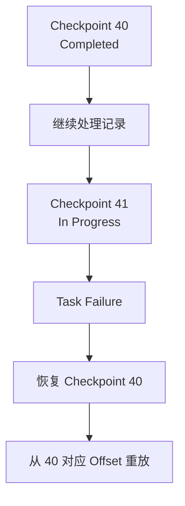

系统不能把 41 中已经成功的几个 Task State Handle 与 40 中剩余 Task 的状态拼起来，因为它们不属于同一个全局切面。只有协调器已经确认完成的 Checkpoint，才是可恢复的原子世界。

### 8.2 一次恢复的完整步骤

恢复并不是简单把一个状态文件读回内存，而是重建整个执行的一致关系：

1. 失败检测触发作业或相关区域重启；
2. 协调器选择最近一个 Completed Checkpoint；
3. 新的物理 Task 被调度到可用节点；
4. Keyed State 按 key-group range 分配给新 Task；
5. Operator State 按其 redistribution pattern 重新分配；
6. Source 恢复 Checkpoint 中保存的分区位置；
7. Sink 恢复未完成事务、WAL 或 committable 元数据；
8. Source 从恢复位置重新读取 Checkpoint 之后的数据；
9. 新执行继续向前推进。

```text
Completed Checkpoint
  -> Operator / Keyed State
  -> Source Offsets
  -> Sink Transaction Metadata
  -> 新 Task 部署
  -> 输入重放
```

Checkpoint 之后、失败之前已经处理过的记录会被再次执行。Flink 所说的 exactly-once State，并不是承诺每条记录在 CPU 上只执行一次，而是保证回滚状态后重新执行，最终对 Managed State 的可观察影响等价于一次。

### 8.3 失败窗口决定了测试必须检查什么

| 失败发生在 | 当前 Checkpoint 能否恢复 | 正确行为 |
| --- | --- | --- |
| Barrier 尚未完成对齐 | 不能 | 回到上一个 Completed Checkpoint |
| 本地逻辑快照已创建、远端上传中 | 不能 | 清理未完成状态文件和元数据 |
| 部分 Task 已 ACK | 不能 | 不能与旧 Checkpoint 混合恢复 |
| 协调器已标记 Completed | 可以 | 允许作为新的恢复点 |
| Sink 已 prepare、全局尚未完成 | 不能直接提交 | 恢复时 abort 或继续由协议判定 |
| 全局完成通知发出、Sink 响应丢失 | 取决于 Sink | commit 必须可重试、幂等或可查询结果 |

如果 E2E 测试只在 Job 正常结束后比较最终条数，就覆盖不到这些真正危险的窗口。

### 8.4 fail-recovery 和确定性假设

论文建立在 fail-recovery、deterministic process model 上：失败的进程可以通过重新部署和恢复旧状态被替代，同一段输入在确定性逻辑下能够重建同样的内部演进。

现实应用可能引入非确定性，例如：

- 直接读取未进入状态的系统时间；
- 调用结果不可重放的外部服务；
- 使用无稳定种子的随机数；
- 多输入并发合并顺序影响业务结果；
- 在用户线程之外修改状态或外部系统。

Checkpoint 不能自动把这些行为变得确定。需要把决定结果的上下文纳入状态，或者让外部调用具备幂等、缓存和重放语义。

## 九、扩缩容、版本升级与 Savepoint

### 9.1 故障恢复与扩缩容共享同一个基础

论文指出，恢复和 Rescale 表面上是两种操作，本质上都需要：

```text
停止或替换当前物理执行
  -> 选择一个一致状态点
  -> 创建新的 Task 布局
  -> 把状态重新分配给新布局
  -> 从同一输入位置继续执行
```

区别只是故障恢复通常保持原并行度，而扩缩容主动改变并行度。

### 9.2 key-group 怎样支撑状态重新分配

Checkpoint 元数据不会只记录“旧 Subtask 2 有一个状态文件”，而要能定位哪些 State Handle 对应哪些 key-group range。

恢复到新并行度时：

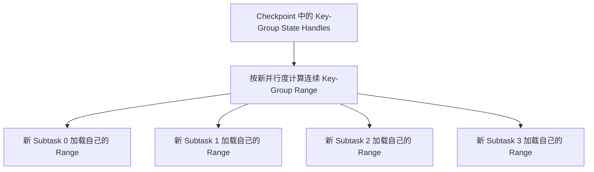

这也是为什么 `maxParallelism` 不是一个无关紧要的配置。它决定可用 key-group 数量，也约束未来 Keyed State 可以怎样切分：

- key-group 太少，未来很高并行度下无法继续细分；
- key-group 太多，快照元数据、索引和小分片管理成本会上升；
- 修改已有有状态作业的 max parallelism 需要谨慎验证兼容性。

### 9.3 论文中的 checkpoint-stop-modify-restore

论文把计划内重配置概括成：

```text
checkpoint -> stop -> modify -> restore
```

它可以用于：

- 软件补丁；
- 替换读取同一状态的算子实现；
- 新增状态；
- 作业版本分叉；
- 扩缩容和资源迁移；
- 从历史状态点启动调试实例。

这个思想今天仍成立，但现代 Flink 已经明确区分 Checkpoint 和 Savepoint 的操作语义。

### 9.4 Checkpoint 与 Savepoint 不是两个可互换的名称

| 维度 | Checkpoint | Savepoint |
| --- | --- | --- |
| 主要目的 | 非预期故障后的自动恢复 | 计划内升级、迁移、扩缩容和运维 |
| 所有权 | 通常由 Flink 创建、管理和清理 | 由用户显式创建、持有和删除 |
| 触发频率 | 通常较高 | 通常按运维动作触发 |
| 优化目标 | 创建轻量、恢复快速 | 可移植性和作业变更能力 |
| 格式 | Backend 原生格式，可为增量 | 默认 canonical，也可选择 native |
| 生命周期 | 作业终止后可能被删除，除非配置保留 | 不会因作业终止自动删除 |

官方文档把两者类比为数据库的恢复日志与人工备份。底层都使用快照基础设施，但兼容性承诺、格式和生命周期不同。

计划内升级应至少检查：

- 有状态算子是否设置稳定 UID；
- 新旧 Job Graph 能否匹配对应状态；
- Serializer 是否支持 Schema Evolution；
- 删除的状态是否允许跳过；
- Snapshot 类型是否支持当前变更；
- 新并行度是否在 max parallelism 能力范围内；
- Source Split 和 Sink 事务元数据能否迁移。

“Savepoint 可以恢复”也不意味着任意代码都兼容。它只提供状态搬运和映射的基础，业务状态 Schema 仍然需要明确演进契约。

## 十、端到端 Exactly-Once：真正的边界在 Sink

### 10.1 内部状态一致，不代表外部世界只看见一次

考虑以下失败窗口：

```text
1. Source 读取记录 r
2. Operator 更新 Managed State
3. Sink 把 r 追加到外部系统
4. 新 Checkpoint 尚未完成
5. Task 失败
6. 作业恢复到上一个 Checkpoint
7. Source 再次读取 r
8. Sink 再次追加 r
```

Operator 的状态可以完全正确，因为恢复时状态回滚，再次处理 `r` 后仍得到相同最终值；但外部系统已经看见两次追加。

因此，端到端 exactly-once 需要三段同时成立：


### 10.2 幂等 Sink：重复执行，结果不变

如果外部写入使用稳定主键做 Upsert，同一业务版本重复写入会覆盖同一行，那么恢复重放虽然发生了多次物理请求，最终可观察结果仍可能等价于一次。

但“有主键”不自动等于幂等。下面这些操作仍可能不幂等：

- `balance = balance + delta`；
- 无稳定 ID 的 append；
- 依赖当前值的条件更新；
- 每次写入生成新版本号；
- 外部系统按到达顺序触发下游动作。

真正的幂等需要定义：同一个逻辑记录用什么稳定身份被识别，重复提交在目标系统中怎样被折叠。

### 10.3 事务 Sink：把可见性与 Checkpoint 完成绑定

当写入不能幂等时，Sink 需要把外部事务纳入 Checkpoint 生命周期。

典型两阶段流程是：

1. 当前事务接收本 Epoch 的记录；
2. Checkpoint 到来时 flush 并 pre-commit，生成事务句柄；
3. 事务句柄作为 Sink State 或 committable 进入 Checkpoint；
4. 全局 Checkpoint 完成后 commit；
5. Checkpoint 失败或恢复到更早 Epoch 时 abort 未完成事务。

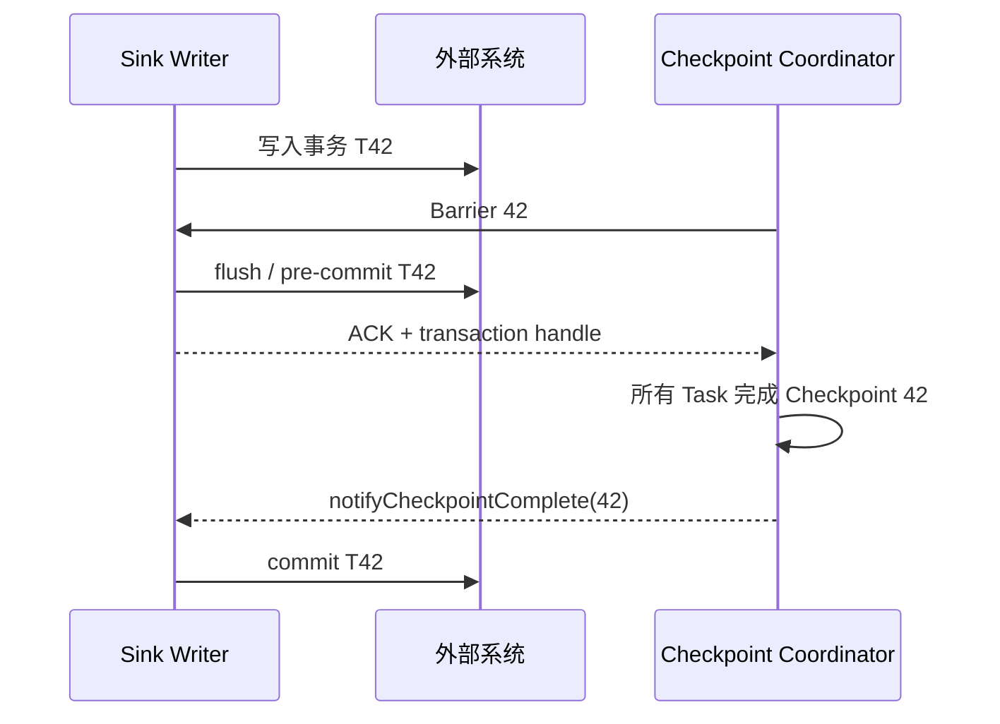

难点并不只在正常路径，而在模糊失败：

| 失败窗口 | Sink 必须具备的能力 |
| --- | --- |
| prepare 前失败 | 丢弃当前未完成写入 |
| prepare 后、Checkpoint 完成前失败 | 恢复后识别并 abort 悬挂事务 |
| commit 请求发出、响应丢失 | 能查询事务状态或安全重试 commit |
| 协调器完成、Writer 尚未收到通知 | 恢复后根据 Checkpoint/事务 ID 补交 |
| 事务超时早于恢复完成 | 配置足够事务 TTL，或提供可恢复的超时处理 |

### 10.4 Flush 与 Commit 不是同一个概念

这对连接器开发尤其重要：

- `flush` 可能只是把客户端 Buffer 发给服务端；
- `pre-commit` 表示事务已经准备好，但尚不可对外最终确认；
- `commit` 才决定外部副作用进入可见、不可回滚状态。

Checkpoint 时等待异步请求全部完成，可以让记录至少已经被外部系统接收，通常有助于 at-least-once；但它并不能阻止恢复重放再次发送同一批记录。要达到 exactly-once，仍需事务、原子发布或严格幂等。

### 10.5 exactly-once 是效果语义，不是物理执行次数

更准确的说法是：

> 失败恢复后，系统的最终状态和外部可见结果，与每条输入只产生一次逻辑影响的执行等价。

这不表示：

- 每条记录只被 CPU 调用一次；
- 网络请求只发送一次；
- 外部事务从不重试；
- 用户代码永远不会重复执行。

重放和重试是容错的正常组成部分，关键是系统能否把重复物理执行收敛到一次逻辑结果。

## 十一、Queryable State 与 JobManager HA：论文中的另外两条支线

### 11.1 Queryable State 讨论的是可见性，不只是查询接口

论文提出从外部按 key 查询 Flink Managed State。客户端先询问 JobManager：某个 key 当前由哪个 TaskManager 持有；再向对应 TaskManager 发起点查。

这套设计希望避免每次状态更新都主动复制到外部数据库：在线计算仍使用本地 Backend，只有外部真正查询时才读取当前值。

但论文明确指出，当时的 Queryable State 返回的是 Task 当前 Working State，相当于数据库的 read-uncommitted：

- 这个状态可能属于尚未完成的 Checkpoint；
- Task 失败后系统可能回滚到更早 Epoch；
- 外部客户端之前看到的值可能不再属于恢复后的历史。

所以 Queryable State 的核心问题不是“能否发一个 RPC 查到值”，而是外部读者看到的状态版本具有怎样的隔离级别。

现代阅读必须补充时代背景：Queryable State 自 Flink 1.18 起已经被弃用。它仍有历史研究价值，但不应作为新系统的默认在线查询架构。需要对外稳定服务状态时，更常见的方案是把经过明确提交语义的数据物化到专用存储。

### 11.2 JobManager 的元数据也必须高可用

Task 状态都写进 Checkpoint，并不意味着 JobManager 可以随意丢失。JobManager 持有：

- 活跃作业与执行图元数据；
- Checkpoint 协调状态；
- 已完成 Checkpoint 的引用；
- 调度和重配置决策；
- Task 反馈的状态句柄。

论文时代通过 ZooKeeper Leader Election 和被动 Standby 解决 JobManager 单点问题。非关键元数据可以异步持久化；如果 Master 在异步提交期间失败，最坏情况是退回更早、但仍然完整的 Checkpoint。

今天 Flink 的 HA 实现和部署形态已经变化，但设计要求没有变：

> 状态文件存在，不代表恢复元数据一定存在。Checkpoint 的 State Handle、完成标记和作业身份必须一起处于可靠、高可用的控制面中。

## 十二、King 生产实验：大状态究竟怎样影响 Checkpoint

### 12.1 RBEA 不是简单的计数作业

论文使用 King 的 Rule-Based Event Aggregator（RBEA）说明状态管理在真实生产中的表现。RBEA 面向分析人员提供 Standing Query 服务，主要输入有两类：

1. 游戏用户事件流，例如游戏开始、结束等，每天超过 300 亿事件；
2. 分析人员提交的查询流，查询由 Groovy 或 Java DSL 脚本表示。

查询会广播到所有 `Query Processor` 实例，游戏事件则按用户 ID 分区。Processor 保存每个用户的 Managed State，并根据动态规则产生聚合事件；后续 `Dynamic Window Aggregator` 按 Event Time Window 聚合，最后写入外部数据库或 Kafka。

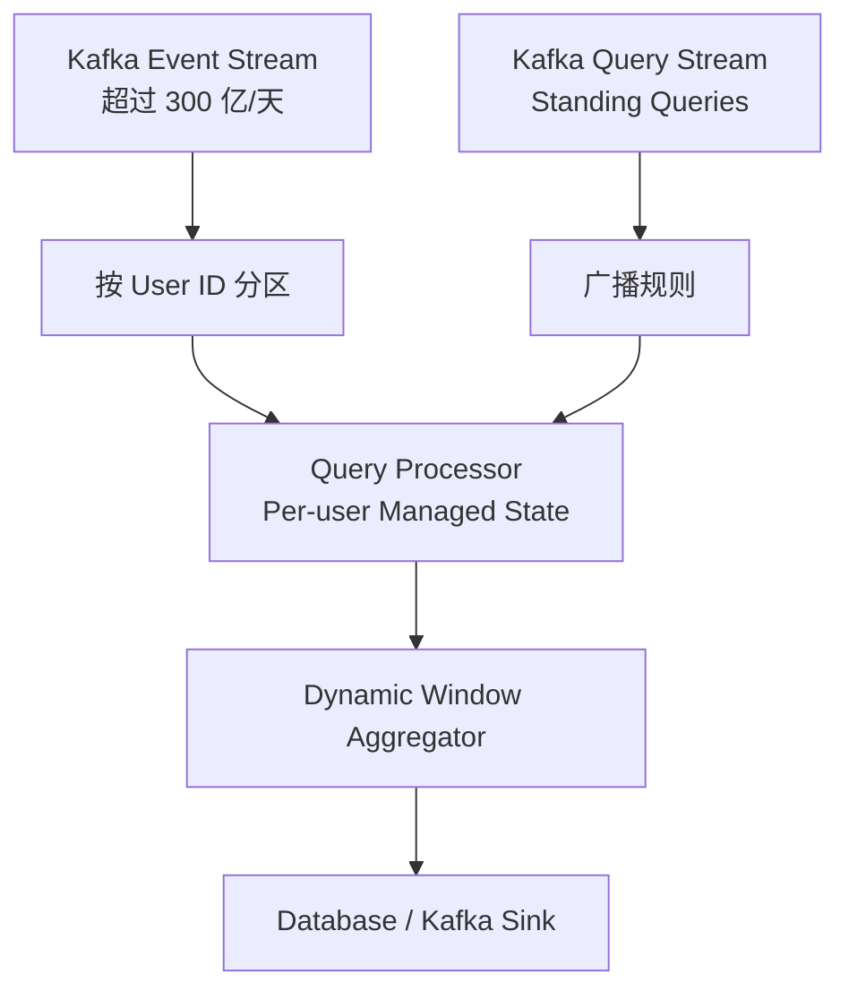

这个拓扑有多次 `keyBy` 和 Shuffle，也有大规模用户状态，比单算子基准更能体现 Barrier 传播与状态物化的差异。

### 12.2 论文披露的生产环境

| 项目 | 数据 |
| --- | --- |
| King 业务规模 | 超过 3.5 亿月活用户 |
| RBEA 事件流 | 超过 300 亿事件/天 |
| 集群 | 共享 YARN 集群，18 台物理机 |
| 单机规格 | 32 CPU Cores、378 GB RAM、SSD + HDD |
| Flink 版本 | 1.2.0 |
| Working State | 本地 SSD 上的 RocksDB |
| Checkpoint Storage | 异步写入 HDD 支撑的 HDFS |
| 被观察的部署 | 5 个 RBEA 部署，每个对应不同游戏 |
| 并行度 | 状态规模实验固定为 70 |
| 全局状态规模 | 约 100–500 GB |
| 平均 Alignment Delay | 每次完整快照约 1.3 秒 |

这里最容易产生的误读是：**“500 GB 状态只需要 1.3 秒完成 Checkpoint。”**

论文并没有这样说。1.3 秒是这些部署中每次 Full Snapshot 的平均 Alignment Delay，不是数百 GB 状态全部写入 HDFS 的总时长。完整异步物化可能持续几十秒甚至更久，但它与前台执行并行。

### 12.3 论文观察到的两个关系

第一，Global State Size 会影响完整异步 Snapshot Duration。状态越大，需要物化到 HDFS 的数据通常越多。

第二，Alignment Time 没有表现出与 Global State Size 的明显相关性。因为 Alignment 等待的是 Barrier 到齐，而不是等待全部状态上传。

论文还在固定 200 GB 状态下比较了并行度 30、50、70，观察到 Alignment 与两类因素相关：

- 拓扑中连续的 Shuffle/`keyBy` 阶段数；
- 每一阶段的并行度和连接数量。

这给出了一个很重要的诊断原则：

```text
状态大小主要影响物化成本；
数据流形态、背压与并行度主要影响 Barrier 对齐成本。
```

### 12.4 这组实验能证明什么

- 数百 GB 状态不必导致全图 Stop-the-world；
- 同步协调与异步物化分离确实能控制前台停顿；
- Alignment 需要按拓扑和并行实例分析，不能只看状态总量；
- 本地 Working State + 远端持久 Checkpoint 是可落地的生产架构。

### 12.5 它不能证明什么

| 不能直接推出的结论 | 原因 |
| --- | --- |
| 所有 500 GB 作业都只增加约 1 秒延迟 | 1.3 秒来自特定拓扑、负载和集群的平均 Alignment |
| 状态大小永远不影响前台吞吐 | 异步 I/O 仍会竞争 CPU、磁盘和网络资源 |
| 并行度增加必然严格线性恶化 | 实际还受拓扑、负载、连接模式和资源影响 |
| Checkpoint 快就代表恢复快 | 论文没有给出大规模故障恢复时长与 P99 |
| 对象存储、云原生弹性下结论相同 | 实验使用 2017 年的 Flink 1.2、RocksDB、YARN 和 HDFS |
| 严重背压下 aligned checkpoint 一样稳定 | 论文没有覆盖现代 unaligned checkpoint 所针对的全部场景 |

从研究评价看，这组数据的价值是生产真实性，而不是严格控制变量的通用 Benchmark。它来自五个长期运行部署，足以说明架构可行；但不能替代今天针对自己拓扑、Backend 和 Checkpoint Storage 的压测。

## 十三、从 2017 到现代 Flink：哪些原则没变，哪些实现已经变化

论文建立的是状态管理骨架，现代 Flink 则不断补齐背压、大状态、云存储和运维契约。以撰写本文时的 stable 2.3 文档为参照，可以这样区分：

| 主题 | 2017 论文的主线 | 现代阅读需要补充 |
| --- | --- | --- |
| 一致快照 | 多输入 Barrier Alignment，DAG 中不保存普通在途数据 | Unaligned Checkpoint 可保存 Channel State，在背压下让 Barrier 越过 Buffer |
| 放弃对齐 | 语义退化为 at-least-once | 现代 unaligned 仍可以保持 exactly-once，不能与论文的关闭对齐混为一谈 |
| State Backend | 同时讨论在线状态访问与快照物化 | State Backend 和 Checkpoint Storage 自 1.13 起职责明确分离 |
| RocksDB 增量 | 利用 LSM 与不可变版本减少重复复制 | Embedded RocksDB 正式支持增量 Checkpoint，并管理共享 SST 生命周期 |
| Savepoint | 从一致快照用途讨论升级、分叉和重配置 | Checkpoint 与 Savepoint 的所有权、格式、兼容性和生命周期被明确区分 |
| 大状态 | 本地 RocksDB + HDFS 异步快照 | 还出现 ForSt 等存算分离探索，但当前 stable 文档仍标记其为 experimental |
| Queryable State | 按 key 查询当前 Working State，read-uncommitted | 自 Flink 1.18 起 deprecated，不应作为新架构建议 |
| Sink | 幂等或 WAL/事务 Sink 与 Snapshot Notification 协调 | Unified Sink API 进一步明确 Writer、Committable 与 Committer 的职责 |

### 13.1 核心原则没有变化

无论是 aligned 还是 unaligned，以下链路仍是理解 Flink 容错的基础：

```text
Source 位置进入快照
  -> Operator State 对同一 Epoch 一致
  -> State Backend 产生可恢复句柄
  -> Checkpoint Storage 持久保存
  -> 协调器确认全局完成
  -> Sink 决定外部副作用何时提交
```

改变的是每一层的实现与优化方式，而不是端到端一致性需要这些参与者的事实。

### 13.2 Unaligned 不是“更先进所以总应该开启”

适合 unaligned 的典型信号是：

- 作业持续背压；
- Checkpoint Start Delay 或 Barrier 传播时间很高；
- Alignment 占总耗时的大部分；
- Checkpoint Storage 仍有足够 I/O 余量。

不适合盲目开启的情况是：

- 主要瓶颈是状态上传或对象存储吞吐；
- Channel Buffer 很大，保存后会显著放大 Checkpoint；
- 作业依赖受限的连接模式或升级能力；
- 长时间单记录处理才是 Barrier 延迟根因；
- 团队还没有解决持续背压本身。

Unaligned 可以让 Checkpoint 更快越过拥堵，但不会提升慢算子的处理能力，也不会自动消除数据倾斜。

### 13.3 Savepoint 始终要当作一次兼容性操作

现代 Savepoint 支持 canonical 与 native 等格式，能力矩阵也会随版本演进。计划升级时不应只问“Savepoint 是否成功生成”，还要问：

- 目标版本能否读取这个 Snapshot 类型；
- 是否更换 State Backend；
- Job Graph 是否发生任意拓扑变化；
- Unaligned Checkpoint 中的 Channel State 是否限制升级；
- 状态 Serializer 是否支持新 Schema；
- Operator UID 是否稳定。

论文告诉我们快照为什么可以成为重配置点，官方版本文档则决定某次具体变更是否受支持。

## 十四、Checkpoint 变慢时，怎样把问题定位到正确层次

第 4.6 节解释 Alignment 成本，第 13.2 节讨论是否选择 unaligned；本章不再重复原理，而是把这些机制收敛成一套可执行的诊断顺序。

### 14.1 不要只盯一个 End-to-End Duration

如果只看到“Checkpoint 花了 90 秒”，我们还不知道问题发生在哪。至少需要区分：

- Trigger 后 Barrier 到达 Task 的 Start Delay；
- 多输入通道的 Alignment Duration；
- Backend 创建稳定视图的同步阶段；
- 状态上传或物化的异步阶段；
- Checkpointed Data Size 与完整状态规模；
- 最慢 Subtask、失败原因和超时位置；
- 恢复阶段的下载、加载和重放耗时。

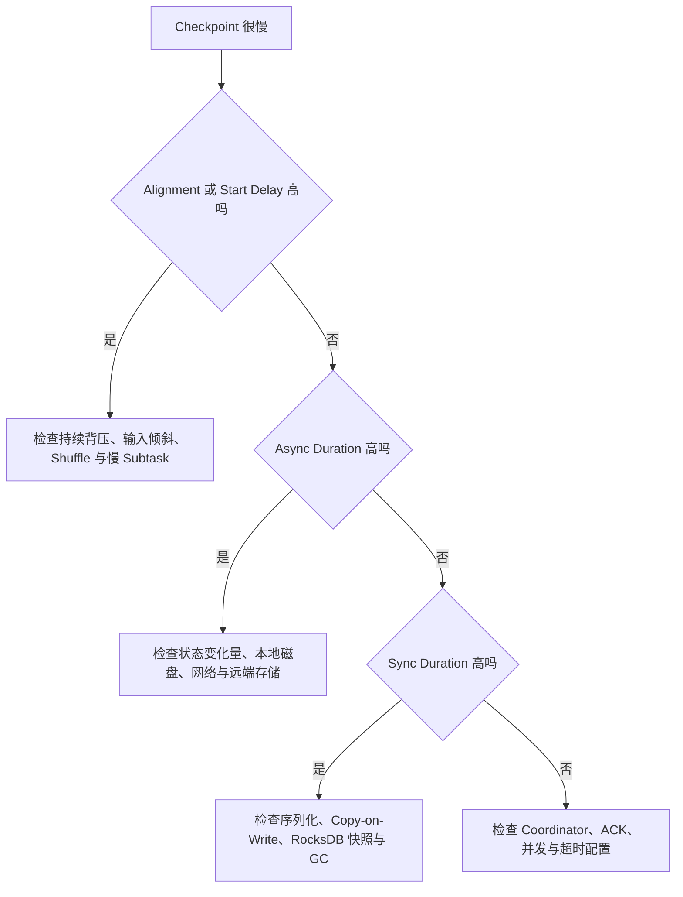

### 14.2 常见症状与更可能的根因

| 观测 | 更可能的根因 | 优先验证 |
| --- | --- | --- |
| 状态很小，Alignment 却很高 | 背压、输入速率差、Barrier 被旧记录阻挡 | 各输入 Barrier 到达差、背压图、热点 Subtask |
| Alignment 很低，总时长很高 | 异步物化或 Checkpoint Storage 慢 | 上传字节、存储延迟、网络吞吐、请求限流 |
| 只有一个 Subtask 慢 | 数据倾斜、热点 key、单机磁盘或 GC | Subtask 分位数、Key 分布、节点资源 |
| 增量大小突然放大 | 高更新率、RocksDB Compaction、共享文件变化 | SST/Compaction 指标、变更量、Checkpoint 文件 |
| Checkpoint 很快，恢复很慢 | 下载、文件数量、Backend 初始化或重放量大 | Restore Duration、共享文件数、Source Lag |
| Unaligned 后仍然很慢 | 单记录处理不可抢占，或 I/O 才是瓶颈 | Mailbox/用户函数、Channel State 大小、Storage I/O |
| Checkpoint 周期越短，系统越不稳定 | 并发快照与资源争用 | Min Pause、并发数、后台上传重叠 |

### 14.3 优化顺序比某个参数更重要

一个更安全的排查顺序是：

1. 先确认是否存在持续背压和热点 Subtask；
2. 再拆分 Alignment、Sync、Async 三类耗时；
3. 检查 Checkpoint Storage 是否可靠且有足够吞吐；
4. 检查增量 Checkpoint 是否真正降低了变化量；
5. 根据瓶颈选择 Buffer Debloating、扩容、RocksDB 调优或 unaligned；
6. 最后才调整 Timeout、并发数和间隔，避免用更长超时掩盖根因。

把 Timeout 从 10 分钟改成 30 分钟可以减少失败次数，却不等于解决了 Checkpoint 为什么需要 20 分钟。

## 十五、对 SeaTunnel / Zeta 与连接器设计的工程启发

下面这一节是我基于论文做的工程推论，不是论文原文结论。Flink 和 SeaTunnel 的运行时实现不同，不能机械照搬 Barrier 代码；但它们面对的是同一类问题：怎样让 Source 进度、引擎状态、异步请求和 Sink 副作用处于一个可以恢复的边界中。

### 15.1 Checkpoint Contract 必须覆盖完整链路

对数据集成引擎来说，一次可恢复状态至少可能包含：

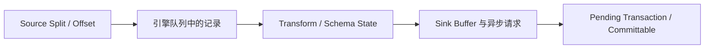

如果其中某一部分游离在 Checkpoint 之外，就会出现语义缺口：

- Source Offset 已前移，但记录还没进入可恢复的下游状态；
- Sink Buffer 未保存，失败后数据丢失；
- 异步请求已经成功，状态却恢复到请求发出之前；
- Pending Transaction 存在于外部系统，Master Failover 后没人知道该提交还是回滚；
- Connector 后台线程继续写入已经被取消的旧执行实例。

### 15.2 Source Progress 不是一个 getter 就能定义清楚

假设 Worker 上的 Source Reader 暴露 `getProgress()`，Master 上的 Enumerator 定期拉取。这只能回答“某一瞬间 Reader 报告了什么”，还不能证明：

- 进度对应的记录已经进入引擎数据通道；
- 记录已经越过所有需要纳入 Checkpoint 的 Buffer；
- Progress Report 与某个 Checkpoint ID 存在稳定绑定；
- Reader Failover 后不会前移或回退到错误位置；
- 多个 Split 的进度能组成同一个全局切面。

Flink 论文的启示是：进度必须成为 Epoch 协议的一部分，而不是独立于数据流的一份监控快照。

### 15.3 Connector 后台线程最容易逃逸出一致性边界

我在[之前关于 Engine-Level FlushSignal 的文章]()里讨论过，为什么定时 Flush 不应该由每个 Connector 随意启动后台线程。状态管理论文给这个问题补上了另一层解释：后台线程不仅会制造并发和异常传播问题，还可能绕过 Checkpoint 的有序边界。

必须回答：

- `writeRecord()` 与后台 `flush()` 是否并发修改同一 Buffer；
- Checkpoint 到来时，已经发出的异步请求由谁等待；
- 请求完成后异常怎样回到 Task 主生命周期；
- Checkpoint 失败时，后台请求产生的外部结果是否可撤销；
- cancel/close/restore 后，旧线程是否可能继续写；
- Flush 是单纯传输 Buffer，还是让数据永久可见。

FlushSignal 与 Checkpoint Barrier 不是同一个控制事件，但二者都说明：控制语义应该进入引擎可排序、可失败、可观察的执行路径，而不是从运行时之外直接操作 Connector。

### 15.4 Sink 的 Writer、Committer 与 Coordinator 必须共享事务身份

这一节把第 10.3 节的事务失败窗口映射到 SeaTunnel 的 Writer、Committer 和 Master 协作，因此会再次出现 prepare、complete、abort 与重复通知等概念，但关注点从协议原理转向引擎接口责任。

一个真正可恢复的事务 Sink，需要明确回答：

| 问题 | 需要的协议答案 |
| --- | --- |
| 谁创建事务 | Writer、全局 Coordinator，还是目标系统服务端 |
| 事务属于哪个 Checkpoint | 必须有稳定的 Epoch / Checkpoint ID 关联 |
| 谁保存 Pending Transaction | Writer State、Committer State 或 Master 元数据 |
| 全局完成后谁提交 | 本地 Committer 还是 Global Committer |
| Commit 通知重复怎么办 | 提交操作必须幂等或可查询状态 |
| Master Failover 后怎么办 | 新 Coordinator 能恢复所有未决事务 |
| Rescale 时怎么办 | Pending Transaction 不能因 Task 编号变化而失去归属 |
| Checkpoint Abort 怎么办 | 明确超时、回滚和孤儿事务清理策略 |

只实现 `prepareCommit()` 并不能自动得到 exactly-once。Prepare 结果必须被可靠保存，Complete/Abort 必须在 Coordinator Failover、通知重复和响应丢失时仍然可判定。

### 15.5 扩缩容需要稳定逻辑分片，不能绑定物理 Worker

key-group 给 SeaTunnel 的抽象启示不是“照抄 Flink 的 hash 公式”，而是：

> 状态必须先属于一个稳定的逻辑分片，再由当前物理 Task 承载。

如果 Source Split、Transform State 或 Sink Pending State 永久绑定 `workerId/taskIndex`，扩缩容和 Failover 都会变成特殊迁移逻辑。更合理的设计是使用稳定 Split ID、Partition ID、Bucket ID 或事务 ID，再根据当前并行度重新分配。

### 15.6 E2E 稳定性测试要主动控制失败时序

| 故障注入点 | 必须验证的结果 |
| --- | --- |
| Barrier/Checkpoint 触发前失败 | 恢复到上一个完成点，不错误前移 Source |
| 部分 Task 快照完成后失败 | 未完成 Checkpoint 绝不能被选为恢复点 |
| Snapshot 上传中远端存储超时 | 失败可诊断，临时文件可清理，不能静默成功 |
| Sink prepare 后、complete 前失败 | 恢复后 abort 或继续提交有确定规则 |
| 外部 commit 成功但 ACK 丢失 | 重试不会产生第二次逻辑提交 |
| Complete 通知重复或乱序 | Connector 行为幂等，不提交错误 Epoch |
| Writer/Committer/Master 分别失败 | Pending State 在对应 Failover 后仍可恢复 |
| Rescale 后恢复 | 每份状态恰好被一个合法实例接管 |
| Source 空闲或低吞吐 | 控制事件仍能传播，不能依赖下一条业务数据触发 |
| 持续背压期间 Checkpoint | 测试可稳定重现对齐等待，而不是依赖 sleep 碰运气 |

稳定性测试应使用 latch、故障注入 Hook、可控事务服务端或测试代理，把执行精确停在某个阶段。依赖 `Thread.sleep()` 等待“也许已经 pre-commit”会让测试本身成为 flaky test，也无法证明真正覆盖了目标窗口。

### 15.7 观测系统必须能回答“卡在哪个阶段”

对 SeaTunnel 或其他引擎，如果只暴露一个 Checkpoint 总耗时，维护者很难区分：

- Source 没有及时响应；
- 数据通道控制消息被背压阻挡；
- 某个 Transform 状态序列化很慢；
- Sink 在等待异步请求；
- Checkpoint Storage I/O 很慢；
- Master 在等待某个 Task ACK；
- Global Committer 卡在外部事务提交。

论文把 Alignment 与 Async Snapshot 分开度量，这种阶段化观测比一个总成功/失败计数更有诊断价值。

## 十六、我如何评价这篇论文

### 16.1 它最强的地方

第一，它没有把状态当作用户代码里的一个普通对象，而是把状态声明、分区、快照、恢复和外部提交组织成了系统协议。

第二，它把一致性协调与状态物化解耦。Barrier 不关心底层是 Heap、RocksDB 还是外部数据库；Backend 也不需要重新发明全局 Epoch。

第三，Barrier 复用已有数据通道传播，局部 Alignment 代替全图暂停。算法与流处理拓扑的执行方式天然结合，而不是在旁边增加一个重量级全局事务系统。

第四，同一份一致快照成为容错、扩缩容、软件升级、作业分叉和 Sink 提交的共同基础。这比为每个运维场景单独设计状态迁移协议更统一。

第五，论文用 King 的真实生产数据说明：大状态并不必然等于长时间前台停顿。真正关键的是缩短同步切面，并让物化异步进行。

### 16.2 它的边界同样清楚

- 强依赖可重放 Source、FIFO Channel 与 fail-recovery 模型；
- 用户逻辑中的外部调用和非确定性不会被 Checkpoint 自动修复；
- 端到端 exactly-once 仍依赖 Sink 和目标系统能力；
- Alignment 在持续背压下可能成为主要延迟来源；
- 有环拓扑需要额外记录 Channel State；
- Schema Evolution 和任意代码升级并没有因为快照存在而消失；
- Queryable State、ZooKeeper HA 和具体 Backend 描述具有明显版本背景；
- 生产实验没有覆盖现代对象存储、unaligned、ForSt 和大规模恢复长尾。

### 16.3 这篇论文今天最值得带走的，不是某个配置项

如果把全文压缩成一个心智模型，就是：

```text
Source Offset
  -> Barrier 划分 Epoch
  -> 多输入 Alignment 建立一致切面
  -> Operator 固定逻辑状态版本
  -> State Backend 异步物化
  -> Coordinator 确认全局 Completed
  -> 故障后恢复状态并重放输入
  -> Sink 协议决定外部结果语义
```

最后是我认为最重要的六条结论：

1. **状态管理不是把对象序列化，而是建立可恢复的一致性边界。**
2. **Barrier 同步的是数据流中的逻辑 Epoch，不是所有机器的物理时钟。**
3. **key-group 把逻辑状态分片与当前物理并行度解耦，才让 Rescale 成为可管理操作。**
4. **一致切面与状态物化必须解耦，大状态系统才能避免周期性全局停顿。**
5. **Flink 内部 Managed State 的 exactly-once，不自动等于外部结果 exactly-once。**
6. **真正可靠的 Connector 必须把 Source Progress、异步请求、Buffer 与外部事务全部放入可恢复合同。**

这也是为什么我认为这篇 2017 年的论文依然值得读。具体 API、Backend 和运维选项一直在变，但它给出的系统边界至今没有过时：

> 一个持续向前运行的流系统，必须周期性地产生一个可以重新进入的逻辑世界；这个世界由输入位置、算子状态、数据通道边界和外部提交协议共同定义。

## 参考资料

1. Paris Carbone et al., [State Management in Apache Flink: Consistent Stateful Distributed Stream Processing](https://www.vldb.org/pvldb/vol10/p1718-carbone.pdf), PVLDB 10(12), 2017.
2. Apache Flink 2.3, [Checkpointing](https://nightlies.apache.org/flink/flink-docs-release-2.3/docs/dev/datastream/fault-tolerance/checkpointing/).
3. Apache Flink 2.3, [Checkpointing under backpressure](https://nightlies.apache.org/flink/flink-docs-release-2.3/docs/ops/state/checkpointing_under_backpressure/).
4. Apache Flink 2.3, [State Backends](https://nightlies.apache.org/flink/flink-docs-release-2.3/docs/ops/state/state_backends/).
5. Apache Flink 2.3, [Checkpoints vs. Savepoints](https://nightlies.apache.org/flink/flink-docs-release-2.3/docs/ops/state/checkpoints_vs_savepoints/).
6. Apache Flink 2.3, [Tuning Checkpoints and Large State](https://nightlies.apache.org/flink/flink-docs-release-2.3/docs/ops/state/large_state_tuning/).
7. Apache Flink 2.3, [Fault Tolerance Guarantees of Data Sources and Sinks](https://nightlies.apache.org/flink/flink-docs-release-2.3/docs/connectors/datastream/guarantees/).
8. Apache Flink 2.3, [Deprecated API List](https://nightlies.apache.org/flink/flink-docs-release-2.3/api/java/deprecated-list.html).
