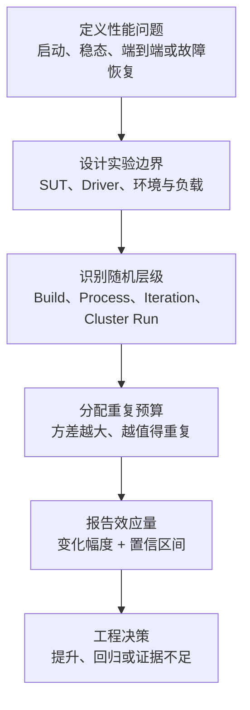
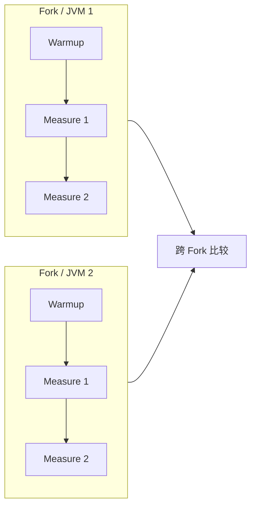
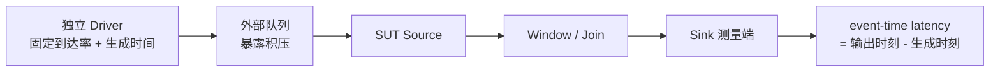
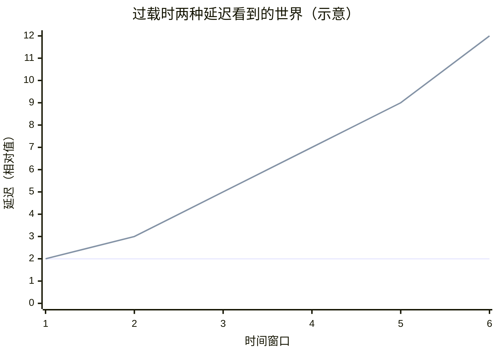
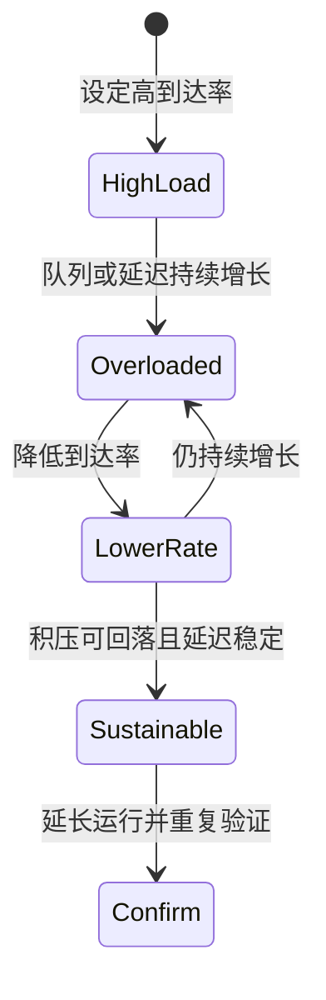
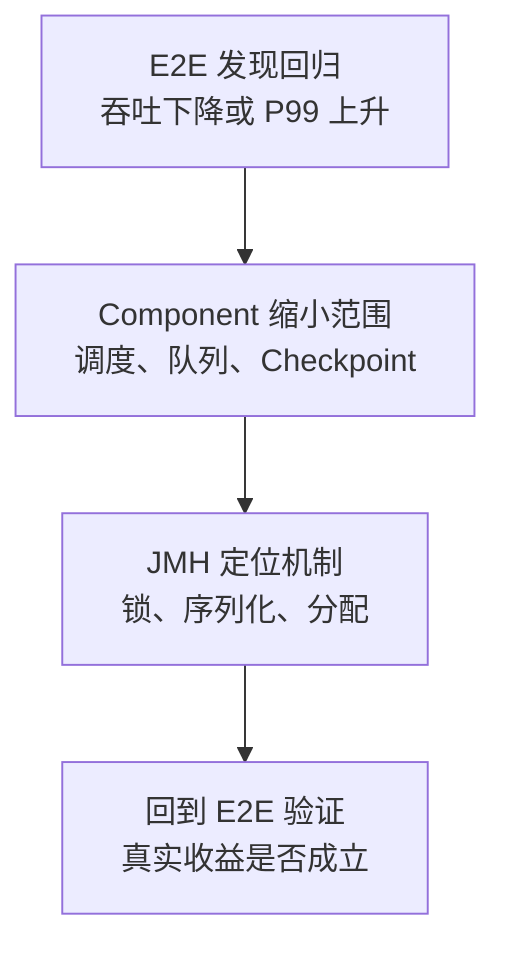

做性能测试最容易犯的错误，不是少写了一个 `@Warmup`，而是从一开始就没有定义清楚自己想证明什么。

“这个方法每秒能执行 40 亿次”“新版本快了 5%”“集群吞吐达到 100 万条每秒”，这些数字都可能是真的，却不一定能支持我们想表达的结论：

- 40 亿 `ops/s` 是稳定状态下单个 JVM 的结果，还是包含启动与 JIT 的真实调用成本？
- 5% 的差异来自代码，还是来自不同 JVM 进程、GC、调度、代码布局或机器状态？
- 100 万条每秒时，输入是否已经在外部队列里持续堆积？
- 延迟是在 Source 已经接收数据后开始计算，还是从数据真正生成时开始计算？
- 被比较的到底是引擎，还是 Kafka、Redis、网络或数据生成器？

本文精读三篇互相衔接的论文：

1. Andy Georges 等人在 OOPSLA 2007 发表的 [Statistically Rigorous Java Performance Evaluation](https://dri.es/files/oopsla07-georges.pdf)；
2. Tomas Kalibera 与 Richard Jones 在 ISMM 2013 发表的 [Rigorous Benchmarking in Reasonable Time](https://kar.kent.ac.uk/33611/)；
3. Jeyhun Karimov 等人在 ICDE 2018 发表的 [Benchmarking Distributed Stream Data Processing Systems](https://arxiv.org/pdf/1802.08496)。

这不是三篇论文的逐段翻译。全文会把它们压缩成一套可执行的方法：

> 先定义被测对象与性能语义，再识别随机性来自实验的哪一层；把时间花在真正贡献方差的层级上；最后用效应量及其不确定性，而不是一个最好看的单点数字，决定性能是否真的发生了变化。

阅读时需要区分三类内容：

- **论文事实**：论文的方法、数据和作者结论；
- **现代 JMH 映射**：把论文概念映射到 JMH 的 Fork、Warmup 和 Measurement；
- **工程推导**：面向 SeaTunnel Zeta 长期性能基线的设计建议，不代表论文原文结论。

## 一、三篇论文其实在回答同一个问题

三篇论文的尺度不同，但它们处理的是同一条证据链。

| 论文 | 被测对象 | 核心问题 | 最重要的答案 |
| --- | --- | --- | --- |
| 2007：Java 严谨性能评估 | JVM 上的程序 | 非确定性下怎样得到可信数字 | 区分启动与稳定态；跨 JVM 重复；报告置信区间 |
| 2013：合理时间内严谨测试 | 多层实验 | 到底在哪一层、重复多少次 | 估计各层方差与成本，把预算投向主要不确定性来源 |
| 2018：分布式流处理基准 | 流处理集群 | 吞吐和延迟怎样才不被背压与外部组件掩盖 | Driver 与 SUT 分离；测端到端延迟；寻找可持续吞吐 |

把它们放在一起，可以得到下面这条链路：



如果前面的定义错了，后面的统计再漂亮也只能精确地回答一个错误问题。

## 二、第一篇：Java 性能不是一个常数

### 2.1 论文为什么要挑战“跑几次取最好值”

JVM 程序的执行时间会被多种因素共同影响：

- 类加载和初始化；
- JIT 编译触发时机及优化层级；
- GC 策略、堆大小和对象布局；
- 线程调度；
- 操作系统缓存与后台活动；
- 硬件平台及输入数据。

同一份代码、同一个参数、同一台机器，连续两次运行也不保证得到相同结果。因此，性能不是源码的固定属性，而是给定实验条件下的随机变量。

论文调查了 50 篇 Java 性能研究文章，其中 16 篇没有说明实验方法，只有 4 篇报告了置信区间。常见做法包括取平均值、中位数、最好值、第二好值或最差值，但这些摘要方式隐含的性能问题完全不同。

例如三次测量为：

```text
10.1 ms, 10.4 ms, 14.8 ms
```

取最好值 `10.1 ms` 相当于问：

> 在观测到的最有利运行条件下，它最快能有多快？

这不是典型性能，更不是未来一次运行的可靠预期。随着重复次数增加，极值会越来越极端，所以 `best of 30` 与 `best of 3` 甚至不是同一个统计口径。

论文在多个 GC、堆大小、Benchmark 与硬件平台上做成对比较，发现当时流行的方法在部分实验中会产生最高约 16% 的误导性比较，超过 3% 的比较甚至会把优劣方向判断反。平均值和中位数总体好于最好值、第二好值和最差值；增加样本通常能改善均值与中位数，却不会修复极值统计量的语义问题。

**核心观点不是“平均值永远正确”，而是单点摘要必须和采样设计、不确定性一起解释。**

### 2.2 启动性能和稳定态性能不能混成一个指标

论文把 Java 性能拆成两个不同问题。

启动性能关心一个短生命周期程序从 JVM 启动到完成任务的成本，其中类加载和 JIT 本来就是现实成本。论文建议启动多个 JVM，每个 JVM 只执行一次被测任务，再跨 JVM 计算均值与置信区间。

稳定态性能关心长时间运行的服务或引擎在初始化之后的能力。论文建议：

1. 启动多个 JVM；
2. 每个 JVM 内执行多轮；
3. 丢弃预热阶段；
4. 在每个 JVM 内对稳定区间求一个摘要值；
5. 再跨 JVM 摘要值计算置信区间。

这一点非常关键：**同一 JVM 内连续迭代共享 JIT Profile、堆布局和进程状态，它们不是等价的独立样本。**



现代 JMH 已经把这套结构做成了 Harness：

| 论文概念 | JMH 概念 | 作用 |
| --- | --- | --- |
| VM invocation | Fork | 新建 JVM，重置 JIT Profile 与进程级状态 |
| Benchmark iteration | Warmup / Measurement iteration | 在同一 JVM 内按时间窗口重复调用 |
| Startup phase | Warmup | 让初始化、编译与缓存状态接近目标阶段 |
| Measurement | 测量迭代 | 产生最终统计数据 |

但使用 JMH 不等于实验自动严谨。JMH 能避免许多 Harness 级错误，却不知道你的业务问题是启动还是稳定态，也不知道状态初始化是否污染了被测路径，更不知道 Benchmark 是否代表生产负载。

### 2.3 置信区间到底告诉了我们什么

对于独立样本 \(x_1,\ldots,x_n\)，样本均值为：

\[
\bar{x}=\frac{1}{n}\sum_{i=1}^{n}x_i
\]

样本较小时，均值的双侧置信区间通常写成：

\[
\bar{x}\pm t_{1-\alpha/2,n-1}\frac{s}{\sqrt{n}}
\]

其中 \(s\) 是样本标准差，\(t\) 是 Student t 分布的分位点。

这里要修正一个常见说法：已经计算出的 95% 频率学置信区间，并不表示“真实均值有 95% 概率落在这个固定区间内”。更准确的解释是：

> 如果用同一方法反复采样并构造区间，长期来看约 95% 的区间会覆盖真实均值。

置信区间的宽度同时表达了样本波动与样本数量。样本数增加时，标准误大致按 \(1/\sqrt{n}\) 缩小：想把误差宽度减半，通常需要约四倍独立样本，而不是两倍。

论文实验中，多数 Benchmark 的变异系数约为 2%，但部分更高；最大值与最小值的差异，启动场景通常约 8%，稳定态场景可达约 20%。因此，看到 1%～3% 的“提升”时，不报告不确定性，几乎等于没有完成论证。

### 2.4 第一篇论文真正留下的遗产

这篇论文最有价值的不是某个固定的预热次数，而是四条方法论：

1. **先决定测启动还是稳定态。**
2. **把多个 JVM 进程纳入实验，而不是只在一个 JVM 中加迭代。**
3. **不要用最好的一次代替典型性能。**
4. **让样本数量服从目标精度，而不是迷信固定的 3、5 或 30 次。**

论文的 JavaStats 会在置信区间达到目标宽度时停止采样。某些低波动组合不到 10 个样本就能得到约 1% 的区间，而另一些组合做满 30 次后区间仍超过 3%。这已经指出了下一篇论文要解决的问题：**重复实验的预算应该怎样分配？**

## 三、第二篇：严谨不等于把所有层级都重复 30 次

### 3.1 重复次数相乘，是性能实验昂贵的真正原因

一次性能测量往往不是单层结构，而是嵌套过程：

```text
重新构建二进制
  └─ 启动 JVM
       └─ 完成预热
            └─ 执行测量迭代
```

如果每一层都机械重复 10 次，总测量数会变成 \(10^3=1000\)。再对 baseline 与 candidate 各做一遍，成本继续翻倍。

2013 年论文的突破点是：

> 不是每个潜在随机源都值得同等重复。只有会给最终结果带来可观随机方差的层级，才需要获得主要预算。

作者把实验层级抽象为：

- **Compilation / Build**：重新编译 VM、编译器或 Benchmark；
- **Execution**：使用同一二进制启动新进程；
- **Iteration**：同一进程中的重复测量。

这一模型可以直接扩展到分布式系统：

- Build；
- Cluster deployment；
- Job submission；
- Measurement window。

### 3.2 首先分清“未初始化”和“非独立”

论文对稳定态提出了两个门槛：

- **Initialized state**：明显的初始化开销已经结束；
- **Independent state**：后续测量近似独立同分布，不再受前序迭代系统性影响。

独立态比初始化态更强。曲线看起来平稳，不代表相邻样本没有自相关；连续下降、缓慢漂移、奇偶交替或阶段跳变，都可能让普通置信区间低估不确定性。

作者对 DaCapo Benchmark 的每次 Execution 最多检查 300 个 Iteration，发现大量 Benchmark/VM/平台组合在合理时间内仍达不到独立态。早期依赖“最近窗口的变异系数足够小就停止预热”的自动方法，有时过早停止，有时又运行过多。

这对 JMH 使用者有一个很实际的提醒：

> `Warmup(iterations = 5)` 是实验配置，不是“第五轮必然进入稳态”的数学证明。

如果 Benchmark 无法在合理时间进入独立态，论文的建议不是无限预热，而是对所有进程选择同一个、已经完成初始化的固定迭代位置，并在更高层级重复。这样改变了被测问题，但至少保证不同方案比较的是同一生命周期位置。

### 3.3 用方差分解决定钱花在哪里

假设一次预实验估计出：

- 迭代层方差 \(T_1^2\)；
- 进程层方差 \(T_2^2\)；
- 执行一次迭代的成本 \(c_1\)；
- 新启动一个进程并预热到可测状态的成本 \(c_2\)。

论文给出的相邻层最优重复数具有下面的结构：

\[
r_i \approx
\sqrt{\frac{c_{i+1}}{c_i}\frac{T_i^2}{T_{i+1}^2}}
\]

不用急着背公式，它表达的是一个非常符合工程直觉的关系：

- 低层测量越便宜，越可以多做；
- 某一层贡献的方差越大，越应该在该层重复；
- 新进程预热越昂贵，越值得在同一进程多取一些有效测量；
- 如果进程间方差远大于进程内方差，应少做同进程迭代，多启动新进程。

论文在 DaCapo 上得到的最优有效迭代数差异非常大：

| Benchmark | 每次新进程的预热成本 | 迭代层波动 | 进程层波动 | 最优有效迭代数 |
| --- | ---: | ---: | ---: | ---: |
| bloat6 | 110.0 s | 14.0% | 2.7% | 10 |
| lusearch9 | 12.3 s | 3.4% | 30.3% | 1 |
| xalan6 | 24.6 s | 7.2% | 8.9% | 2 |
| xalan9 | 71.8 s | 3.5% | 0.8% | 15 |

`lusearch9` 的主要随机性来自进程之间，所以在同一个 JVM 里做更多 Iteration 收益很低；`xalan9` 新启进程很贵、进程内测量便宜且进程间波动低，因此每个进程多测几轮更划算。

这组数据直接否定了“一套 Fork/Iteration 参数适用于所有 Benchmark”的想法。

### 3.4 先做一次定标实验，再长期复用

论文给出的工程流程不是每次都重新做复杂统计，而是：

1. 对每个 Benchmark/JVM/平台组合做一次规模较大的定标实验；
2. 判断何时完成初始化、能否达到独立态；
3. 估计 Build、Execution、Iteration 各层方差；
4. 记录每层成本；
5. 计算后续真实实验的重复分配；
6. 只有 Benchmark、JVM、平台发生显著变化时才重新定标。

这是一种一次投入、长期复用的“实验配置治理”。对于长期性能基线，它比每次 PR 随意设置 `forks=3, iterations=5` 更可靠，也更省时间。

### 3.5 为什么 p-value 不够，应该报告效应量

显著性检验主要回答：

> 如果两个系统实际没有差异，当前或更极端数据出现的概率有多大？

它不直接回答我们真正关心的问题：

> 新系统到底快了多少，这个幅度有多不确定？

样本足够大时，毫无工程价值的 0.1% 差异也可能“统计显著”。所以论文主张报告 Effect Size Confidence Interval，例如：

```text
candidate 相对 baseline 提升 5.5%，95% 置信区间为 [3.0%, 8.0%]
```

这句话同时给出：

- 方向：更快；
- 幅度：中心估计约 5.5%；
- 不确定性：合理范围约 3.0%～8.0%；
- 置信水平：95%。

而 `p < 0.05` 一项都没有完整给出。

## 四、第三篇：流处理的最大吞吐，不是“能塞进去多少”

前两篇论文解决了重复和统计问题，但进入分布式流处理之后，测量对象本身更容易出错。

### 4.1 Closed World 会制造协调遗漏

很多吞吐测试使用闭环模型：

```text
发送请求 -> 等待系统完成 -> 再发送下一批
```

系统变慢时，Driver 也跟着降低发送速度。最拥堵的时间段反而没有新的样本进入，这就是 Coordinated Omission：负载生成器与被测系统的停顿发生了协调，测试漏掉了用户真正经历的排队时间。

论文采用开放系统思路：Driver 按设定速率持续生成带时间戳的事件，并在 Driver 与 SUT 之间设置队列。



如果系统处理不过来，队列会增长，Event-time Latency 会持续上升。系统不能再通过降低摄入速度把过载藏起来。

### 4.2 Processing-time Latency 会把排队时间抹掉

论文区分了两个指标：

\[
L_{event}=t_{output}-t_{generated}
\]

\[
L_{processing}=t_{output}-t_{ingested}
\]

其中：

- `generated`：事件在外部 Driver 中生成；
- `ingested`：事件进入 SUT 的 Source；
- `output`：结果离开 SUT 的输出算子。

过载时，背压会降低 Source 摄入速度。数据可能在 SUT 外排队几十秒，但进入 Source 后只用几毫秒就完成。因此 Processing-time Latency 看起来稳定，Event-time Latency 却持续恶化。



图中的数值是解释概念的原创示意，不是论文实验数据。它说明：**系统内部服务时间稳定，不能证明用户端到端等待时间稳定。**

### 4.3 有状态算子的延迟必须先定义“输出继承哪个时间”

Map 是一条输入对应一条输出，时间戳容易继承；Window Aggregation 或 Join 的一条输出由多条输入共同产生，延迟从哪条输入开始计算并不显然。

论文的定义是：窗口输出继承所有贡献输入中最大的 Event Time。

\[
t_{output\ event}=\max(t_{event,1},\ldots,t_{event,n})
\]

例子：

```text
窗口输入事件时间：580, 590, 600
窗口结果发出时间：610
窗口结果 Event Time：max(...) = 600
Event-time Latency：610 - 600 = 10
```

这样排除了“等待窗口自然闭合”本身的业务时间，只测窗口准备完成后系统产生结果的延迟。对于 Join，先确定匹配输入所属窗口的最大时间，再让每条 Join 输出继承参与匹配记录的最大时间。

这不是唯一可能的定义。若业务关心最早事件等待了多久，可以使用最小时间或同时报告 `oldest-event latency`。论文更重要的贡献是提醒我们：**有状态算子不先定义时间传播规则，所谓端到端延迟没有可比性。**

### 4.4 Driver 和 SUT 必须分离

论文不使用 Kafka 读取测试数据，也不把输出写入 Redis，因为先前一些流处理比较实际上被 Kafka 或 Redis 限制，最后比较的是外部组件而不是引擎。

它采用：

- 可水平扩展的内存数据生成器；
- 生成能力高于最快 SUT 的上限；
- Driver 与 SUT 使用不同机器；
- 吞吐在 Driver/Queue 边界观测；
- 延迟在 SUT 输出侧观测；
- 集群时钟通过本地 NTP 同步。

这条原则需要结合测试目标理解：

| 想回答的问题 | 是否应该包含 Kafka / 外部 Sink |
| --- | --- |
| 引擎核心执行能力 | 不应让外部系统成为瓶颈 |
| Kafka Source Connector 能力 | 必须包含 Kafka，并单独证明 Kafka 有余量 |
| 生产 Pipeline 端到端容量 | 应包含真实外部系统，但结论属于整个 Pipeline |

不存在永远正确的边界，只有与性能声明匹配的边界。

### 4.5 可持续吞吐把吞吐和延迟重新绑在一起

论文给出 Sustainable Throughput 的定义：

> 系统在不出现长期背压、即 Event-time Latency 不持续增长时，能够承受的最高事件到达率。

测试方法是先给出明显过高的生成速率，再逐步降低，直到外部队列不再持续增长、Event-time Latency 不再呈长期上升趋势。



所以“短时间成功摄入 120 万条/秒”并不等于可持续吞吐为 120 万条/秒。系统可能只是把数据从 Driver 搬进了更靠内的 Buffer。

论文在 2018 年使用 Storm 1.0.2、Spark 2.0.1 和 Flink 1.1.3 得到了一组具体排名与数值。这些数据只能说明当时版本、工作负载、调优和硬件下的表现，不能作为今天选择引擎的排行榜。真正应该继承的是测试方法：

- 同时看吞吐时间序列和延迟分布；
- 用 Skew、Window Size、Join、流量尖峰等场景暴露架构差异；
- 检查瓶颈是否转移到网络、调度或单个 Hot Key；
- 报告 P90/P95/P99，而不只报告平均延迟。

论文自己也明确留下了边界：Exactly-once、乱序/迟到处理、故障恢复等功能与吞吐/延迟之间的取舍仍需要后续研究。因此，一个现代引擎基准不能只有 Happy Path。

## 五、把三篇论文合成一套证据体系

### 5.1 Microbenchmark、Component Benchmark 与 End-to-End 不能互相替代

| 层级 | 典型工具/环境 | 能证明什么 | 不能证明什么 |
| --- | --- | --- | --- |
| Microbenchmark | JMH | 序列化、队列、锁、对象分配等局部路径 | 集群吞吐、背压、网络与调度 |
| Component Benchmark | Mini Cluster / 单机引擎 | Task 执行、Queue、调度、Checkpoint 子系统 | 真实多机网络、外部系统容量 |
| End-to-End | 独立 Driver + 集群 SUT | 可持续吞吐、端到端延迟、扩展性与恢复代价 | 精确定位某一行代码为什么变慢 |

正确做法不是选择其中一个，而是让三层形成定位闭环：



JMH 快了 20%，端到端可能完全不变，因为该路径只占总成本的 1%；端到端变慢，也可能不是任何单个方法变慢，而是背压传播、资源竞争或负载倾斜发生变化。

### 5.2 一个结果至少包含四层上下文

任何可长期比较的性能结果都应该保存：

1. **身份**：Git SHA、分支、构建产物校验值；
2. **环境**：CPU 型号与 Governor、核心数、内存、NUMA、OS、Kernel、JDK、JVM 参数、容器限制；
3. **实验设计**：Fork、Warmup、Measurement、负载模型、并行度、数据分布、窗口、状态规模；
4. **原始与摘要指标**：逐轮数据、均值/中位数、标准差、置信区间、分位数、GC、CPU、内存、网络、积压。

只保存最终 `score`，未来无法判断变化来自代码还是环境，也无法用新的统计方法重新分析历史数据。

## 六、落到 JMH：一个能回答问题的微基准长什么样

下面的例子不是为了展示所有注解，而是说明实验边界。

```java
@BenchmarkMode(Mode.AverageTime)
@OutputTimeUnit(TimeUnit.NANOSECONDS)
@Warmup(iterations = 8, time = 1)
@Measurement(iterations = 8, time = 1)
@Fork(value = 5)
public class SerializerBenchmark {

    @State(Scope.Thread)
    public static class Input {
        Serializer serializer;
        SeaTunnelRow row;

        @Setup(Level.Trial)
        public void setup() {
            serializer = createSerializer();
            row = createRepresentativeRow();
        }
    }

    @Benchmark
    public void serialize(Input input, Blackhole blackhole) {
        byte[] bytes = input.serializer.serialize(input.row);
        blackhole.consume(bytes);
    }
}
```

逐项检查：

- `Level.Trial` 的初始化不计入单次序列化时间；
- 每个线程拥有独立输入，避免误测共享状态竞争；
- `Blackhole` 阻止结果因不可观察而被消除；
- 多个 Fork 观察进程级/JIT 差异；
- Warmup 和 Measurement 参数应该来自定标，而不是复制示例；
- 测试数据必须覆盖生产中有代表性的字段数量、字符串长度、Null 比例和嵌套结构。

还需要一个空操作或最小路径 Baseline，用来识别 Harness 与调用开销；必要时使用 `-prof gc` 观察 `gc.alloc.rate.norm`，判断“更快”是否来自把成本转移到分配或 GC。

### 6.1 怎样比较 baseline 和 candidate

不要只看两行：

```text
baseline   102.0 ns/op
candidate   98.5 ns/op
```

应该计算方向正确的效应量。对于 `ns/op`：

\[
improvement=\frac{\mu_{base}-\mu_{new}}{\mu_{base}}
\]

对于 `ops/s`：

\[
improvement=\frac{\mu_{new}-\mu_{base}}{\mu_{base}}
\]

然后为比值或改变量构造置信区间，并设置最小工程关注阈值 \(\delta\)。例如 \(\delta=2\%\)：

| 95% 效应量区间 | 结论 |
| --- | --- |
| 整体高于 +2% | 有意义的性能提升 |
| 整体低于 -2% | 有意义的性能回归 |
| 完全位于 [-2%, +2%] | 工程上近似等价 |
| 跨过阈值或跨过 0 | `INCONCLUSIVE`，证据不足 |

`INCONCLUSIVE` 不是失败，而是诚实结论：当前噪声与样本预算不足以区分小变化。盲目把它判成“无变化”或“回归”都会制造错误决策。

### 6.2 怎样读 JMH 的 `± Error`

例如：

```text
3993070397.039 ± 270530283.867 ops/s
CI (99.9%): [3722540113.172, 4263600680.907]
```

它表达的不是“每次都能达到约 39.9 亿”，也不是“结果有 99.9% 概率在区间内”。它是对当前采样和聚合模型下均值不确定性的描述。

如果要判断新实现是否更快，不能只检查两个 Score 谁大，也不能简单用“两个单独置信区间是否重叠”代替差值/比值的置信区间。真正的比较对象是 **candidate 相对 baseline 的效应量分布**。

## 七、落到 SeaTunnel Zeta：一套长期性能基线应该怎样分层

以下是从三篇论文推导出的工程方案。

### 7.1 第一层：JMH 机制基准

优先覆盖性能敏感、边界稳定且可独立执行的路径：

- Disruptor / BlockingQueue 入队出队；
- SeaTunnelRow 序列化与反序列化；
- Transform 调用链；
- State 操作与快照元数据处理；
- Checkpoint 协调器的核心数据结构；
- 多线程调度、锁竞争与任务状态转换。

输出不仅包括 `ops/s` 或 `ns/op`，还应包括：

- `gc.alloc.rate.norm`；
- GC 次数与时间；
- 参数组合；
- Fork 级原始结果；
- JDK/JVM/硬件指纹。

### 7.2 第二层：Mini Cluster 引擎链路

使用可控的内存 Source/Sink，避免外部 Connector 抢走瓶颈，覆盖：

- Source → Queue → Transform → Sink；
- 单表与多表；
- 窄记录与宽记录；
- 均匀 Key 与 Hot Key；
- 无状态与有状态；
- 无 Checkpoint、周期 Checkpoint、大状态 Checkpoint；
- 不同并行度和不同背压强度。

这层要回答：“Zeta 自己的执行链路发生了什么变化？”

### 7.3 第三层：独立 Driver 的分布式基准

Driver 必须：

- 与 Worker 资源隔离；
- 以固定速率或可复现速率曲线生成数据；
- 在事件生成时写入时间戳和序列号；
- 记录已生成、已摄入、已输出、丢失和重复数量；
- 自身吞吐至少高于 SUT 目标上限，并提供余量证明。

最小场景矩阵：

| 维度 | 基线场景 | 压力场景 |
| --- | --- | --- |
| 到达率 | 固定 50% 容量 | 搜索可持续上限、突增与回落 |
| Key 分布 | 均匀 | Zipf / 单 Hot Key |
| 算子 | Map / Filter | Window Aggregation / Join |
| 状态 | 小状态 | 大状态、增量增长 |
| 可靠性 | 无故障 | Worker Kill、恢复、Checkpoint |
| 语义 | At-least-once | Exactly-once 与外部提交 |

主指标应该是：

- Sustainable Throughput；
- Event-time Latency 的 P50/P95/P99；
- Backlog/Queue 随时间的斜率；
- CPU、内存、GC、网络、磁盘；
- Checkpoint Duration、Alignment/Channel State、恢复时间；
- 丢失、重复与结果正确性。

### 7.4 PR Gate 与 Nightly 不应该跑同一套实验


- **PR Gate**：少量高信噪比场景；发现明显回归；严格限制耗时；
- **Nightly**：更多 Fork/Cluster Run、场景矩阵和历史趋势；
- **Release**：长时间运行、故障恢复、Exactly-once、资源泄漏；
- **定标任务**：平台/JDK/引擎大版本变化时重新估计方差和重复数。

PR Gate 不应因为证据不足就随机阻塞。建议三态输出：

```text
PASS         没有发现超过阈值的回归
REGRESSION   置信区间整体越过回归阈值
INCONCLUSIVE 样本不足或波动过大，转 Nightly/人工复核
```

## 八、一个可执行的实验 Cookbook

### Step 1：写下性能声明

不要写“测试 Zeta 性能”，而要写：

```text
在固定 JDK、硬件、并行度和均匀 Key 下，
candidate 是否使无外部 I/O 的 Zeta 核心 Pipeline
可持续吞吐提升至少 3%，且 P99 Event-time Latency 不恶化超过 5%？
```

声明决定 SUT 边界、指标、阈值和负载。

### Step 2：验证 Driver 与观测器不成为瓶颈

把 SUT 替换成最小消费端，测 Driver 上限；检查 CPU、网络和队列。若 Driver 只能产生 100 万条/秒，就不能用它证明 SUT 上限也是 100 万条/秒。

### Step 3：做定标实验

对每个关键场景采集较多的：

- Fork/Cluster Run；
- Measurement Window；
- Build（如果怀疑构建或代码布局有随机性）。

检查时间序列、自相关、分布和异常值来源，估计各层方差与成本。

### Step 4：固定生命周期位置

明确：

- 预热何时结束；
- 状态是否已经达到目标规模；
- JIT/类加载是否属于被测成本；
- Checkpoint 是否已经稳定进入周期；
- 测量窗口是否避开部署与清理阶段。

### Step 5：运行 baseline 与 candidate

尽可能交错或随机化顺序，避免机器温度、系统漂移、邻居任务等时间趋势只偏向一侧：

```text
B1, C1, C2, B2, C3, B3 ...
```

两者必须使用相同输入、配置、数据分布和资源配额。

### Step 6：先验证正确性，再看速度

至少检查：

- 输入与输出计数关系；
- 聚合/Join 结果；
- 丢失与重复；
- 异常和重试；
- 故障恢复后的最终一致性。

一个通过丢数据换来的吞吐提升不是性能优化。

### Step 7：输出效应量、区间和原始数据

推荐摘要：

```text
吞吐：+4.8%，95% CI [+3.1%, +6.5%]
P99 Event-time Latency：+1.2%，95% CI [-0.8%, +3.4%]
CPU / million records：-3.6%
结论：吞吐达到预设 +3% 门槛，延迟未越过 +5% 退化门槛。
```

## 九、最容易把结果做假的十种方式

| 错误 | 为什么错 | 修复 |
| --- | --- | --- |
| 只跑一次 | 无法估计随机性 | 在最高随机层级重复 |
| 只在一个 JVM 多迭代 | 低估进程/JIT 差异 | 使用多个 Fork |
| 取最好值 | 把偶然有利状态当典型性能 | 报告分布与区间 |
| 固定预热 5 次就宣布稳态 | 配置不是稳态证据 | 定标并检查趋势/自相关 |
| 把每次内部调用当独立样本 | 伪造巨大样本量 | 以 Fork/Run 等实验单位聚合 |
| 只报 p-value | 没有变化幅度与工程意义 | 报告效应量置信区间 |
| 只报平均延迟 | 尾延迟与尖峰被抹平 | 报 P50/P95/P99 和时间序列 |
| 在 SUT 内开始计时 | 背压前的排队被忽略 | 从外部生成时间计算 |
| 用最大摄入率当吞吐 | Buffer 可以暂存过载 | 寻找可持续吞吐 |
| 不保存环境和原始数据 | 无法复现与重新分析 | 结果与环境清单一起版本化 |

## 十、结论：性能评估的产物不是数字，而是可信决策

三篇论文合在一起，可以压缩成五条原则：

1. **性能是带条件和随机性的分布，不是源码上的常数。**
2. **启动、稳定态、服务时间和端到端时间是不同指标，不能混用。**
3. **重复必须发生在随机性真正出现的层级，固定次数不是严谨的同义词。**
4. **吞吐必须和积压、延迟一起解释；可持续能力比瞬时摄入峰值更有价值。**
5. **最终要报告变化幅度及其不确定性，并允许得出“证据不足”。**

对于 JMH，严谨意味着理解 Fork、Warmup、Measurement 背后的独立性与生命周期；对于 Zeta，严谨意味着把 Driver、SUT、外部系统和观测边界拆清楚，并用可持续吞吐与 Event-time Latency 观察背压。

真正成熟的性能框架，不是每次都给出一个绿色或红色结论，而是能够回答：

```text
我们测了什么？
为什么这些样本能代表它？
变化有多大？
不确定性有多大？
瓶颈属于谁？
这个证据足以支持什么工程决策？
```

当这些问题都有明确答案时，Benchmark 才从“跑分工具”变成了引擎演进的性能证据系统。

## 参考资料

1. Andy Georges, Dries Buytaert, Lieven Eeckhout, [Statistically Rigorous Java Performance Evaluation](https://dri.es/files/oopsla07-georges.pdf), OOPSLA 2007.
2. Tomas Kalibera, Richard Jones, [Rigorous Benchmarking in Reasonable Time](https://kar.kent.ac.uk/33611/), ISMM 2013.
3. Jeyhun Karimov et al., [Benchmarking Distributed Stream Data Processing Systems](https://arxiv.org/pdf/1802.08496), ICDE 2018.
4. OpenJDK, [Java Microbenchmark Harness (JMH)](https://github.com/openjdk/jmh).
5. OpenJDK JMH Samples, [JMHSample_02_BenchmarkModes](https://github.com/openjdk/jmh/blob/master/jmh-samples/src/main/java/org/openjdk/jmh/samples/JMHSample_02_BenchmarkModes.java).
