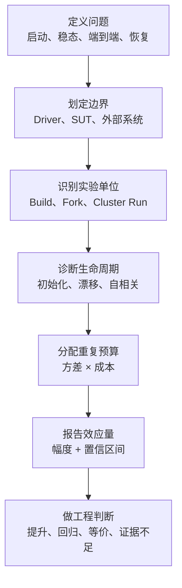
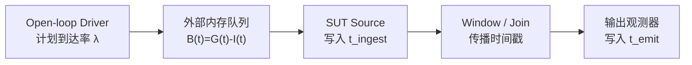
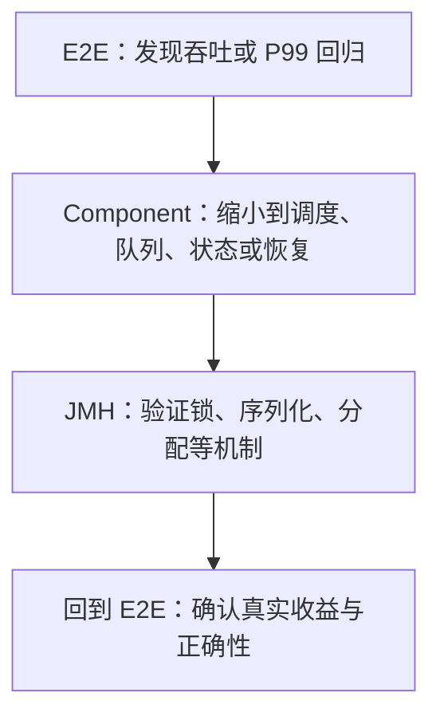

做性能测试最危险的结果，不是程序报错，而是它顺利跑完，打印出一个看起来很精确、实际上回答错了问题的数字。

```text
baseline   102.0 ns/op
candidate   98.5 ns/op
```

仅凭这两行，我们还不知道：

- 3.5 ns 的差异来自代码，还是来自不同 JVM 进程、JIT、GC 与机器状态？
- 这里的 40 次测量，是 40 个独立 JVM，还是同一个 JVM 中高度相关的 40 个 Iteration？
- 被测的是启动性能、稳定态性能，还是某个任意生命周期位置？

分布式流处理的数字更容易骗人：

```text
ingest throughput = 1,000,000 events/s
processing latency P99 = 20 ms
```

它仍然可能遗漏了三十秒的外部排队时间，甚至通过丢弃慢事件把 P99 “优化”得更低。

本文精读三篇互相衔接、也互相修正的论文：

1. Andy Georges 等人在 OOPSLA 2007 发表的 [Statistically Rigorous Java Performance Evaluation](https://dri.es/files/oopsla07-georges.pdf)；
2. Tomas Kalibera 与 Richard Jones 在 ISMM 2013 发表的 [Rigorous Benchmarking in Reasonable Time](https://kar.kent.ac.uk/33611/)；
3. Jeyhun Karimov 等人在 ICDE 2018 发表的 [Benchmarking Distributed Stream Data Processing Systems](https://arxiv.org/pdf/1802.08496)。

这不是逐段翻译。每篇论文都沿着同一条路径来读：

> 原始问题 → 实验设计 → 关键数据 → 推理过程 → 结论边界 → 后续论文如何修正

文中还会严格区分三类内容：

- **论文事实**：论文的方法、实验数据与作者结论；
- **现代工具映射**：把论文概念映射到 JMH、集群基准等今天常用的工具；
- **工程扩展**：为了让方法可自动执行而补充的阈值、算法和示例，不冒充论文原文。

## 一、三篇论文不是三个摘要，而是一条方法演进

三篇论文的被测对象从单 JVM 扩展到多层实验，再扩展到分布式流系统，但它们始终在追问同一件事：

> 一个性能声明，需要怎样的实验与统计证据才站得住？

| 论文 | 它修复的主要错误 | 关键方法 | 它没有解决的问题 |
| --- | --- | --- | --- |
| 2007：Java 严谨性能评估 | 单次运行、取最好值、混淆启动与稳态 | 多 JVM 重复、均值与置信区间、启动/稳态分离 | 用低 CoV 找稳态仍可能误判；没有优化多层重复预算 |
| 2013：合理时间内严谨测试 | 每层机械重复、把相关迭代当独立样本 | 初始化/独立性诊断、分层方差、成本最优重复、比值区间 | 主要研究执行时间；不定义分布式流系统的吞吐与延迟语义 |
| 2018：流处理系统基准 | 闭环负载、背压隐藏、错误计时边界、外部组件喧宾夺主 | 独立 Driver、开放负载、Event-time Latency、Sustainable Throughput | 跨独立集群运行的不确定性处理较弱；不覆盖所有可靠性语义 |

真正值得连读的地方有两处。

第一，2013 年论文直接修正了 2007 年论文的一项稳态判断思路：

> “最近一段时间波动很小”不等于“已经稳定且样本独立”。

第二，2018 年论文虽然重新定义了流系统的测量边界，却没有充分解决跨部署、跨进程、跨运行的不确定性：

> 流系统也需要把 2007/2013 年的分层实验思想加回来；一亿条记录不是一亿次独立实验。

三篇论文合起来才形成完整证据链：



后面所有公式和工具配置，都服务于这条链。只要前面的测量语义错了，后面的统计只能更精确地回答一个错误问题。

## 二、2007：Java 性能不是常数，最好的一次也不是答案

### 2.1 论文先证明：当时的问题不是偶发现象

作者先审查了 50 篇 Java 性能研究文章：

- 16 篇没有说明实验方法；
- 10 篇报告最好值，8 篇报告平均值；
- 中位数和第二好值各 4 篇，最差值 3 篇；
- 只有 4 篇报告置信区间；
- 也就是说，大量工作使用某个单点摘要，却没有解释它究竟代表什么性能问题。

随后，论文构造了一个相当大的实验空间：

- 5 种垃圾收集策略；
- 21 个堆大小；
- 14 个 Benchmark；
- 3 台不同机器。

5 种 GC 两两比较会得到：

\[
\binom{5}{2}=10
\]

组比较。每个 Benchmark 又有 21 个堆大小，所以每个 Benchmark 包含：

\[
21\times 10=210
\]

组 GC 对比。

作者用 ANOVA 和 Tukey HSD 的同时 95% 置信区间作为严谨参照，再检验当时常见的简化做法：在 \(n=3,5,10,30\) 次运行中取 best、second best、mean、median 或 worst，并设置 1%～3% 的最小关注差异 \(\theta\)。

实验采样本身也区分两种问题：

- 启动性能使用 30 个 JVM，每个 JVM 只执行一次；
- 稳定态性能使用 10 个 JVM，每个 JVM 最多执行 30 个 Iteration。

这一步很重要：论文不是泛泛地说“统计学更好”，而是把常用简化方法逐项与更严谨的成对比较结论对照。

### 2.2 为什么 `best of N` 从结构上就有偏

假设一次运行时间 \(X\) 的累积分布函数是 \(F(x)\)，\(N\) 次独立运行中最好值为：

\[
M_N=\min(X_1,\ldots,X_N)
\]

那么：

\[
P(M_N\le x)=1-\left(1-F(x)\right)^N
\]

当 \(N\) 增加时，\(M_N\) 会系统性地向更小、更“好看”的方向移动。这不是实现变快了，而是抽取极端值的机会增加了。

因此：

- `best of 3` 与 `best of 30` 估计的不是同一个量；
- 多跑几次不会修复最好值，它只会把偏差推得更远；
- 两个方案的尾部分布形状不同，best 还可能偏爱波动更大的那个方案。

考虑两个实现：

| 实现 | 典型时间 | 波动 | 一次异常好运 |
| --- | ---: | ---: | ---: |
| A | 100 ms | 很小 | 98 ms |
| B | 103 ms | 很大 | 91 ms |

若取 30 次中的最好值，B 很可能因为一次 `91 ms` 被宣布获胜；但随机挑选一次未来运行，A 仍更可能更快。best 回答的是“我这批样本里最幸运的一次有多快”，不是典型性能，也不是期望性能。

论文 Figure 1 的 GC 案例正展示了这种错觉：`best of 30` 会让某些本应有差异的策略看起来接近，也会让 SemiSpace 因偶然出现一次极好运行而获得虚假优势；完整置信区间给出的比较关系并不相同。

### 2.3 论文怎样判断简化结论是否误导

为了避免“误导”成为主观形容，论文把简化方法与严谨参照的关系分类。可以把核心意思概括为：

| 类别 | 简化方法与严谨结果的关系 | 风险 |
| --- | --- | --- |
| Indicative | 方向与是否存在有意义差异的结论一致 | 可以提供正确指示 |
| Misleading | 简化方法声称存在差异，严谨分析却没有足够证据，或反之 | 夸大或掩盖差异 |
| Incorrect | 连优劣方向都与严谨结果相反 | 直接导致错误决策 |

论文发现，启动性能实验中某些常用方法的误导性比较最高约 16%；稳定态比较在较严格的 \(\theta=1\%\) 条件下，误导比例可以超过 20%；还有超过 3% 的比较会给出相反方向。这里的百分比依赖具体实验设置，不能脱离启动/稳态、样本数、摘要方法与 \(\theta\) 单独引用。

稳定态的误导比例还会随工程阈值改变：论文报告 \(\theta=2\%\) 时仍可超过 10%，\(\theta=3\%\) 时仍可超过 5%。这说明“只关心大变化”会降低风险，却不会自动让错误统计方法变正确。

论文还做了 Replay Compilation 实验来控制 JIT 编译计划。误导没有消失：启动场景仍约 5%，稳定态仍接近 4%。所以随机 JIT 决策只是噪声来源之一，不是全部解释；进程地址布局、系统状态、GC 与其他运行时因素仍会造成变化。

正确解读不是“平均值永远无敌”。论文数据表明 mean 与 median 总体比极值稳定，但任何单点摘要都必须和下面三件事一起出现：

1. 样本是怎样产生的；
2. 哪些样本可视为独立；
3. 估计值有多不确定。

### 2.4 启动性能和稳定态性能是两个不同问题

论文把 Java 性能拆成两个 Estimand，也就是两个真正想估计的对象。

#### 启动性能

启动性能关心短生命周期程序从 JVM 启动、类加载、初始化、JIT 到完成任务的总成本。论文的方法是：

1. 启动多个独立 JVM；
2. 每个 JVM 只执行一次目标任务；
3. 把 VM invocation 作为独立实验单位；
4. 跨 invocation 计算均值和置信区间。

论文还排除批次中的首次 invocation，以减少操作系统缓存和共享库首次装载状态造成的特殊影响。这里不能机械照搬“丢第一轮”：如果生产语义恰好就是冷机首次启动，那些成本反而属于被测对象。关键是明确你到底要测冷启动、温启动还是典型启动。

#### 稳定态性能

稳定态性能关心长时间运行程序完成初始化后的能力。论文的方法可写成：

```text
p 个独立 JVM
  └─ 每个 JVM 执行 q 个 Iteration
       └─ 找到稳定窗口并在 JVM 内求均值
            └─ 用 p 个 JVM 均值构造跨 JVM 区间
```

同一 JVM 内的迭代共享：

- JIT Profile 与已编译代码；
- 堆布局与 GC 历史；
- 类加载状态；
- 进程地址空间与代码布局；
- 线程和缓存状态。

所以 5 个 Fork × 8 个 Measurement Iteration 不能直接解释成 40 个独立 JVM 实验。更合理的第一步是每个 Fork 先产生一个摘要，再以 Fork 为独立单位比较。

现代 JMH 的结构与论文概念大致对应：

| 论文概念 | JMH 概念 | 它控制什么 |
| --- | --- | --- |
| VM invocation | Fork | 新 JVM、JIT Profile 与进程状态 |
| Initialization iterations | Warmup | 测量前的生命周期位置 |
| Benchmark iterations | Measurement iteration | 同一 JVM 内的时间窗口 |
| Harness 防护 | State、Blackhole、模式选择 | 初始化边界、死代码消除、测量语义 |

JMH 能消除大量 Harness 级错误，但它不知道业务声明是什么，也不会自动证明第 5 次 Warmup 后一定稳态。

### 2.5 置信区间表达的是“不确定性”，不是装饰

对独立样本 \(x_1,\ldots,x_n\)，样本均值为：

\[
\bar{x}=\frac{1}{n}\sum_{i=1}^{n}x_i
\]

在样本近似独立、分布条件合理且总体方差未知时，小样本均值区间通常写成：

\[
\bar{x}\pm t_{1-\alpha/2,n-1}\frac{s}{\sqrt{n}}
\]

95% 频率学置信区间不是“真实均值有 95% 概率落在这个已经固定的区间内”。准确解释是：

> 如果按同一规则反复采样并构造区间，长期来看约 95% 的区间会覆盖真实均值。

标准误大致随 \(1/\sqrt n\) 缩小，所以想把区间宽度减半，通常需要约 4 倍独立样本。这里“独立”是关键：把同一 JVM 中相邻调用数量乘以 1000，并不会神奇地得到 1000 个进程级独立证据。

另一个常见误解是“样本达到 30 就一定正态”。中心极限定理是渐近结果，不是 \(n=30\) 的魔法开关；自相关、重尾、双峰与分层结构不会因为凑到 30 个数字自动消失。

论文自己的数据也否定了固定样本数：`jess + GenCopy` 做满 30 次后，论文口径下的 CI width 仍超过 3%；`db + MarkSweep/GenMS` 不到 10 次就能达到约 1%。注意 2007 年图表使用的是 CI **全宽**，后续论文的一些精度表使用 CI **半宽**，两者不能不加说明地直接比较。

### 2.6 第一篇论文的真正贡献与局限

它留下的核心遗产是：

1. 启动与稳定态必须分开定义；
2. 多 JVM invocation 是 Java 性能实验的基本单位；
3. 极值不是典型性能；
4. 结果必须包含不确定性；
5. 样本数应由目标精度决定，而不是迷信固定次数。

但它判断稳定态时使用了“最近一段 Iteration 的 CoV 低于阈值”一类收敛窗口。这个方法有一个根本漏洞：

> 低波动只说明点挤得近，不说明它们没有趋势、自相关或状态切换。

这正是 2013 年论文要修正的地方。

## 三、2013：低 CoV 不等于稳态，重复还必须花在正确层级

### 3.1 六年之后，性能论文仍普遍没有报告不确定性

Kalibera 与 Jones 审查了 122 篇论文。其调查中：

- 90 篇使用执行时间；
- 71 篇没有报告任何变异信息；
- 65 篇报告性能比值；
- 只有 3 篇尝试给比值构造置信区间。

这组数字说明，问题已经不只是“有没有多跑几次”。很多工作即便有大量测量，仍然没有回答：

- 这些测量属于哪一层？
- 哪一层贡献了主要随机性？
- 两个均值的比值有多不确定？
- 为了缩小区间，下一分钟应该用来多跑 Iteration，还是多启动一个进程？

### 3.2 2013 年论文怎样修正 2007 年的稳态方法

先看四种看似“最近窗口波动都不大”的序列：

| 时间序列形态 | 最近窗口 CoV | Lag / ACF 特征 | 能否直接当独立稳态样本 |
| --- | ---: | --- | --- |
| 围绕常数随机波动 | 低 | 没有明显结构 | 可能可以，仍需结合上下文 |
| 缓慢下降 | 低 | 显著正相关 | 不可以，仍在漂移 |
| 奇偶交替 | 低 | Lag-1 显著负相关 | 不可以，存在周期结构 |
| 突然换挡/双峰 | 某些窗口很低 | 状态分层或跳变 | 不可以，存在阶段变化 |
| 很晚发生 Deoptimization | 前期可很低 | 后段出现结构突变 | 前期“稳态”不能外推 |

论文把要求拆成两层：

- **Initialized state**：明显初始化成本已经结束；
- **Independent state**：后续样本不仅看似平稳，而且相邻观测没有可见的系统依赖。

作者检查 run-sequence plot、lag plot 与自相关函数（ACF），并将真实序列与随机重排序列的结构作对照。结论并不乐观：在 DaCapo、多个 JVM 与平台组合中，即使一次 Execution 观察最多 300 个 Iteration，也有不少组合无法在合理时间达到独立态。

论文给出的三个具体组合，比抽象批评更能说明问题：

| Benchmark / 平台 | 完成初始化 | 达到独立态 | DaCapo Harness 选择 | Georges 2007 方法选择 |
| --- | ---: | ---: | ---: | ---: |
| avrora9 / P1 | 2 | 128 | 4 | 1 |
| lusearch9 / P1 | 3 | 5 | 5 | 247 |
| xalan6 / P1 | 2 | 2 | 29 | 不收敛 |

- `avrora9`：CoV 方法在初始化完成前就停止；
- `lusearch9`：第 5 轮已经达到论文判定的独立态，却预热到第 247 轮；
- `xalan6`：第 2 轮已经独立，算法反而无法收敛。

这不是少几轮、多几轮的微小浪费。论文指出，选择不同的所谓“稳态 Iteration”，最终性能结果可能相差几十个百分点。

这给出三个重要结论：

1. `Warmup(iterations = 5)` 只是配置，不是证明；
2. 无限增加 Warmup 可能仍得不到独立样本；
3. 若无法达到独立态，可以在所有 Execution 中固定一个已经初始化的生命周期位置，再跨 Execution 比较。它改变了被测问题，却比每次随意挑“看起来最稳”的窗口更可比。

需要注意，ACF 也不是机械通过即证明一切。有限样本可能检不出弱依赖；真正严谨的做法是把时间序列、领域机制与统计诊断一起解释。

### 3.3 嵌套随机效应模型：为什么低层重复消不掉高层噪声

一次 Java 实验可以简化为：

\[
Y_{b,e,i}
=\mu+B_b+E_{b,e}+I_{b,e,i}
\]

其中：

- \(B_b\)：第 \(b\) 次 Build 带来的偏移；
- \(E_{b,e}\)：同一 Build 下第 \(e\) 个 JVM Execution 的偏移；
- \(I_{b,e,i}\)：同一 JVM 中第 \(i\) 个 Iteration 的波动；
- \(\mu\)：目标配置的总体平均性能。

这不是说每种随机性都一定存在，而是要求先用定标实验判断它是否存在、贡献多大。

若有 \(B\) 个 Build、每个 Build 有 \(F\) 个 Fork、每个 Fork 有 \(M\) 个有效 Iteration，并把三个方差分量分别记作 \(\tau_B^2,\tau_F^2,\tau_I^2\)，平衡设计下总体均值方差近似为：

\[
\operatorname{Var}(\bar Y)
=\frac{\tau_B^2}{B}
+\frac{\tau_F^2}{BF}
+\frac{\tau_I^2}{BFM}
\]

所以：

- 增加 Iteration 只能缩小最后一项；
- 增加 Fork 不能消除 Build 方差；
- 若结论希望推广到“重新构建后的二进制”，却只测一个固定 JAR，那么 Build 层根本没有获得重复；
- 仍存在随机性的最高层，决定真正的独立样本量与区间自由度。

JMH 负责 Fork 与 Iteration，但不会替你重新构建 Benchmark JAR；Thread 和单次 Operation 是负载构成，也不是新的高层独立实验。

只看 Fork 与 Iteration 两层时：

\[
Y_{j,i}=\mu+F_j+\epsilon_{j,i}
\]

设 Fork 间方差为 \(\tau_F^2\)，Fork 内 Iteration 方差为 \(\tau_I^2\)，有 \(r_F\) 个 Fork、每个 Fork \(r_I\) 个有效 Iteration，则整体均值方差近似为：

\[
\operatorname{Var}(\bar Y)
=\frac{\tau_F^2}{r_F}
+\frac{\tau_I^2}{r_Fr_I}
\]

这个公式揭示了最容易被忽略的事实：

> 增加同一 Fork 内的 Iteration，只能缩小第二项；第一项 Fork 间不确定性完全不会因此消失。

用一个教学算例把它算完。假设相对均值：

- Fork 间标准差为 4.5%；
- Fork 内标准差为 1.5%；
- 当前有 5 个 Fork。

若每个 Fork 做 2 个有效 Iteration：

\[
SE
=\sqrt{\frac{0.045^2}{5}+\frac{0.015^2}{5\times2}}
\approx2.067\%
\]

把每个 Fork 的 Iteration 从 2 增加到 20：

\[
SE
=\sqrt{\frac{0.045^2}{5}+\frac{0.015^2}{5\times20}}
\approx2.018\%
\]

测量次数增加了 10 倍，标准误却只从 2.067% 降到 2.018%，因为主要噪声在 Fork 层。

若改成 20 个 Fork，每个仍做 2 个 Iteration：

\[
SE
=\sqrt{\frac{0.045^2}{20}+\frac{0.015^2}{20\times2}}
\approx1.034\%
\]

这才真正压缩了主要不确定性。结论不是“Fork 永远比 Iteration 重要”，而是：

> 先估计方差来自哪一层，再决定重复预算。

### 3.4 成本与方差共同决定最优重复数

如果低层波动大但单次测量便宜，应该多做低层重复；如果高层波动大，就要多启动独立进程或部署。论文给出的相邻层最优重复数具有下面的形式：

\[
r_i
\approx
\left\lceil
\sqrt{
\frac{c_{i+1}}{c_i}
\frac{T_i^2}{T_{i+1}^2}
}
\right\rceil
\]

其中：

- \(T_i^2\)：第 \(i\) 层方差；
- \(c_i\)：在第 \(i\) 层增加一次重复的成本；
- \(i+1\)：更高一层，例如从 Iteration 上升到新 Execution。

它表达了两个权衡：

- 某层越便宜、方差越大，越值得在该层多重复；
- 更高层启动越贵、但方差又很小，则在当前进程多取几个样本更划算。

论文 Table 5 中几个 DaCapo 组合差异极大：

| Benchmark | \(c_1\)：一次有效 Iteration | \(c_2\)：新 Execution 与预热 | \(T_1\)：Iteration 波动 | \(T_2\)：Execution 波动 | 最优 Iteration 数 |
| --- | ---: | ---: | ---: | ---: | ---: |
| bloat6 | 35.5 s | 110.0 s | 14.0% | 2.7% | 10 |
| lusearch9 | 1.7 s | 12.3 s | 3.4% | 30.3% | 1 |
| xalan6 | 10.8 s | 24.6 s | 7.2% | 8.9% | 2 |
| xalan9 | 6.7 s | 71.8 s | 3.5% | 0.8% | 15 |

以 `bloat6` 为例：

\[
r_{\text{bloat6}}
=\left\lceil
\sqrt{
\frac{110}{35.5}
\frac{14^2}{2.7^2}
}
\right\rceil
=\lceil9.13\rceil
=10
\]

再看 `lusearch9`：

\[
r_{\text{lusearch9}}
=\left\lceil
\sqrt{
\frac{12.3}{1.7}
\frac{3.4^2}{30.3^2}
}
\right\rceil
=\lceil0.30\rceil
=1
\]

`lusearch9` 的主要随机性在不同 JVM Execution 之间。在同一 JVM 中再跑 29 轮，几乎是在错误层级上花钱。相反，`xalan9` 的新进程预热昂贵，进程间波动又低，同一进程多取有效 Iteration 更划算。

这组数据比“建议 Fork 5 次、测量 10 次”更有价值，因为它证明：

> 不存在适用于所有 Benchmark 的万能 Fork/Iteration 参数。

### 3.5 一个原创成本算例：什么时候 2 个 Iteration，什么时候 14 个

下面不是论文数据，只是为了让公式更直观。

假设：

- 一次有效 Iteration 成本 2 秒；
- 新启动进程并预热成本 40 秒；
- Fork 内标准差 1.5%；
- Fork 间标准差 4.5%。

最优 Iteration 数近似为：

\[
r
\approx\left\lceil
\sqrt{\frac{40}{2}\frac{1.5^2}{4.5^2}}
\right\rceil
=\lceil1.49\rceil
=2
\]

如果其他条件不变，但 Fork 间标准差只有 0.5%：

\[
r
\approx\left\lceil
\sqrt{\frac{40}{2}\frac{1.5^2}{0.5^2}}
\right\rceil
=\lceil13.42\rceil
=14
\]

同一台机器、同一个预热成本，只因为方差结构变化，最佳配置就从 2 变成 14。这就是“先定标，再长期复用实验设计”的意义。

### 3.6 伪重复：50 行数据可能只有 5 个独立实验

假设 5 个 Fork 的均值是：

```text
100, 103, 98, 105, 99 ns/op
```

总体均值为 `101 ns/op`。以 5 个 Fork 作为独立实验单位：

- 样本标准差约为 `2.92 ns/op`；
- \(t_{0.975,4}\approx2.776\)；
- 95% 区间约为：

\[
101\pm2.776\times\frac{2.92}{\sqrt5}
\approx101\pm3.62\ \text{ns/op}
\]

现在假设每个 Fork 又有 10 个高度相关、几乎等于该 Fork 均值的 Iteration。若错误地把 50 个值当成独立样本，区间会被压缩到大约：

```text
101 ± 0.75 ns/op
```

证据并没有突然增加近五倍；我们只是把同一 JVM 的相关观测伪装成独立实验。这叫 Pseudoreplication（伪重复）。

因此，JMH 输出中的 `Cnt=40` 不能自动翻译成“40 个独立 JVM 证据”，JMH 的 `± Error` 也不能不加分析地等同于最高层实验单位的置信区间。严肃回归判断应该保存 Fork 级数据，在与性能声明一致的层级重新聚合。

### 3.7 为什么要直接给“比值”的区间

比较执行时间时，真正关心的通常不是两个均值各自是多少，而是：

\[
\theta=\frac{\mu_{candidate}}{\mu_{baseline}}
\]

若 \(\theta=0.95\)，candidate 的时间约减少 5%。论文讨论使用 Fieller 方法为两个均值之比构造置信区间。

Fieller 方法的核心不是先分别给两个均值画区间，而是寻找所有与观测相容的比值 \(r\)。设 baseline、candidate 的均值估计为 \(\bar X,\bar Y\)，均值估计方差为 \(s_X^2,s_Y^2\)，协方差为 \(s_{XY}\)，临界值为 \(q\)，则求解：

\[
(\bar Y-r\bar X)^2
\le
q^2\left(
s_Y^2-2rs_{XY}+r^2s_X^2
\right)
\]

满足不等式的 \(r\) 构成比值置信集合。独立组设计中 \(s_{XY}=0\)；配对设计必须保留协方差。若分母均值相对不确定性太大，Fieller 区间可能无界，这不是算法“坏了”，而是数据确实不足以稳定估计一个比值。执行时间远离 0 时通常不会遇到这个问题。

这和“分别算两个 CI，看它们是否重叠”不同：

- 两个单独区间是否重叠，不是比值或差值的置信区间；
- 它不能直接给出变化幅度；
- 两个估计若存在配对或共同环境相关性，单独区间还会丢失协方差信息。

还要区分两个经常混写的量：

\[
\text{time reduction}
=1-\frac{\mu_C}{\mu_B}
\]

\[
\text{speedup factor}
=\frac{\mu_B}{\mu_C}
\]

从 100 ms 降到 50 ms，是“耗时减少 50%”，也是“速度为 2 倍”，不能写成“提升 100%”却不说明口径。

现代工程中，在设计成立的前提下，也可以对配对 log-ratio 做 t 区间，或对独立 Run 做分层 Bootstrap。这些属于实用扩展，不是把任意 100 万条内部记录丢进 Bootstrap 就能制造独立性。

## 四、2018：流系统的最大摄入速度，不等于可持续吞吐

前两篇论文假设“执行时间”本身已经定义清楚。到了分布式流处理，连时间从哪里开始、吞吐在哪里数、谁属于 SUT 都可能错。

### 4.1 闭环到达模型会制造协调遗漏

典型闭环负载是：

```text
发一批数据 → 等系统完成 → 再发下一批
```

系统一变慢，Driver 也跟着减少发送；最拥堵的时段反而没有足够的新样本到达。用户实际经历的排队时间被漏掉，这就是 Coordinated Omission。

论文采用开放负载：

> 下一条事件的计划到达时间不依赖上一条是否处理完成。

“开放”不要求到达间隔一定服从 Poisson 分布。它可以是固定速率、可复现的突发曲线或其他外生过程；关键是 SUT 不能反过来让 Driver 悄悄降速。



队列有两个作用：

1. 吸收生成速率与摄入速率的短时抖动；
2. 把长期服务能力不足暴露成可观测 backlog。

但队列不是无限魔法。必须先证明 Driver、队列、时间戳记录器和输出观测器都有高于目标 SUT 的容量余量。若队列满后反向阻塞 Driver，实验又退化成闭环；若队列满后丢数据，backlog 平台也不能被误判为稳定。

### 4.2 Backlog 把“输入很多”变成可检验关系

定义：

\[
G(t)=\text{截至 }t\text{ 已按计划生成的事件数}
\]

\[
I(t)=\text{截至 }t\text{ 已被 SUT Source 摄入的事件数}
\]

则外部积压为：

\[
B(t)=G(t)-I(t)
\]

若计划到达率为 \(\lambda\)，SUT 平均摄入率为 \(\mu_{in}\)，在足够长的观察窗口内：

\[
\frac{dB(t)}{dt}\approx\lambda-\mu_{in}
\]

当 \(\lambda>\mu_{in}\) 时，SUT 即使一直报告“内部处理延迟 20 ms”，用户等待也会不断增长。

这是流系统里最重要的测量分解：

\[
L_{event}=t_{emit}-t_{event}
\]

\[
L_{processing}=t_{emit}-t_{ingest}
\]

在论文的在线合成负载里，`t_event` 可以由 Driver 在生成时写入；但在历史回放、乱序注入或迟到数据场景中，“业务事件时间”和“Driver 此刻生成它的时间”可能完全不同，必须额外保存生成时钟，不能混成一个字段。

### 4.3 完整窗口算例：80 ms 的内部延迟，为什么用户等了 3.2 秒

考虑 10 秒窗口 `[12:00:00, 12:00:10)`：

| 事件 | `t_event` | `t_ingest` | 进入 SUT 前等待 |
| --- | --- | --- | ---: |
| e1 | 12:00:01.000 | 12:00:04.100 | 3.100 s |
| e2 | 12:00:05.000 | 12:00:08.110 | 3.110 s |
| e3 | 12:00:09.800 | 12:00:12.920 | 3.120 s |

假设窗口结果在 `12:00:13.000` 发出。

论文让窗口输出继承所有贡献输入中最大的 Event Time：

\[
t_{event,out}
=\max_i(t_{event,i})
=12{:}00{:}09.800
\]

处理时间采用相同传播规则：

\[
t_{processing,out}
=\max_i(t_{ingest,i})
=12{:}00{:}12.920
\]

于是：

\[
L_{event}
=12{:}00{:}13.000-12{:}00{:}09.800
=3.200s
\]

\[
L_{processing}
=12{:}00{:}13.000-12{:}00{:}12.920
=0.080s
\]

两者都对，但回答不同问题：

- `80 ms`：最后一个必要输入进入 SUT 后，计算与输出用了多久；
- `3.2 s`：从最新贡献事件发生到用户看见结果，端到端等了多久。

若只在 Source 摄入时开始计时，3 秒以上的外部排队会被整个抹掉。

为什么不是继承最早事件 `12:00:01.000`？若取最小时间，会得到：

\[
L_{oldest}
=12{:}00{:}13.000-12{:}00{:}01.000
=12s
\]

这包含了早到事件按照业务语义等待窗口闭合的时间。论文使用最大贡献时间，是为了测“窗口已经具备最新必要输入后，系统还要多久产生结果”。

它也限定了指标含义：`max-event latency` 不代表最老事件体验。若业务关心首次等待，应同时报告 `oldest-event latency`。Watermark、Trigger、Allowed Lateness、首次结果/最终结果/迟到更新也都必须写进实验合同。

### 4.4 Driver 和 SUT 的边界必须服从性能声明

论文没有用 Kafka 喂数据，也没有把结果写入 Redis，因为外部系统可能先成为瓶颈，最终比较的不是引擎。它采用可水平扩展的内存生成器、独立机器、Driver/Queue 边界吞吐观测以及输出侧延迟观测。

但这不能被误读成“Benchmark 永远不能有 Kafka”：

| 想回答的问题 | 合理 SUT 边界 |
| --- | --- |
| 引擎核心执行能力 | 外部 Source/Sink 只提供足够余量，不应主导结果 |
| 某个 Connector 的能力 | Connector 与它依赖的外部系统必须在边界内 |
| 生产 Pipeline 端到端容量 | Kafka、网络、Sink 都属于被测整体 |

一条性能结论必须写成“谁在什么条件下有多快”，而不是只写一个引擎名称和吞吐数字。

对 Window 与 Join 还要特别注意：

- 输入条数与输出条数通常不相等；
- 不能用输出条数直接代表输入吞吐；
- 输入吞吐应在 Driver/Queue 边界测；
- 输出侧用序号、结果摘要与延迟证明输入确实被正确处理。

### 4.5 Sustainable Throughput：把吞吐和延迟重新绑在一起

论文定义 Sustainable Throughput：

> 在不出现长期背压，也就是 Event-time Latency 不持续增长的情况下，系统能够承受的最高事件到达率。

论文从明显过高的生成速率向下降档，直到队列不再连续增长且 Event-time Latency 不再长期上升。这个过程适合寻找容量区间。

工程上正式确认某个速率，还需要补充论文没有固定给出的合同：

- 每档从清空 backlog、重置状态或独立部署开始；
- 预先声明预热时长、观察时长、趋势容差与失败条件；
- 对边界速率做多个独立 Cluster Run；
- 同时验证丢失、重复、断连、错误与延迟 SLO；
- 报告容量区间，不假装知道一个无限精确的单点。

### 4.6 原创容量算例：怎样证明 64,000/s 可持续，而 65,000/s 不可持续

下面的数字是用于讲解方法的构造数据，**不是论文实验结果**。每档负载包含 2 分钟预热和 10 分钟观察：

| 计划到达率 \(\lambda\) | 平均摄入率 | Backlog 斜率 | P95 Event-time Latency | P95 Processing-time Latency | 判定 |
| ---: | ---: | ---: | ---: | ---: | --- |
| 72,000/s | 64,500/s | +7,480 events/s | 0.31 s → 69.8 s | 74 ms → 77 ms | 不可持续 |
| 66,000/s | 64,800/s | +1,190 events/s | 0.28 s → 11.4 s | 72 ms → 75 ms | 不可持续 |
| 65,000/s | 64,900/s | +96 events/s | 0.26 s → 1.18 s | 71 ms → 73 ms | 不可持续 |
| 64,000/s | 64,000/s | +4 events/s，95% CI `[-31, 39]` | 0.25 s → 0.27 s | 70 ms → 72 ms | 可持续 |

这组数据至少揭示四件事。

第一，72,000/s 时系统仍能“摄入”64,500/s，内部延迟也只有几十毫秒，但它每秒留下约 7,500 条输入。十分钟后，端到端等待已经接近一分钟。

第二，65,000/s 只比服务能力高一点。短跑 30 秒可能完全看不出问题；十分钟后，小缺口已经积累成稳定上升的 backlog 和 Event-time Latency。

第三，64,000/s 并不要求 backlog 每一秒都为零。GC、网络和调度会造成短时波动，关键是没有长期正斜率，并且积压能回落。

第四，`+4 events/s` 这个点估计本身不足以宣布过载；区间跨过 0，说明它与短时噪声相容。

若预先声明以下**工程阈值**：

- Driver、队列与观测器均未饱和；
- 丢失、重复、连接中断为 0；
- backlog 趋势的单侧 95% 上界不超过到达率的 0.1%；
- P95 Event-time Latency 趋势上界不超过 5 ms/min；
- 临时 backlog 在约定恢复窗口内回落；
- 多个独立 Cluster Run 均通过；

那么可以写出严谨结论：

> 在当前硬件、并行度、数据分布、窗口语义和判定合同下，64,000 events/s 是最高已验证可持续到达率；65,000 events/s 已出现长期积压。若容量对到达率单调，则边界位于 `[64,000, 65,000)` events/s，精度受 1,000 events/s 搜索步长限制。

其中 0.1%、5 ms/min 和重复次数是示例工程合同，不是论文给出的普适常数。

若生产还要求 P99 不超过 \(L_{\max}\)，可把容量进一步定义为：

\[
T_{SLO}
=\max\{r:
\beta_{backlog}\approx0,\ 
P99\le L_{\max},\
correctness=pass
\}
\]

“不持续积压”是最低条件，不等于满足业务 SLO。

### 4.7 把容量搜索写成可执行算法

```text
输入：候选速率集合 R、观察时长 W、趋势容差 ε、独立运行次数 k

1. 用短跑从明显过载处向下降档，只确定边界大致区间。
2. 对每个正式候选速率 r：
   a. 清空队列并重置状态，或创建独立部署；
   b. 完成预热；
   c. 在 W 内记录 G(t)、I(t)、延迟、错误、丢失与资源指标；
   d. 估计 backlog 与 Event-time Latency 的趋势及区间；
   e. 若 Driver/Observer 饱和或正确性失败，标记 INVALID；
   f. 若趋势越过失败阈值，标记 UNSUSTAINABLE；
   g. 若区间落在稳定范围，标记 SUSTAINABLE；
   h. 否则标记 INCONCLUSIVE。
3. 在边界附近执行 k 个独立 Cluster Run。
4. 输出 [最高已验证稳定速率, 最低已验证不稳定速率)，而非单点。
```

不能为了省时间让 72k、66k、65k、64k 共用一个不断下降的长运行，然后直接把最后一段叫作 64k 的结果。前一档遗留 backlog 会污染后一档。连续降档只适合定界，正式确认要恢复可比初始状态。

### 4.8 论文真实数据：读数不是为了背排行榜，而是为了学瓶颈归因

论文使用当时的 Storm 1.0.2、Spark 2.0.1 与 Flink 1.1.3。以下 Aggregation 可持续吞吐来自论文实验，单位为 million events/s：

| 系统 | 2 nodes | 4 nodes | 8 nodes |
| --- | ---: | ---: | ---: |
| Storm | 0.40 | 0.69 | 0.99 |
| Spark | 0.38 | 0.64 | 0.91 |
| Flink | 1.20 | 1.20 | 1.20 |

如果只看最后一列，会得到“Flink 最高”的旧版本排行榜；更值得学的是扩展效率。以 2 节点为基线：

\[
E(N)=\frac{T_N}{(N/2)T_2}
\]

| 系统 | 4 节点效率 | 8 节点效率 | 方法上的解释 |
| --- | ---: | ---: | --- |
| Storm | 86.3% | 61.9% | 节点增加仍有收益，但非线性扩展 |
| Spark | 84.2% | 59.9% | 同样出现扩展效率下降 |
| Flink | 50.0% | 25.0% | 论文归因于从 2 节点起已接近共享 1 Gb/s 网络上限 |

因此，“加节点吞吐不涨”不能直接推出“引擎不会扩展”。如果 2 节点已经吃满共享网络，增加 Worker 只是在同一个外部瓶颈后排队。严谨推理要从：

```text
吞吐平台
  → 检查 CPU / 网络 / Driver / 队列 / 单 Key
  → 找到先饱和的资源
  → 再判断是引擎机制还是实验边界
```

Join 场景也展示了不同实现的扩展差异：

| 系统 | 2 nodes | 4 nodes | 8 nodes |
| --- | ---: | ---: | ---: |
| Spark | 0.36 | 0.63 | 0.94 |
| Flink | 0.85 | 1.12 | 1.19 |

而在 4 节点极端数据倾斜的 Aggregation 场景中，论文报告 Spark 约 0.53 M/s、Flink 约 0.48 M/s、Storm 约 0.20 M/s。排名会随 Key 分布改变，说明“哪个系统更快”不是一个脱离工作负载的属性。

论文的大窗口实验还有一条很好的证据链：60 秒窗口下，Spark 吞吐约下降 2 倍、平均延迟约上升 10 倍；作者继续追踪缓存、重复计算以及 inverse reduce 等实现路径。精读性能论文时，真正要学的是：

> 现象 → 资源行为 → 实现机制

而不是只摘抄最终柱状图。

### 4.9 第三篇论文的边界：记录很多，不代表独立实验很多

这篇论文对测量语义贡献很大，但统计设计仍有局限：

- 使用固定比例的预热/测量切分，不能替代对初始化、漂移与自相关的诊断；
- 大量记录可以精确描述一次运行内部的延迟分布，却不能自动估计“重新部署一个集群后结果会变多少”；
- 100 million records 不是 100 million 次独立 Cluster Run；
- 历史版本、硬件和网络环境不应被当作今天的产品排名；
- Exactly-once、乱序/迟到、故障恢复及其代价没有被完整纳入。

把前两篇论文的方法补回来后，流基准的实验单位应分层理解：

| 层级 | 适合回答的问题 |
| --- | --- |
| 单条 Record | 一次 Run 内的延迟分布、P50/P95/P99 |
| Measurement Window | 同一部署随时间的漂移、背压与恢复 |
| Cluster Run / Deployment | 重启、调度、JIT、网络状态带来的运行间差异 |
| Build / Version | 版本之间的工程效应量 |

版本比较的置信区间应尊重 Cluster Run 这一更高层级，而不能把每条 Record 当成版本级独立样本。

还有五个容易遗漏的边界：

1. **时钟误差**：跨机器做单向延迟相减时，若两端相对参考时钟各有 \(\epsilon\) 误差，最坏差值误差约为 \(2\epsilon\)。亚毫秒结论必须报告同步误差上限，必要时使用更严格的同步方案。
2. **幸存者偏差**：只对成功输出计算 P99，丢掉的慢事件不会进入分布，系统可能“越丢越快”。延迟必须与序号完整性、丢失和重复一起报告。
3. **全局分位数**：不能平均各 Worker 的 P99；应合并可合并直方图或原始样本，再计算全局分位数。
4. **Little’s Law 交叉校验**：稳态下 \(L=\lambda W\) 可用来核对平均在途量、吞吐与平均等待时间是否数量级一致；它不是替代原始测量。
5. **接近饱和的非线性**：排队直觉 \(W\approx S/(1-\rho)\) 说明利用率 \(\rho\) 接近 1 时，小幅增压会导致等待急剧放大；这只是解释模型，真实流系统并不满足简单 M/M/1 假设。

## 五、三篇论文合起来，才是一套完整的性能证据体系

### 5.1 论文之间的批判性对话

| 论文 | 最强贡献 | 后一篇或本文补上的缺口 |
| --- | --- | --- |
| Georges 2007 | 把 JVM 非确定性、独立 invocation 与 CI 带进 Java 性能评估 | CoV 窗口会把低波动误认成稳态；Kalibera/Jones 用趋势与相关性诊断修正 |
| Kalibera/Jones 2013 | 把重复实验变成分层成本优化，并直接处理效应量比值 | 主要围绕执行时间和手工定标，不定义开放负载、背压与流时间语义 |
| Karimov 2018 | 定义 Driver/SUT 边界、Event-time Latency 与 Sustainable Throughput | 需要用前两篇的多层实验单位和跨 Run 不确定性，补强版本比较 |

这三篇论文共同导出一句比“多跑几次”更完整的原则：

> 先确保测量没有系统性偏差，再在正确实验层级估计随机误差，最后用带区间的工程效应量做决策。

### 5.2 随机误差和系统误差不能混为一谈

统计重复主要处理随机误差：

- 不同 Fork 的 JIT/布局差异；
- GC、调度和短时噪声；
- 不同部署的随机状态；
- 网络与运行时波动。

它不能修复系统误差：

- Benchmark 测到了常量折叠或死代码；
- 初始化被错误放进或移出计时边界；
- Driver 已经饱和；
- CPU Governor、功耗或容器限额不一致；
- 丢数据后只统计幸存结果；
- baseline 与 candidate 使用不同输入或生命周期位置。

重复一万次错误实验，只会对错误问题得到更窄的区间。

### 5.3 Micro、Component 与 End-to-End 各自证明什么

| 层级 | 能证明什么 | 不能直接证明什么 |
| --- | --- | --- |
| JMH Microbenchmark | 序列化、队列、锁、分配等局部机制 | 集群吞吐、背压、网络与调度 |
| Component / Mini Cluster | 引擎内部链路、调度、状态与 Checkpoint 子系统 | 真实多机网络和完整外部系统容量 |
| 独立 Driver 的 End-to-End | 可持续吞吐、端到端延迟、扩展与恢复 | 精确定位某一行代码为什么变慢 |

三层应该形成定位闭环：



JMH 快 20%，端到端可能不变，因为那段代码只占总成本 1%；端到端变慢，也可能不是任何单个方法变慢，而是背压传播或 Hot Key 改变了系统行为。

## 六、落到 JMH：从代码、原始数据到效应量判断

### 6.1 一个可审查的微基准

```java
@BenchmarkMode(Mode.AverageTime)
@OutputTimeUnit(TimeUnit.NANOSECONDS)
@Warmup(iterations = 8, time = 1)
@Measurement(iterations = 8, time = 1)
@Fork(5)
public class SerializerBenchmark {

    @State(Scope.Thread)
    public static class Input {
        @Param({"small", "wide", "nested"})
        String shape;

        RecordSerializer serializer;
        Event event;

        @Setup(Level.Trial)
        public void setup() {
            serializer = createSerializer();
            event = createRepresentativeEvent(shape);
        }
    }

    @Benchmark
    public void serialize(Input input, Blackhole blackhole) {
        byte[] bytes = input.serializer.serialize(input.event);
        blackhole.consume(bytes);
    }
}
```

逐项审查：

- `Level.Trial` 把输入准备移出单次序列化计时；
- `Scope.Thread` 避免误把共享状态竞争混入纯序列化问题；
- `@Param` 防止只测一个常量形状，并显式覆盖代表性数据；
- 多 Fork 观察进程/JIT 层波动；
- Warmup/Measurement 应来自定标，示例中的 8 不是通用答案；
- `Blackhole` 只帮助阻止结果因不可观察而被消除，它不是魔法。常量输入、纯表达式、错误 State 范围仍可能让你测到不真实路径。

应使用真实可代表的字段数、字符串长度、Null 比例、嵌套深度与数据分布；必要时检查生成代码并使用 profiler 证明热点确实是目标路径。

一个可复现命令：

```bash
java -jar target/benchmarks.jar SerializerBenchmark \
  -f 5 -wi 8 -i 8 -r 1s \
  -rf json -rff result.json -prof gc
```

至少保留：

- JMH JSON 原始结果；
- Fork/Iteration 身份；
- `gc.alloc.rate.norm`、GC 次数和时间；
- JDK/JVM 参数、CPU、OS、Governor 与容器限制；
- Git SHA、构建产物校验值和 Benchmark 参数。

### 6.2 完整比较算例：不是看两行 Score 谁更小

下面是一个**原创教学数据集**。8 对数字表示 8 个预先设计的运行 Block；每个 Block 内 baseline/candidate 使用相同环境与输入，执行顺序随机化：

| Block | Baseline ns/op | Candidate ns/op | Candidate 耗时下降 |
| ---: | ---: | ---: | ---: |
| 1 | 102.4 | 99.6 | 2.734% |
| 2 | 100.9 | 99.0 | 1.883% |
| 3 | 103.1 | 100.2 | 2.813% |
| 4 | 101.7 | 99.1 | 2.557% |
| 5 | 104.0 | 101.2 | 2.692% |
| 6 | 102.2 | 99.5 | 2.642% |
| 7 | 103.3 | 100.3 | 2.904% |
| 8 | 101.5 | 98.9 | 2.562% |

算术均值：

\[
\bar x_B=102.3875,\qquad \bar x_C=99.725
\]

为保持比值对称性，对每个 Block 计算：

\[
z_i=\log\left(\frac{C_i}{B_i}\right)
\]

在这些**确实配对的 Block**上对 \(\bar z\) 构造 t 区间，再变换回耗时下降：

\[
improvement=1-\exp(\bar z)
\]

得到：

```text
candidate 耗时下降：2.599%
95% CI：[2.338%, 2.859%]
```

若事先声明最小工程关注阈值 \(\delta=2\%\)，区间下界仍高于 2%，可以判断为有工程意义的提升。

这个配对方法只有在实验设计真的形成 Block 时才成立，例如在同一时段、同一机器状态下交错运行：

```text
B1/C1, C2/B2, B3/C3, C4/B4 ...
```

若 baseline 与 candidate 是两批互不匹配的独立 Fork，不能事后按行号强行配对；应使用适合独立样本的 ratio CI，例如论文讨论的 Fieller 方法，或明确假设下的分层 Bootstrap。

### 6.3 把工程阈值写进判定，而不是看 p-value

对于 `ns/op`：

\[
improvement
=1-\frac{\mu_{candidate}}{\mu_{baseline}}
\]

对于 `ops/s`：

\[
improvement
=\frac{\mu_{candidate}}{\mu_{baseline}}-1
\]

设最小工程关注阈值为 \(\delta=2\%\)：

| 95% 效应量区间 | 判定 |
| --- | --- |
| 整体高于 +2% | 有意义的性能提升 |
| 整体低于 -2% | 有意义的性能回归 |
| 完全位于 [-2%, +2%] | 在预定精度内工程等价 |
| 跨过 0 或工程阈值 | `INCONCLUSIVE`，证据不足 |

`INCONCLUSIVE` 不是失败。它意味着当前噪声和样本预算不足以区分小变化，需要增加正确层级的重复、改善环境或接受差异小于检测能力。

只报 `p < 0.05` 不够：样本极多时，0.1% 的无价值变化也可显著；样本太少时，5% 的潜在回归也可能不显著。工程决策需要“变化幅度 + 区间 + 阈值”。

### 6.4 多场景回归还有多重比较问题

如果独立地对 50 个 Benchmark 都按 5% 显著性做判断，即使全部没有真实差异，长期平均也可能出现约：

\[
50\times0.05=2.5
\]

个假阳性。

实务上至少需要：

- 对首次报警做独立复测；
- 区分探索性报警与正式 Gate；
- 场景很多时考虑控制 FDR；
- 保留效应量阈值，避免统计显著但工程无意义；
- 不要为了“全绿”在看到结果后随意修改阈值。

## 七、通用 Benchmark Cookbook：把论文方法变成可执行合同

### 7.1 先写 Experiment Manifest

不要先运行命令再解释结果。先提交一份类似下面的实验合同：

```yaml
claim:
  question: "candidate 是否把核心 pipeline 的可持续吞吐提高至少 3%？"
  primary_metric: "sustainable_input_rate"
  guardrails:
    p99_event_latency_change: "<= +5%"
    loss: 0
    duplicates: 0

scope:
  sut: "in-memory source -> transform -> stateful window -> validating sink"
  excluded: ["external broker", "external database"]

workload:
  arrival_model: "open-loop"
  key_distribution: "uniform and Zipf variants"
  record_shape: "versioned schema id"
  window: "10s tumbling, event-time"

design:
  independent_unit: "cluster_run"
  warmup: "2m, justified by calibration"
  observation: "10m"
  runs_per_candidate_rate: 5
  order: "randomized baseline/candidate blocks"

decision:
  throughput_delta: 0.03
  backlog_slope_tolerance: 0.001
  confidence: 0.95
  inconclusive: "escalate to longer independent runs"
```

这里的数字仍然只是模板。重要的是在看到结果前固定：

- 想证明什么；
- 哪个指标是主指标；
- 哪些正确性与延迟指标是 Guardrail；
- 独立实验单位是什么；
- 哪些阈值决定 PASS、REGRESSION 或 INCONCLUSIVE。

### 7.2 先验证测量系统，再验证 SUT

将 SUT 替换成最小消费端，测 Driver 与 Observer 上限。确认：

- 目标峰值下 Driver CPU/网络仍有余量；
- 队列不会满、不会阻塞或丢数据；
- 时间戳与序号记录不会成为瓶颈；
- Observer 能处理最高输出基数；
- 时钟同步误差小于待判断差异；
- 指标采样不会明显改变 SUT 行为。

测量系统未定标，后续所有吞吐上限都可能只是 Driver 上限。

### 7.3 用定标实验决定重复，而不是复制配置

对关键场景做一次较大规模定标：

1. 保存完整时间序列；
2. 检查初始化、趋势、阶段跳变与自相关；
3. 估计 Build、Fork/Cluster Run、Window 等层级方差；
4. 测量增加各层重复的成本；
5. 计算后续实验预算；
6. JDK、硬件、Benchmark 或系统机制显著改变时重新定标。

定标是配置治理，而不是每次 PR 都重新做一篇统计论文。

### 7.4 Baseline 与 Candidate 要抵抗时间漂移

连续先跑完所有 baseline，再跑所有 candidate，会把温度、邻居任务、系统更新和硬件漂移混进版本效应。应使用随机化或区组设计：

```text
Block 1: baseline → candidate
Block 2: candidate → baseline
Block 3: baseline → candidate
...
```

两者必须共享：

- 输入数据与随机种子；
- JVM、资源限额和并行度；
- 状态规模与生命周期位置；
- 调优预算；
- Driver/Observer 版本；
- 故障注入时刻与恢复判断。

### 7.5 先过正确性，再谈性能

最低正确性检查：

- sequence 是否有缺口；
- 是否有重复；
- Window/Join/Aggregation 结果是否正确；
- Sink 是否只统计成功结果；
- 异常、重试与断连是否为零；
- 故障恢复后最终状态是否符合承诺语义。

吞吐提高 10% 但丢了 1% 数据，不是性能优化。

### 7.6 PR、Nightly 与 Release 只在证据强度上分层

| 层级 | 目标 | 合理内容 | 不应做什么 |
| --- | --- | --- | --- |
| PR Gate | 捕获大而稳定的回归 | 少量高信噪场景、固定环境、三态判断 | 用少量噪声数据裁决 1% 变化 |
| Nightly | 收窄不确定性、覆盖矩阵 | 更多独立 Run、Skew、Window、状态规模、趋势 | 只保留最终 Score |
| Release | 验证长期与可靠性代价 | 长稳、突发恢复、故障、Exactly-once、资源泄漏 | 把无故障短跑外推到生产 |
| Calibration | 更新实验设计 | 重新估计生命周期、方差与成本 | 把旧参数永久当真理 |

统一输出：

```text
PASS         没有发现超过阈值的回归
REGRESSION   效应量区间整体越过回归阈值
EQUIVALENT   区间完全位于工程等价范围
INCONCLUSIVE 当前证据无法完成裁决
INVALID      Driver、正确性或实验合同失败
```

### 7.7 一个结果至少要保存四层上下文

1. **身份**：Git SHA、分支、构建产物校验值；
2. **环境**：CPU、核心数、内存、NUMA、OS、Kernel、JDK、JVM 参数、Governor、容器限制；
3. **实验设计**：Fork、Warmup、Measurement、Cluster Run、到达模型、并行度、数据分布、窗口、状态规模；
4. **原始与摘要数据**：逐轮数据、时间序列、均值、区间、分位数、GC、CPU、网络、磁盘、backlog、正确性。

只保存最终 `score`，未来既不能复现，也不能用更合适的统计方法重新分析。

## 八、审查一份性能报告时，按这张表逐项追问

| 常见错误 | 为什么会错 | 应该怎样修复 |
| --- | --- | --- |
| 只跑一次 | 无法估计随机性 | 在最高相关随机层级做独立重复 |
| 取最好值 | 把偶然好运当典型性能 | 报告分布、效应量与区间 |
| 只在一个 JVM 多迭代 | 消不掉进程/JIT 层方差 | 增加 Fork，并保留层级身份 |
| 把 Iteration 当独立 Fork | 伪重复，区间虚假变窄 | 先按 Fork 聚合或用分层模型 |
| 固定 5 次 Warmup 宣布稳态 | 低 CoV 可能仍有漂移/自相关 | 定标并检查时间序列、Lag 与 ACF |
| 两个 CI 不重叠就算快 | 不是效应量本身的区间 | 直接计算差值/比值区间 |
| 只报 p-value | 没有变化幅度和工程意义 | 预设 \(\delta\)，报告效应量 CI |
| 闭环 Driver | SUT 变慢时 Driver 也减速 | 使用与完成进度解耦的开放负载 |
| 在 Source 内开始计时 | 抹掉 SUT 外的排队 | 同时报 Event-time 与 Processing-time |
| 用最大摄入率当吞吐 | Buffer 能暂存过载 | 用 backlog 与延迟趋势判 Sustainable |
| 平均 Worker P99 | 分位数不可这样聚合 | 合并直方图/样本再算全局分位数 |
| 只统计成功输出 | 丢掉慢事件会产生幸存者偏差 | 延迟与序号、丢失、重复一起报告 |
| 加节点不涨就怪引擎 | 外部网络/Driver 可能先饱和 | 先做资源与边界归因 |
| 不保存原始数据和环境 | 无法复现、诊断或重算 | 原始结果与 Manifest 一起版本化 |

## 九、结论：Benchmark 的产物不是数字，而是可反驳的证据

三篇论文连起来，最终不是得到一个固定的 `forks=5` 或 `warmup=8`，而是得到一套判断顺序：

1. **定义 Estimand**：启动、稳定态、端到端、窗口新鲜度还是故障恢复；
2. **排除系统性偏差**：测量边界、Driver、正确性、死代码与环境必须先成立；
3. **识别独立实验单位**：Record、Iteration、Fork、Cluster Run 与 Build 不能混为一层；
4. **诊断生命周期**：低波动不等于初始化完成，更不等于统计独立；
5. **按方差和成本分配重复**：把时间花在主要不确定性来源；
6. **报告工程效应量及区间**：允许提升、回归、等价、证据不足和实验无效；
7. **明确外推边界**：特定版本、硬件、负载与语义下的结果，不是产品永恒排行榜。

一份成熟的性能报告应该能回答：

```text
我们真正测了什么？
为什么测量边界没有隐藏排队或外部瓶颈？
哪些观测才是独立实验？
变化有多大，区间有多宽？
正确性和延迟约束是否仍成立？
这个证据足以支持什么结论，又不能支持什么结论？
```

只有这些问题有答案，Benchmark 才从“跑分工具”升级为工程决策系统。

## 参考资料

1. Andy Georges, Dries Buytaert, Lieven Eeckhout, [Statistically Rigorous Java Performance Evaluation](https://dri.es/files/oopsla07-georges.pdf), OOPSLA 2007.
2. Tomas Kalibera, Richard Jones, [Rigorous Benchmarking in Reasonable Time](https://kar.kent.ac.uk/33611/), ISMM 2013.
3. Jeyhun Karimov et al., [Benchmarking Distributed Stream Data Processing Systems](https://arxiv.org/pdf/1802.08496), ICDE 2018.
4. OpenJDK, [Java Microbenchmark Harness (JMH)](https://github.com/openjdk/jmh).
5. OpenJDK JMH Samples, [JMH Samples](https://github.com/openjdk/jmh/tree/master/jmh-samples/src/main/java/org/openjdk/jmh/samples).
