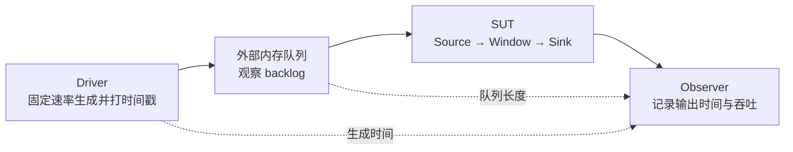
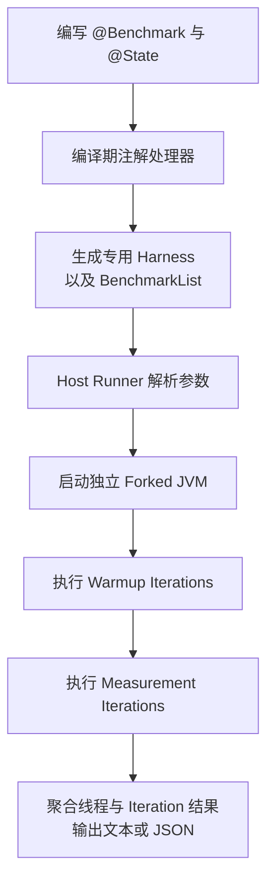

性能测试最容易制造的一种错觉是：数字越精确，结论就越可靠。

```text
baseline    102.0 ns/op
candidate    98.5 ns/op
```

这两行最多说明“某两次测量得到两个数字”，还不能证明 candidate 真快了 3.5 ns。我们至少还需要知道：

- 测量的是冷启动、稳定态，还是某个随机的 JVM 生命周期位置？
- 样本来自多个独立 JVM，还是同一个 JVM 中高度相关的 Iteration？
- 差异来自代码，还是 JIT、GC、进程布局、机器漂移与测试顺序？
- 3.5 ns 即使真实存在，对实际系统是否有意义？

到了分布式流处理系统，问题又多一层：如果事件已经在系统外排队 30 秒，而指标只从 Source 接收到事件后开始计时，那么“P99 延迟 20 ms”可能完全正确，也完全没有用户价值。

本文只做三件事：

1. 精读三篇论文，讲清它们分别解决了什么问题、怎样解决、用什么证据论证，以及结论的边界；
2. 从源码层解释 JMH 怎样运行，再用四个具体场景讲清它的正确用法；
3. 总结我对“可信性能证据”的理解。

三篇论文不是三份互不相关的摘要，而是依次补上性能测试中的三个缺口：

| 论文 | 它追问的核心问题 | 给出的主要答案 |
| --- | --- | --- |
| 2007，Statistically Rigorous Java Performance Evaluation | Java 程序每次运行都不同，应该怎样得到可信结果？ | 区分启动与稳定态；以独立 JVM 运行作为重要实验单位；报告均值与置信区间，不取最好值 |
| 2013，Rigorous Benchmarking in Reasonable Time | 严谨测试需要大量重复，怎样把时间花在真正产生不确定性的层级？ | 识别 Build、Execution、Iteration 的分层方差；先定标，再分配重复预算；报告效应量区间 |
| 2018，Benchmarking Distributed Stream Data Processing Systems | 流系统中的吞吐和延迟到底从哪里开始、到哪里结束？ | 分离 Driver 与 SUT；使用外部队列和生成时间；测 Event-time Latency 与 Sustainable Throughput |

贯穿全文的核心思想只有一句话：

> 可信 Benchmark 不是“多跑几次”，而是先定义测量对象，再找到独立实验单位，最后用与问题匹配的统计方法表达不确定性。

## 一、三篇论文精读：从“测得准”到“测得对”

### 1.1 2007：Java 性能不是一个常数

论文：[Statistically Rigorous Java Performance Evaluation](https://dri.es/files/oopsla07-georges.pdf)，Andy Georges、Dries Buytaert、Lieven Eeckhout，OOPSLA 2007。

#### 它要解决什么问题

Java 程序的执行时间会被很多运行时因素影响：

- JIT 的采样与编译时机；
- 线程调度；
- GC 发生的时间与堆布局；
- 操作系统中断、缓存与其他机器状态。

因此，即使代码、参数和机器都不变，多次运行也会得到不同结果。论文真正质疑的不是“有噪声”这件事，而是当时大量研究处理噪声的方式没有统计含义。

作者调查了 50 篇 Java 性能论文：

- 16 篇没有说明实验方法；
- 10 篇报告最好值，8 篇报告平均值；
- 中位数与第二好值各有 4 篇，最差值有 3 篇；
- 只有 4 篇报告置信区间。

`best of N` 看似在排除机器噪声，实际回答的是“这 N 次中最幸运的一次有多快”。N 越大，遇到极端好运样本的机会越大，所以 `best of 3` 与 `best of 30` 甚至不是同一个估计目标。

假设两个实现的测量结果如下：

| 实现 | 大多数运行 | 偶然出现的最好值 |
| --- | ---: | ---: |
| A | 约 100 ms，波动很小 | 98 ms |
| B | 约 103 ms，波动很大 | 91 ms |

取最好值会宣布 B 获胜；但如果明天随机运行一次，A 更可能更快。最好值偏爱“容易偶尔走运”的实现，而不是典型情况下更快的实现。

#### 它怎样解决

论文先把两个经常混在一起的问题拆开。

启动性能关注 JVM 启动、类加载、初始化、JIT 与任务执行的总成本。实验方法是：

1. 启动多个独立 JVM；
2. 每个 JVM 只执行一次任务；
3. 将每次 JVM invocation 视为一个观测；
4. 在这些观测上计算均值与置信区间。

稳定态性能关注长时间运行程序在初始化之后的执行能力。论文的方法是：

1. 启动多个独立 JVM；
2. 每个 JVM 执行多个 Iteration；
3. 在每个 JVM 内找到作者认为已经稳定的窗口，并计算该 JVM 的平均值；
4. 最后在多个 JVM 平均值之间计算总体均值与置信区间。

这里最关键的不是“预热多少次”，而是实验单位：

```text
Fork 1: Iteration 1 ... Iteration k  ->  Fork 1 的稳定态均值 m1
Fork 2: Iteration 1 ... Iteration k  ->  Fork 2 的稳定态均值 m2
...
Fork n: Iteration 1 ... Iteration k  ->  Fork n 的稳定态均值 mn

最终在 m1, m2, ..., mn 上估计均值与不确定性
```

同一个 JVM 内的 Iteration 共享 JIT Profile、已编译代码、堆与 GC 历史，因此不能简单地把 5 个 Fork × 10 个 Iteration 宣称为 50 次彼此独立的 JVM 实验。

论文使用置信区间表达随机误差。一个常见的小样本均值区间可以简写为：

```text
CI = x̄ ± t(0.975, n - 1) × s / √n
```

每个符号的含义是：

- `CI`：这里是 95% 置信区间；
- `x̄`：n 个独立实验单位的样本均值；
- `s`：这 n 个样本的样本标准差；
- `n`：独立实验单位的数量，在这里通常应理解为独立 JVM invocation 的数量，而不是方法调用次数；
- `√n`：样本数量 n 的平方根；
- `t(0.975, n - 1)`：自由度为 `n - 1` 的 t 分布 97.5% 分位点，用来形成双侧 95% 区间。

95% 置信区间的严格含义不是“真实均值有 95% 概率位于这个已经算出的区间内”，而是：如果按照同一规则反复做实验并构造区间，长期来看约 95% 的区间会覆盖真实均值。

#### 它怎样论证

作者没有只做一个玩具算例，而是构造了较大的实验矩阵：

- 5 种 Jikes RVM 垃圾收集策略；
- 14 个 Benchmark，其中 7 个来自 SPECjvm98，7 个来自 DaCapo；
- 每个 Benchmark 从最小可运行堆开始，到 6 倍最小堆结束，以 0.25 倍为步长，共 21 个堆大小；
- 3 台不同硬件平台。

论文使用 30 个 JVM invocation 分析启动性能；稳定态实验则使用多个 JVM，并在每个 JVM 内执行多个 Iteration。作者把常见的 best、second best、mean、median、worst 方法与更严格的置信区间比较结论进行对照。

在这套特定实验中：

- 启动性能的常见简化方法，误导性结论最高达到约 16%；
- 某些方法给出相反优劣方向的错误结论超过 3%；
- 稳定态比较在最小关注差异为 1% 时，误导性结论超过 20%；
- 即使使用 Replay Compilation 控制一部分 JIT 随机性，误导也没有完全消失。

这些百分比不能脱离论文的 GC、堆、硬件与阈值设置外推；它们真正证明的是：错误的汇总方法并非只在理论上有风险，而是足以改变工程结论。

论文还发现，达到同一精度所需的样本数会随 Benchmark、GC 与堆大小显著变化。有的组合不到 10 次就得到很窄的区间，有的组合做满 30 次后区间仍然较宽。因此，“统一跑 5 次”或“达到 30 次就可靠”都没有理论依据。

#### 这篇论文的核心结论

我认为它最重要的贡献不是某个统计公式，而是确立了四个基本原则：

1. 启动性能与稳定态性能是两个不同的问题；
2. JVM invocation 是 Java 性能评估中不可忽略的独立层级；
3. 最好值、最差值不能代表典型性能；
4. 性能结果必须同时报告估计值与不确定性。

#### 它没有解决什么

论文用“最近一段 Iteration 的变异系数 CoV 低于阈值”寻找稳定窗口。CoV 是标准差除以均值，它只能说明最近的点挤得是否紧，不能证明：

- 序列没有缓慢上升或下降；
- 相邻 Iteration 彼此独立；
- 不存在奇偶交替或周期；
- 后面不会发生 Deoptimization 或状态切换。

换句话说，低波动不等于稳态。这正是第二篇论文要修正的地方。

### 1.2 2013：严谨不等于把每一层都机械地跑很多次

论文：[Rigorous Benchmarking in Reasonable Time](https://dl.acm.org/doi/10.1145/2491894.2464160)，Tomas Kalibera、Richard Jones，ISMM 2013（[可访问全文](https://www.researchgate.net/publication/257193308_Rigorous_Benchmarking_in_Reasonable_Time)）。

#### 它要解决什么问题

2007 年论文告诉我们要运行多个 JVM、多个 Iteration，并报告区间。但新的现实问题是：如果 Build、JVM Execution、Iteration 都重复很多次，实验成本会迅速爆炸。

作者调查了 2011 年 PLDI、ASPLOS、ISMM、TOPLAS 与 TACO 的 122 篇论文：

- 90 篇测量了执行时间；
- 其中 71 篇没有报告任何变异信息；
- 65 篇报告了执行时间比值；
- 只有 3 篇尝试为比值给出置信区间。

论文认为，研究者不是不知道应该严谨，而是不知道：

- 哪一层必须重复；
- 每层重复多少次；
- 多花一分钟应该增加 Build、Execution，还是 Iteration；
- 怎样直接表达“新版本究竟快了多少”。

#### 它怎样解决

第一步是区分三类变量：

| 变量类型 | 含义 | 正确处理 |
| --- | --- | --- |
| Controlled | 实验者主动固定或选择的变量，如 JVM 参数、堆大小 | 明确记录并保持一致，或作为实验因素系统变化 |
| Random | 每次实验会随机变化的变量，如调度与运行时扰动 | 通过独立重复估计其影响 |
| Uncontrolled | 实验期间近似固定、但实验者没有控制的变量，如代码布局偏置 | 尽量控制；不能控制时将其随机化，否则会形成系统偏差 |

统计方法可以描述随机误差，却无法自动修复系统偏差。如果 baseline 总在机器冷的时候跑、candidate 总在机器热的时候跑，再漂亮的置信区间也只是在精确描述一个有偏实验。

第二步是把实验看成嵌套层级：

```text
Build 1
  ├─ JVM Execution 1
  │    ├─ Iteration 1
  │    └─ Iteration 2
  └─ JVM Execution 2
       ├─ Iteration 1
       └─ Iteration 2

Build 2
  └─ ...
```

如果只考虑 Fork 与 Iteration 两层，总体均值方差可以用下面的简化模型理解：

```text
Var(x̄) ≈ σ²fork / F + σ²iter / (F × I)
```

符号含义如下：

- `Var(x̄)`：最终均值估计的不确定性；
- `σ²fork`：不同 Fork 之间的方差分量；
- `σ²iter`：同一 Fork 内不同 Iteration 的方差分量；
- `F`：Fork 数量；
- `I`：每个 Fork 中参与测量的 Iteration 数量。

这个式子揭示了一个非常实际的结论：

> 增加 Iteration 只能缩小第二项，无法消除 Fork 之间的差异。

如果主要噪声来自不同 JVM 进程，那么把每个 Fork 的 Iteration 从 5 增加到 50，收益可能很小；增加独立 Fork 才真正压缩主要不确定性。如果重新 Build 也会改变代码布局与性能，那么还需要在更高层加入 Build 方差，并重复 Build。

论文因此提出“定标实验”：

1. 第一次为某个 Benchmark、VM 与平台组合做较充分的嵌套重复；
2. 估计每一层贡献的方差；
3. 测量每一层重复的时间成本，例如启动 JVM、完成预热、重新构建；
4. 在给定总时间预算下，把重复分配到“方差贡献大且单位成本合理”的层级；
5. 只有当 Benchmark、VM 或平台明显变化时，才重新定标。

第三步是修正“低 CoV 等于稳态”。作者区分：

- Initialized state：明显的初始化阶段已经结束；
- Independent state：后续 Iteration 不仅看似平稳，而且没有明显自相关。

他们结合 Run-sequence Plot、Lag Plot 与自相关函数 ACF 检查序列，而不是只看最近窗口的波动大小。

#### 它怎样论证

作者对 DaCapo 的多种 Benchmark、JVM 与平台组合执行最多 300 个 Iteration，并比较手工诊断、DaCapo Harness 启发式和 2007 年 CoV 方法。

下面是论文 Table 3 中 Platform P1 的三个典型例子：

| Benchmark | 初始化完成 | 达到独立态 | DaCapo Harness 选择 | 2007 CoV 方法选择 |
| --- | ---: | ---: | ---: | ---: |
| avrora9 | 2 | 128 | 4 | 1 |
| lusearch9 | 3 | 5 | 5 | 247 |
| xalan6 | 2 | 2 | 29 | 无法收敛 |

三行数据分别说明：

- `avrora9` 中，CoV 方法在初始化完成之前就宣布稳定；
- `lusearch9` 第 5 轮已经达到论文判定的独立态，CoV 方法却预热到第 247 轮；
- `xalan6` 第 2 轮已经独立，CoV 方法反而无法收敛。

因此，固定 `Warmup(iterations = 5)` 只是配置，不是“已经进入稳定态”的证据；同样，无限增加 Warmup 也未必能得到独立样本。

论文还给出一个很重要、但经常被忽略的退路：如果 Benchmark 在合理时间内无法达到独立态，就不要让在线启发式在每次运行中随意挑不同窗口，而应在所有运行中选择同一个、已经完成初始化的生命周期位置。它测量的可能不是理想“峰值稳态”，但至少比较对象一致。

第四步是直接报告效应量区间。只说 `p < 0.05` 只能说明数据不太支持“完全无差异”，不能回答差异是否重要。对于执行时间，更有用的表达是：

```text
candidate / baseline = 0.94，95% CI [0.92, 0.97]
```

这是一个教学示例，不是论文的实测数据。它表达的是：candidate 的执行时间估计为 baseline 的 94%，区间为 92% 到 97%；也就是性能改善大约在 3% 到 8% 之间。差异的方向、幅度和不确定性一次说清楚了。

#### 这篇论文的核心结论

第二篇论文把“多跑几次”推进成了“在哪一层多跑几次”：

1. 先控制或随机化系统偏差；
2. 找到真正引入随机性的最高层；
3. 用定标实验估计各层方差与成本；
4. 把重复预算花在主要不确定性上；
5. 报告性能变化的幅度与区间，而不只报告显著性。

#### 它没有解决什么

这套方法不是一组可以从论文直接复制的固定次数。作者明确强调：重复次数依赖 Benchmark、VM 与平台，论文表格中的数字不能原样套用到另一台机器。

它还需要几个前提：

- 分层结构和方差模型与实际实验大致匹配；
- 定标之后，各层成本与方差没有发生根本变化；
- 实验者愿意查看时间序列并判断初始化与独立性；
- 测量指标本身已经定义正确。

最后一个前提非常关键。统计方法能告诉我们一个指标估计得有多准，却不能告诉我们这个指标是否代表用户真正关心的问题。第三篇论文就从这里开始。

### 1.3 2018：流系统的“最大输入速度”不等于可持续吞吐

论文：[Benchmarking Distributed Stream Data Processing Systems](https://arxiv.org/pdf/1802.08496)，Jeyhun Karimov 等，ICDE 2018。

#### 它要解决什么问题

当时不少流处理 Benchmark 存在三类测量边界错误。

第一，Kafka、Redis 等外部组件可能先成为瓶颈，最后测到的是整套部署中最慢的外部组件，而不是流处理引擎。

第二，Driver 与 SUT（System Under Test）混在一起。不同系统使用自己的内部指标，延迟起点、吞吐口径和结果数量都不一致，横向比较失去共同尺度。

第三，只测 Processing-time Latency。事件在 Source 之前的等待时间被排除后，背压越严重，SUT 反而可能摄入得越慢、内部处理延迟越稳定；外部队列却在持续增长。

这就是 Coordinated Omission：测量节奏跟着被测系统变慢，恰好漏掉系统无法及时服务的那部分等待。

#### 它怎样解决

论文把 Driver 与 SUT 完全分离：



具体做法包括：

- Driver 在独立机器上按固定速率生成数据，不等待上一条处理完成；
- 每条事件在生成时记录 Event Time；
- Driver 与 SUT Source 之间放置内存队列，吸收瞬时摄入波动并暴露 backlog；
- 吞吐从 Driver/队列侧测量，延迟在输出侧根据原始时间戳计算；
- Driver 不与 SUT 共用机器，避免生成负载抢占被测系统资源。

这里需要区分两个延迟：

```text
Event-time latency      = 输出时间 - 事件生成时间
Processing-time latency = 输出时间 - SUT 摄入时间
```

前者包含 SUT 外部排队，更接近事件从产生到获得结果的等待；后者只描述事件进入 SUT 之后的处理时间。两者都有诊断价值，但不能互相替代。

窗口算子的输出由多条输入共同产生，不能随便选择一条输入的时间戳。论文定义：

```text
窗口输出的 event time = 所有贡献输入中最大的 event time
窗口输出延迟 = 输出时间 - 窗口输出的 event time
```

其中：

- “贡献输入”是实际参与该聚合或 Join 输出的输入事件；
- “最大的 event time”代表最后一个必要输入到达的逻辑时间；
- “输出时间”是 SUT 产生结果的时刻。

例如一个聚合结果由 event time 为 580、590、600 的三条输入构成，并在 610 输出，那么论文口径下的窗口输出延迟是 `610 - 600 = 10`。这样不会把窗口本身等待数据凑齐的完整跨度全部算成引擎处理延迟。

这个定义也有明确语义边界：它衡量“最后一个必要事件之后多久产出窗口结果”，不是每一条早到事件的等待时间。如果业务关心第一条事件进入窗口后等待了多久，还需要另加指标。

论文进一步定义 Sustainable Throughput：

> 系统能够长期处理、且不会出现持续背压或 Event-time Latency 持续增长的最高输入速率。

寻找方法不是让 Source 无限制拉取并记录瞬时峰值，而是：

1. 先给出明显高于系统能力的固定生成速率；
2. 观察队列长度和 Event-time Latency 是否持续增长；
3. 逐步降低生成速率；
4. 找到系统可以长期维持、backlog 不再单调增长的最高速率。

#### 它怎样论证

作者使用游戏业务启发的窗口聚合和窗口 Join，评估当时版本的 Storm 1.0.2、Spark 2.0.1 与 Flink 1.1.3，并改变：

- 集群节点数；
- 窗口大小与滑动步长；
- 数据倾斜；
- 输入速率波动；
- 聚合与 Join 工作负载。

最有说服力的证据不是三个系统的历史排行榜，而是过载实验中的指标分裂：

- SUT 启动背压后，摄入速率下降；
- Processing-time Latency 可以保持相对稳定；
- 但事件继续堆积在外部队列中，Event-time Latency 持续上升。

如果只看 SUT 内部处理时间，会误判系统仍然健康；外部时间戳和 backlog 才揭示真实的容量不足。论文也展示了不同系统在数据倾斜、突发流量、窗口聚合和窗口 Join 下呈现不同瓶颈，说明单一的“每秒多少条”无法概括流系统性能。

#### 这篇论文的核心结论

第三篇论文把问题从“数字是否稳定”推进到“数字是否测对了东西”：

1. Driver 必须独立于 SUT，且不能随 SUT 变慢而同步降速；
2. 延迟起点应尽可能接近事件产生，而不是方便测量的 Source 内部；
3. 吞吐必须与 backlog、Event-time Latency 一起解释；
4. 最大瞬时摄入速率不等于可长期维持的处理能力；
5. 窗口、Join、倾斜与突发流量必须作为独立工作负载。

#### 它没有解决什么

首先，论文为了隔离引擎能力，主动移除了 Kafka、Redis 等外部系统。因此它回答的是“引擎在特定 Driver 下的能力”，不是完整生产链路的端到端容量。若性能声明包含消息队列和 Sink，它们就必须重新进入 SUT 边界。

其次，论文作者把以下问题留作后续工作：

- Exactly-once 的性能代价；
- Out-of-order 与 Late Event；
- 故障、恢复与状态一致性；
- 更丰富的并发查询组合。

最后，这是 2018 年特定版本与特定硬件上的结果，不能用来给今天的产品排名。我的进一步判断是：它对跨独立集群运行的不确定性讨论也弱于前两篇论文。因此，现代流系统 Benchmark 应把 2007/2013 年的独立重复、分层方差和效应量区间重新加到 2018 年的正确测量边界之上。

### 1.4 三篇论文真正连起来的主线

三篇论文分别强调统计、实验预算和系统语义，但最终可以收敛成四个连续问题：

| 顺序 | 必须回答的问题 | 如果答错会怎样 |
| --- | --- | --- |
| 1 | 我想证明什么：冷启动、稳定态、单方法开销、端到端延迟，还是可持续吞吐？ | 用正确工具回答错误问题 |
| 2 | 哪个才是独立实验单位：调用、Iteration、Fork、Build，还是完整 Cluster Run？ | 伪造巨大样本量，低估不确定性 |
| 3 | 主要随机性和系统偏差来自哪里？ | 在错误层级重复，或把时间漂移当代码差异 |
| 4 | 差异有多大、区间多宽、是否达到工程意义？ | 把“统计上可区分”误写成“工程上值得” |

第一篇论文解决了第 2、4 个问题的基础；第二篇把第 2、3、4 个问题做成有限预算下的方法；第三篇则提醒我们，第 1 个问题一旦错了，后面的严谨统计没有意义。

## 二、JMH 怎样实现，以及四个典型使用场景

JMH 是 OpenJDK 提供的 JVM Benchmark Harness。它最擅长测量单 JVM 内的 nano、micro、milli 级代码路径，也可以承载较大的方法级测试。

它能帮助解决：

- 方法调用循环与计时；
- JVM Fork、Warmup、Measurement；
- 多线程协同与 State 生命周期；
- 死代码消除、返回值消费；
- 参数组合与结果输出。

它不能自动解决：

- 被测代码是否代表真实业务；
- Warmup 是否真的达到稳定且独立的状态；
- 多个 Iteration 是否可以当作独立实验；
- baseline 与 candidate 是否受到机器漂移和执行顺序影响；
- 微基准改善能否转化成端到端吞吐或延迟改善。

因此，JMH 是严谨实验的执行工具，不是结论生成器。

### 2.1 JMH 不是用反射调用一次方法，而是生成专用 Harness

JMH 的关键实现位于官方仓库的几个部分：

- `jmh-generator-annprocess` 中的 `BenchmarkProcessor` 是注解处理器；
- `BenchmarkGenerator` 根据 `@Benchmark`、`@State`、`@Setup` 等生成测试代码；
- `Runner` 解析配置并启动 Fork；
- `ForkedMain` 是被 Fork JVM 的入口；
- `ThroughputResult`、`AverageTimeResult` 等将操作数和时间转换成 Score。

整体流程如下：



生成代码的核心逻辑可以简化为：

```java
while (control.warmupShouldWait) {
    benchmark(state);
}

long start = System.nanoTime();
long operations = 0;
do {
    blackhole.consume(benchmark(state));
    operations++;
} while (!control.isDone);
long elapsed = System.nanoTime() - start;
```

真实生成代码还会处理：

- 多线程开始与结束屏障；
- `@Setup`、`@TearDown` 的 Trial、Iteration、Invocation 生命周期；
- `@OperationsPerInvocation` 与 Batch Size；
- 异常传播；
- AuxCounters；
- 不同 Benchmark Mode 的专用循环。

这种编译期生成有两个价值。

第一，测试方法位于紧凑循环内，不需要每次通过反射调用。第二，JMH 可以根据声明提前生成 State 获取、返回值消费和生命周期代码，并在编译期发现一部分非法组合。

如果 `@Benchmark` 返回非 `void` 值，生成代码会把返回值交给 `Blackhole.consume(...)`。所以最简单的防止死代码消除方式通常不是在业务代码里手写 Blackhole，而是直接返回计算结果。

### 2.2 Fork、Warmup、Measurement 分别代表什么

一次典型 JMH 运行可以这样理解：

```text
一个 Benchmark 参数组合
  ├─ Fork 1：全新的 JVM
  │    ├─ Warmup Iteration 1..W
  │    └─ Measurement Iteration 1..M
  ├─ Fork 2：全新的 JVM
  │    ├─ Warmup Iteration 1..W
  │    └─ Measurement Iteration 1..M
  └─ Fork F：...
```

- Fork：新的 JVM 进程，拥有新的 JIT Profile、堆、地址空间和运行时历史；
- Warmup Iteration：执行负载但不进入最终 Score，用于把 JVM 推到目标生命周期位置；
- Measurement Iteration：在固定时间窗口内反复调用 Benchmark 方法并形成一个 Iteration Score；
- Invocation：Benchmark 方法的一次调用，通常数量极大，但不是独立 JVM 实验。

JMH 的四种常用 Mode 回答不同问题：

| Mode | Score 含义 | 适合场景 | 主要风险 |
| --- | --- | --- | --- |
| Throughput | 单位时间完成的操作数 | 队列、计数器、解析器的处理能力 | 高吞吐不代表低尾延迟 |
| AverageTime | 每次操作的平均时间 | 稳定热路径的平均成本 | 平均值会隐藏长尾 |
| SampleTime | 对部分调用采样并形成分布 | 观察方法级延迟分布 | 仍不是外部固定到达率下的系统延迟 |
| SingleShotTime | 单次调用或一个 Batch 的时间 | 冷启动、一次性初始化、较长操作 | 必须通过多个 Fork 获得独立重复 |

Throughput 与 AverageTime 的核心换算非常简单：

```text
Throughput  = N / T
AverageTime = T / N
```

其中：

- `N` 是 Measurement 时间内完成的操作数；
- `T` 是 Measurement 的有效计时时间；
- 多线程 Throughput 会先聚合线程结果；
- `@OperationsPerInvocation` 会改变一次 Benchmark invocation 代表的逻辑操作数。

不要只因为 `ns/op` 看起来直观，就默认选择 AverageTime；Mode 必须服从问题。如果想知道 8 个线程争用一个计数器时每秒能完成多少次更新，Throughput 更自然。如果想测一次冷初始化，应该考虑 `SingleShotTime`、关闭 Warmup，并增加独立 Fork。

### 2.3 建立项目、运行与读懂输出

JMH 官方推荐使用独立 Maven Benchmark 模块，而不是像 JUnit 一样只添加一个依赖后直接从 IDE 运行。下面使用当前稳定版 1.37 创建项目：

```bash
mvn archetype:generate \
  -DinteractiveMode=false \
  -DarchetypeGroupId=org.openjdk.jmh \
  -DarchetypeArtifactId=jmh-java-benchmark-archetype \
  -DarchetypeVersion=1.37 \
  -DgroupId=org.example \
  -DartifactId=benchmark \
  -Dversion=1.0

cd benchmark
mvn clean verify
java -jar target/benchmarks.jar -l
```

一个适合首次定标的命令是：

```bash
java -jar target/benchmarks.jar '.*HashBenchmark.*' \
  -f 5 \
  -wi 5 -w 1s \
  -i 10 -r 1s \
  -rf json \
  -rff target/jmh-result.json
```

参数含义如下：

| 参数 | 含义 |
| --- | --- |
| `-f 5` | 运行 5 个独立 Fork |
| `-wi 5` | 每个 Fork 运行 5 个 Warmup Iteration |
| `-w 1s` | 每个 Warmup Iteration 运行 1 秒 |
| `-i 10` | 每个 Fork 运行 10 个 Measurement Iteration |
| `-r 1s` | 每个 Measurement Iteration 运行 1 秒 |
| `-rf json` | 输出机器可读 JSON |
| `-rff ...` | 指定结果文件 |

这些数字只是第一次观察时间序列和方差的起点，不是三篇论文推导出的通用最优值。正式比较前，应根据 Benchmark、JDK、机器与目标精度调整。

典型输出类似：

```text
Benchmark          Mode  Cnt   Score   Error  Units
HashBenchmark.mix  avgt   50  37.210 ± 0.880  ns/op
```

这是一行教学输出，不是本文实测结论：

- `Mode=avgt` 表示 AverageTime；
- `Cnt=50` 通常来自 5 Fork × 10 Measurement Iteration，不是只调用了 50 次；
- `Score=37.210 ns/op` 是聚合后的平均操作时间；
- `Error=0.880` 是 JMH 展示的 99.9% 均值误差范围；
- JMH 的扩展输出会明确写出该区间假设正态分布。

这里必须保持克制：JMH 展示的 `Score ± Error` 不是 baseline 与 candidate 的效应量区间，也不会证明 50 个 Iteration 全部独立。做版本回归判断时，应保存 JSON 原始结果，查看每个 Fork 的分布，并计算 candidate/baseline 的变化幅度与区间。

### 2.4 场景一：纯计算——防止死代码消除与常量折叠

下面测量一个整数混合函数：

```java
package org.example;

import java.util.concurrent.TimeUnit;
import org.openjdk.jmh.annotations.Benchmark;
import org.openjdk.jmh.annotations.BenchmarkMode;
import org.openjdk.jmh.annotations.Mode;
import org.openjdk.jmh.annotations.OutputTimeUnit;
import org.openjdk.jmh.annotations.Param;
import org.openjdk.jmh.annotations.Scope;
import org.openjdk.jmh.annotations.State;

@State(Scope.Thread)
@BenchmarkMode(Mode.AverageTime)
@OutputTimeUnit(TimeUnit.NANOSECONDS)
public class HashBenchmark {

    @Param({"7", "42"})
    public int seed;

    @Param({"64", "1024"})
    public int rounds;

    @Benchmark
    public int mix() {
        int value = seed;
        for (int i = 0; i < rounds; i++) {
            value = Integer.rotateLeft(value * 31 + i, 5);
        }
        return value;
    }
}
```

这里有三个关键点：

1. `seed` 和 `rounds` 来自非 final 的 State 字段，避免把整个输入写成编译期常量；
2. 方法返回结果，JMH 生成代码会消费它，降低整个计算被当作无用代码删除的风险；
3. `Scope.Thread` 让每个线程拥有自己的 State，避免无意中测到共享字段争用。

下面这种写法是危险的：

```java
@Benchmark
public void wrong() {
    mixConstant(42, 1024);
}
```

输入固定、结果又没有被使用，JIT 可能进行常量折叠或死代码消除。最后测到的可能只是空 Harness 的成本。

这个场景适合纯算法、编码、哈希、序列化内部函数等 CPU 热路径。但如果生产输入有不同长度、字符集或分支分布，就必须用 `@Param` 或预生成数据覆盖这些形态，不能只测最容易优化的一种输入。

### 2.5 场景二：数据结构——用 State 与生命周期隔离准备成本

下面比较有序数组上的线性查找与二分查找：

```java
package org.example;

import java.util.Arrays;
import java.util.concurrent.TimeUnit;
import org.openjdk.jmh.annotations.Benchmark;
import org.openjdk.jmh.annotations.BenchmarkMode;
import org.openjdk.jmh.annotations.Level;
import org.openjdk.jmh.annotations.Mode;
import org.openjdk.jmh.annotations.OutputTimeUnit;
import org.openjdk.jmh.annotations.Param;
import org.openjdk.jmh.annotations.Scope;
import org.openjdk.jmh.annotations.Setup;
import org.openjdk.jmh.annotations.State;

@State(Scope.Thread)
@BenchmarkMode(Mode.AverageTime)
@OutputTimeUnit(TimeUnit.NANOSECONDS)
public class LookupBenchmark {

    @Param({"16", "1024", "65536"})
    public int size;

    private int[] values;
    private int key;

    @Setup(Level.Trial)
    public void prepareDataset() {
        values = new int[size];
        for (int i = 0; i < size; i++) {
            values[i] = i * 2;
        }
        key = values[size - 1];
    }

    @Benchmark
    public int linearSearch() {
        for (int i = 0; i < values.length; i++) {
            if (values[i] == key) {
                return i;
            }
        }
        return -1;
    }

    @Benchmark
    public int binarySearch() {
        return Arrays.binarySearch(values, key);
    }
}
```

`@Setup(Level.Trial)` 在一个 Benchmark Trial 开始时准备一次数组，数组构造不进入查询的计时结果。这样测到的是“已有数据结构上的查找成本”。

如果真正的问题是“构造并查询一次需要多久”，那就应该另写一个 Benchmark，把构造放进 `@Benchmark`。不要为了得到更小的数字，把生产路径必需的工作偷偷移到 Setup。

三个常见生命周期分别是：

| Level | 调用时机 | 适合内容 |
| --- | --- | --- |
| Trial | 每个完整 Benchmark Trial 一次 | 大数据集、连接、共享结构的初始化 |
| Iteration | 每个 Warmup/Measurement Iteration 一次 | 每个时间窗口要重置的计数或批次状态 |
| Invocation | 每次 Benchmark 调用前后 | 必须逐操作恢复的状态，谨慎使用 |

`Level.Invocation` 的 Setup 时间可以从有效计时中扣除，但它仍会改变缓存、分支预测和对象状态，而且每次调用都有 Harness 成本。除非被测语义确实要求逐次重置，否则优先批量准备输入或使用多个预生成样本。

### 2.6 场景三：并发争用——Scope 选错，测量问题就变了

下面比较共享 `AtomicLong` 与 `LongAdder` 的更新吞吐：

```java
package org.example;

import java.util.concurrent.TimeUnit;
import java.util.concurrent.atomic.AtomicLong;
import java.util.concurrent.atomic.LongAdder;
import org.openjdk.jmh.annotations.Benchmark;
import org.openjdk.jmh.annotations.BenchmarkMode;
import org.openjdk.jmh.annotations.Mode;
import org.openjdk.jmh.annotations.OutputTimeUnit;
import org.openjdk.jmh.annotations.Scope;
import org.openjdk.jmh.annotations.State;

@State(Scope.Benchmark)
@BenchmarkMode(Mode.Throughput)
@OutputTimeUnit(TimeUnit.SECONDS)
public class ContendedCounterBenchmark {

    private final AtomicLong atomic = new AtomicLong();
    private final LongAdder adder = new LongAdder();

    @Benchmark
    public void atomicIncrement() {
        atomic.incrementAndGet();
    }

    @Benchmark
    public void adderIncrement() {
        adder.increment();
    }
}
```

分别运行单线程与多线程：

```bash
java -jar target/benchmarks.jar ContendedCounterBenchmark -t 1 -f 5
java -jar target/benchmarks.jar ContendedCounterBenchmark -t 8 -f 5
```

`Scope.Benchmark` 使同一个 Trial 中的所有工作线程共享一个 State，因此多线程运行确实会争用同一计数器。如果改成 `Scope.Thread`，8 个线程会更新 8 份独立 State，测到的是并行独享吞吐，而不是共享争用。

这个例子还有一个比性能更重要的语义提醒：

- `AtomicLong.incrementAndGet()` 可以为每次更新提供一个线性化后的返回值；
- `LongAdder` 通过分散竞争提高高并发更新能力，但读取总和不是同一种强一致语义。

因此，不能根据 LongAdder 的 ops/s 更高就宣布它“全面替代” AtomicLong。Benchmark 只有在候选实现满足同一业务契约时，才有比较意义。

### 2.7 场景四：快慢路径——用 AuxCounters 解释主 Score

平均吞吐可能掩盖输入分布变化。下面让 0%、1% 或 10% 的输入触发异常解析路径，并用 AuxCounters 同时报告成功与失败速率：

```java
package org.example;

import java.util.concurrent.TimeUnit;
import org.openjdk.jmh.annotations.AuxCounters;
import org.openjdk.jmh.annotations.Benchmark;
import org.openjdk.jmh.annotations.BenchmarkMode;
import org.openjdk.jmh.annotations.Level;
import org.openjdk.jmh.annotations.Mode;
import org.openjdk.jmh.annotations.OutputTimeUnit;
import org.openjdk.jmh.annotations.Param;
import org.openjdk.jmh.annotations.Scope;
import org.openjdk.jmh.annotations.Setup;
import org.openjdk.jmh.annotations.State;

@BenchmarkMode(Mode.Throughput)
@OutputTimeUnit(TimeUnit.SECONDS)
public class ParserBenchmark {

    @State(Scope.Thread)
    public static class Inputs {

        @Param({"0", "1", "10"})
        public int invalidPercent;

        private String[] values;
        private int cursor;

        @Setup(Level.Trial)
        public void prepare() {
            values = new String[1024];
            for (int i = 0; i < values.length; i++) {
                values[i] = i % 100 < invalidPercent
                        ? "invalid"
                        : Integer.toString(i);
            }
        }

        public String next() {
            return values[cursor++ & (values.length - 1)];
        }
    }

    @State(Scope.Thread)
    @AuxCounters(AuxCounters.Type.OPERATIONS)
    public static class Outcomes {
        public long valid;
        public long invalid;
    }

    @Benchmark
    public int parse(Inputs inputs, Outcomes outcomes) {
        try {
            int value = Integer.parseInt(inputs.next());
            outcomes.valid++;
            return value;
        } catch (NumberFormatException e) {
            outcomes.invalid++;
            return -1;
        }
    }
}
```

运行后，除了主 Benchmark 的总吞吐，还会看到 `valid` 与 `invalid` 两个 Secondary Result。这样可以回答：

- 总吞吐下降是不是因为失败比例提高；
- 慢路径究竟占多少操作；
- 两个版本是否处理了相同输入分布。

`@AuxCounters` 的边界必须讲清楚：

- 它只能标注 `Scope.Thread` 的 State；
- 只有 public 数值字段或返回数值的 public 方法会成为指标；
- public 字段会在每个 Iteration 开始前重置，并在结束时读取；
- `Type.OPERATIONS` 会按时间归一化，适合成功/失败吞吐；
- `Type.EVENTS` 报告未按时间归一化的事件总数；
- 它是实验性 API，适合解释分支构成，不应代替主性能指标与正确性断言。

### 2.8 怎样从 JMH 输出得到版本结论

假设 AverageTime 模式下定义：

```text
R = candidate time / baseline time
```

其中：

- `R < 1` 表示 candidate 更快；
- `R > 1` 表示 candidate 更慢；
- `R = 1` 表示两者平均时间相同。

正式比较至少应做到：

1. 使用相同硬件、JDK、JVM 参数和 Benchmark 参数；
2. 运行多个 Fork，保留每个 Fork/Iteration 的 JSON 结果；
3. 交替或随机化 baseline 与 candidate 的执行顺序，避免时间漂移总偏向一方；
4. 报告 `R` 的区间，而不是只比较两行 Score；
5. 预先定义工程阈值，例如小于 1% 的变化不做优化结论；
6. 同时检查正确性、分配率、GC 与其他可能被转移的成本。

以“1% 是最小关注变化”为例：

| 比值区间 | 合理结论 |
| --- | --- |
| 整个区间低于 0.99 | 有证据表明 candidate 达到关注阈值以上的改善 |
| 整个区间高于 1.01 | 有证据表明出现达到关注阈值以上的回归 |
| 整个区间位于 0.99～1.01 | 在当前精度与阈值下可认为工程上近似等价 |
| 区间跨越这些边界 | 证据不足，应增加独立重复或检查噪声来源 |

如果使用 Throughput，方向要反过来定义，或者改为 `baseline throughput / candidate throughput`，让“小于 1 表示改善”的语义保持一致。无论怎样定义，都必须在报告中写清分子、分母和“越大越好还是越小越好”。

JMH 的 profiler 可以帮助解释结果：

```bash
java -jar target/benchmarks.jar LookupBenchmark -prof gc
```

例如一个实现 ns/op 下降，却显著增加 `gc.alloc.rate.norm`，它可能只是把 CPU 成本换成了分配和 GC 成本。Profiler 是归因线索，不是自动因果证明；发现异常后仍需要结合代码、汇编、硬件计数器或更高层测试验证。

## 三、总结与感悟

读完三篇论文再回看 JMH，我最大的感受是：性能测试的难点从来不是让程序多执行几遍，而是知道每一个数字究竟代表什么。

第一篇论文最重要的提醒是，不要把偶然的最好值当作能力，也不要把同一 JVM 中的大量调用当作大量独立证据。Java 的动态运行时决定了 Fork 层级不可忽略。

第二篇论文进一步说明，严谨并不等于无限增加运行时间。真正有效的方法是先找出方差来自 Build、Fork 还是 Iteration，再把重复预算花到正确层级。跑得更多不一定知道得更多；在错误层级重复，只会更精确地低估不确定性。

第三篇论文把视线从统计拉回系统语义。一个指标可以测得非常稳定，却从错误的时间点开始计时。流处理系统尤其如此：如果没有固定到达率、外部时间戳、backlog 与 Event-time Latency，背压完全可能把容量不足伪装成低延迟。

JMH 的价值，是把 JVM 内部微基准中最容易犯的一批 Harness 错误标准化处理：生成专用循环、启动 Fork、组织 Warmup 与 Measurement、管理 State、消费返回值、输出机器可读结果。但它无法替我们决定测量边界，也不会自动证明 Warmup 已经稳定，更不会把一个 5 ns 的方法级改善自动转换成系统吞吐提升。

因此，我现在更愿意用下面这句话定义一份好的 Benchmark：

> 它不是给出一个漂亮数字，而是让别人能够明确知道这个数字在什么条件下成立、误差有多大、什么证据可以推翻它。

真正开始写 Benchmark 之前，可以先写出性能声明：

```text
在固定的硬件、JDK、参数和输入分布下，
candidate 相对 baseline 改善哪一个指标，
改善幅度至少是多少，
并且没有破坏哪一种正确性与资源约束。
```

如果这句话写不清楚，代码暂时也不用急着写。因为 Benchmark 的顺序应该是：

```text
先定义问题 → 再设计实验 → 然后运行工具 → 最后解释证据
```

而不是先得到一个数字，再回头为它寻找故事。

### 参考资料

1. Andy Georges, Dries Buytaert, Lieven Eeckhout, [Statistically Rigorous Java Performance Evaluation](https://dri.es/files/oopsla07-georges.pdf), OOPSLA 2007.
2. Tomas Kalibera, Richard Jones, [Rigorous Benchmarking in Reasonable Time](https://dl.acm.org/doi/10.1145/2491894.2464160), ISMM 2013；[可访问全文](https://www.researchgate.net/publication/257193308_Rigorous_Benchmarking_in_Reasonable_Time).
3. Jeyhun Karimov et al., [Benchmarking Distributed Stream Data Processing Systems](https://arxiv.org/pdf/1802.08496), ICDE 2018.
4. OpenJDK, [Java Microbenchmark Harness](https://github.com/openjdk/jmh).
5. OpenJDK JMH, [官方示例目录](https://github.com/openjdk/jmh/tree/master/jmh-samples/src/main/java/org/openjdk/jmh/samples).
6. OpenJDK JMH 源码：[BenchmarkProcessor](https://github.com/openjdk/jmh/blob/master/jmh-generator-annprocess/src/main/java/org/openjdk/jmh/generators/BenchmarkProcessor.java)、[BenchmarkGenerator](https://github.com/openjdk/jmh/blob/master/jmh-core/src/main/java/org/openjdk/jmh/generators/core/BenchmarkGenerator.java)、[Runner](https://github.com/openjdk/jmh/blob/master/jmh-core/src/main/java/org/openjdk/jmh/runner/Runner.java)、[Result](https://github.com/openjdk/jmh/blob/master/jmh-core/src/main/java/org/openjdk/jmh/results/Result.java).
