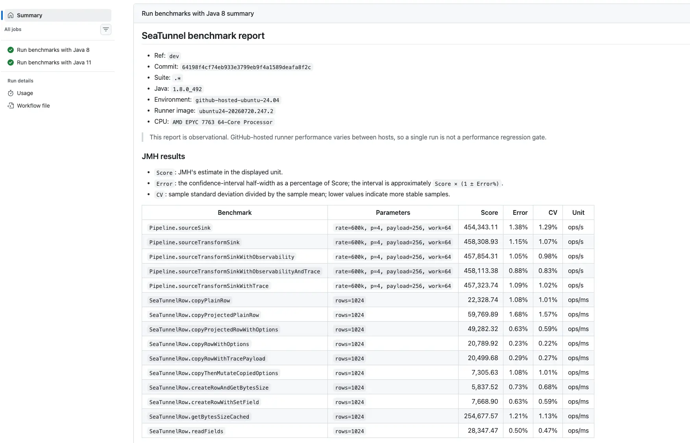
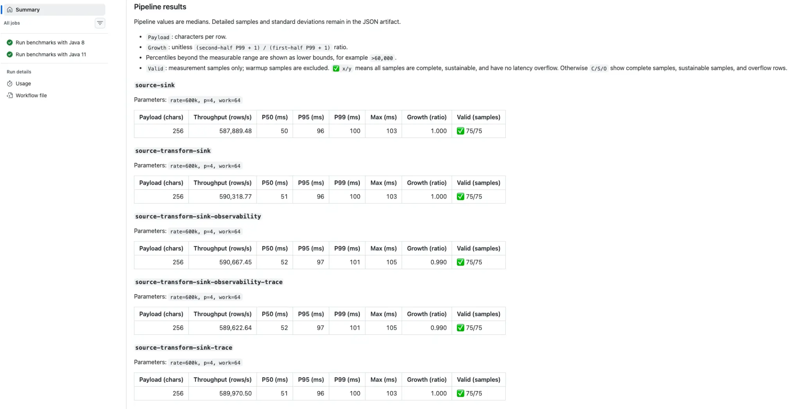
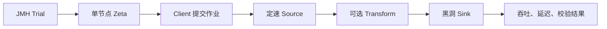

*图 1：同一轮运行中的 JMH 汇总，包括完整 Pipeline 和 SeaTunnelRow 热点操作。*



*图 2：五条 Pipeline 在相同负载下的吞吐、延迟、增长比例与有效样本。*

## 一、先读懂这组结果

这轮测试使用 Java 8、4 GiB 堆、4 个 JVM 可见处理器和 4 个 Pipeline 并行度；每次作业处理 1,000,000 行，计划输入速率为 600,000 行/秒，Payload 为 256 个字符。

结果可以压缩成三点：

1. 五个场景的 Sink 吞吐都在 58.8 万到 59.1 万行/秒，P99 为 100 到 101 ms，Growth 为 0.99 到 1.00，75/75 个样本全部有效，说明当前负载下没有持续积累 backlog；
2. Pipeline JMH Score 的最大差距约为 0.87%，而本轮 Error 为 0.88% 到 1.38%，因此只能说没有观察到可区分的功能开销，不能说某个场景更快或“零开销”；
3. 60 万行/秒是本轮固定负载，不是容量上限。真正的容量评估还需要提高输入速率并持续观察吞吐、P99 和延迟增长。

因此，这组数字首先证明的是基准链路完整、当前负载可持续，并且能够对不同引擎能力进行同口径比较，而不是给 Zeta 下一个脱离环境的绝对性能结论。

## 二、为什么要同时做微基准和完整 Pipeline

SeaTunnel 的基准测试分为两层，两者回答的问题不同。

### SeaTunnelRow 微基准：定位热点

`SeaTunnelRowBenchmark` 关注 Source、Transform 和 Sink 热路径中的基础操作，包括 Row 创建、字段读取、复制、投影、Options 和大小计算。

| 操作 | Score（ops/ms） | CV | 主要含义 |
| --- | ---: | ---: | --- |
| `copyPlainRow` | 22,328.74 | 1.01% | 完整复制普通 Row |
| `copyProjectedPlainRow` | 59,769.89 | 1.57% | 只复制 8 个字段中的 4 个投影字段 |
| `copyProjectedRowWithOptions` | 49,282.32 | 0.59% | 投影复制，同时处理 Options |
| `copyRowWithOptions` | 20,789.92 | 0.22% | 完整复制带 Options 的 Row |
| `copyRowWithTracePayload` | 20,499.68 | 0.27% | 完整复制带 Trace Payload 的 Row |
| `copyThenMutateCopiedOptions` | 7,305.63 | 1.01% | 复制后修改 Options |
| `createRowAndGetBytesSize` | 5,837.52 | 0.68% | 创建 Row 并计算大小 |
| `createRowWithSetField` | 7,668.90 | 0.59% | 逐字段构建 Row |
| `getBytesSizeCached` | 254,677.57 | 1.13% | 读取已经缓存的大小 |
| `readFields` | 28,347.47 | 0.47% | 读取并消费全部字段 |

`ops/ms` 表示每毫秒完成多少次操作，越大越好。例如 `copyPlainRow` 的 22,328.74 ops/ms 约等于每秒 2,233 万次操作。

这些数字主要用于同一方法跨版本比较，或者比较语义相近的操作。不能因为 `getBytesSizeCached` 比 `createRowAndGetBytesSize` 高很多，就直接得出某段完整业务链路快了相同比例：前者只是读取缓存，后者同时包含对象创建和首次大小计算，测量对象并不相同。

在语义接近的复制场景中可以看到，带 Options 的完整复制比普通复制低约 6.9%，加入 Trace Payload 后比普通复制低约 8.2%。这类差异能够提示优化方向，但最终是否影响真实任务，仍要回到完整 Pipeline 验证。

### Zeta Pipeline 基准：验证整体效果

完整 Pipeline 启动真实的单节点 Zeta Master 和 Worker，并通过正常的 Client、配置解析、任务提交和调度链路执行有界作业。



集群在 `Trial` 的 Setup 阶段启动，不进入计时区间。每次 Benchmark invocation 都会提交一个包含 1,000,000 行数据的完整作业，作业配置生成、提交、调度、Source、可选 Transform、Sink 和完成等待都在测量范围内。

这种设计比只调用一个内部方法更接近真实引擎，又通过内存 Source 和黑洞 Sink 去掉了外部系统波动，适合回答“引擎核心链路是否发生变化”。

## 三、完整 Pipeline 是怎么做的

### 用开环 Source 暴露排队时间

Source 根据绝对时间安排每条记录的计划生成时间：

```text
scheduledTime = startTime
              + wholeSeconds × 1000
              + remainder × 1000 / rate
```

如果引擎暂时变慢，计划时间仍然向前推进，不会因为上一条记录处理得慢就暂停计时。记录到达 Sink 后计算：

```text
event-time latency = Sink 接收时间 - 计划生成时间
```

因此，引擎无法及时处理产生的排队会进入 P50、P95 和 P99，而不会被 Source 的自适应变慢隐藏。这避免了性能测试中常见的 Coordinated Omission：系统越慢，测试端发送得越慢，最后反而漏掉最需要测量的等待时间。

### 用确定性组件隔离引擎开销

测试组件尽量不引入随机业务行为：

- Source 生成固定数量、固定 Payload 的内存数据；
- Transform 执行固定次数的 hash 工作，并输出可校验 checksum；
- Sink 不访问外部系统，只统计行数、吞吐、延迟分布和 checksum；
- 每条 Pipeline 都保持相同的数据量、并行度和资源配置，只切换目标能力。

五个场景分别覆盖基础数据链路、Transform、实时忙碌度观测、StainTrace 以及两者组合。这样才能把“功能开销”与“工作负载变化”分开。

### 先验证正确性，再接受性能样本

性能很快但少处理了数据，是无效结果。每次完整作业都会检查：

- `processed_rows` 是否等于 `expected_rows`；
- 基础 Source → Sink 场景的 checksum 是否为 0；
- 含 Transform 的场景 checksum 是否非 0；
- 延迟百分位是否落入统计范围，而不是被 overflow bucket 截断；
- P99 和延迟增长是否满足当前基准的保护条件。

只有数据完整、Transform 确实执行并且延迟可解释，样本才会进入最终报告。

### 用独立 JVM、预热和机器可读结果表达不确定性

公共 JMH 配置使用 3 个 Fork、每个 Fork 3 次预热和 5 次测量。Fork 提供相互独立的 JVM 进程，预热阶段让类加载、JIT 编译和初始化尽量离开最终结果，Measurement 才参与聚合。

每个 Measurement Iteration 内可以完成多次完整 Pipeline invocation，所以图中的 75/75 不是 75 行数据，也不等于 15 个 JMH Iteration，而是这轮 Measurement 阶段实际产生的 75 个 Pipeline 作业样本；预热样本被明确排除。

除了 Markdown 汇总，测试还保留原始 JMH JSON、每次 Pipeline JSON、标准化指标和环境元数据。Commit、JDK、JVM 参数、运行器镜像、CPU、内核、内存和负载参数共同决定一组结果能否与另一组结果比较。

## 四、怎样读懂两套数字

### JMH Score 和 Pipeline Throughput 为什么不同

Pipeline 类声明每次 invocation 包含 1,000,000 个逻辑操作，因此 JMH 会把完整作业耗时换算为 `ops/s`：

```text
JMH Score ≈ 1,000,000 / 完整作业耗时
```

这里的完整作业耗时包括配置生成、提交、调度、Source、Transform、Sink 和结束等待。

Pipeline JSON 的吞吐边界更窄：

```text
Pipeline Throughput
    = processed_rows / (Sink 最后一条接收时间 - 第一条接收时间)
```

它只观察 Sink 实际接收数据的区间，不包含作业提交和收尾固定成本。因此图中 JMH Score 约为 45.4 万到 45.8 万 ops/s，而 Pipeline Throughput 约为 58.8 万到 59.1 万行/秒。这不是两套结果矛盾，而是测量边界不同。

### Score、Error、CV 和 Unit

| 字段 | 含义 | 使用方式 |
| --- | --- | --- |
| `Score` | JMH 对当前方法吞吐的估计值 | 吞吐模式下越大越好 |
| `Error` | 当前运行内部置信区间半宽占 Score 的比例 | 区间可近似理解为 `Score × (1 ± Error%)` |
| `CV` | 样本标准差除以样本均值 | 越低表示本轮样本越集中 |
| `Unit` | 指标单位 | Pipeline 为 `ops/s`，Row 微基准为 `ops/ms` |

`Error` 和 CV 只能描述本次运行内部的波动，不包含不同宿主机、不同 CPU 调度状态和不同系统负载之间的漂移。比较两个版本时，不能只因为 Score 相差 1% 就认定发生了回归。

### P50、P95、P99、Max、Growth 和 Valid

- P50：一半记录的延迟不超过该值，代表典型体验；
- P95 / P99：观察尾部记录，能更早暴露排队、暂停和抖动；
- Max：最慢记录，但对单个异常值更敏感，应和百分位一起看；
- Growth：比较前后半段 P99，判断 backlog 是否持续累积；
- Valid：Measurement 阶段完整、可持续且没有百分位溢出的样本数量。

其中 Growth 的计算方式是：

```text
Growth = (后半段 P99 + 1) / (前半段 P99 + 1)
```

吞吐告诉我们单位时间完成多少工作，延迟告诉我们每条记录等了多久，Growth 告诉我们这种等待是否还在恶化。三者必须结合，任何一个单独使用都可能产生错误结论。

## 五、设计背后的理论依据

基准测试的可信度包含两个层面：一是结果是否具有统计上的可靠性，二是指标是否真正测量了我们关心的性能问题。前者要求正确处理 JVM 波动、独立样本和实验误差，后者要求明确吞吐与延迟的测量边界。

这套设计主要参考了三项性能评估研究：

| 研究 | 核心问题 | 对本设计的启示 |
| --- | --- | --- |
| *Statistically Rigorous Java Performance Evaluation*，OOPSLA 2007 | Java 程序每次运行都可能不同，怎样得到可信结论？ | 区分启动与稳态，以独立 JVM 运行作为重要实验单位，同时报告估计值和不确定性 |
| *Rigorous Benchmarking in Reasonable Time*，ISMM 2013 | Build、JVM 和 Iteration 都存在波动，有限的实验时间应该怎样分配？ | 识别不同层级的方差，通过定标实验把重复预算用于主要的不确定性来源 |
| *Benchmarking Distributed Stream Data Processing Systems*，ICDE 2018 | 流处理系统中的吞吐和延迟应该从哪里开始测量？ | 使用开环负载和事件生成时间，结合 backlog 与尾延迟判断可持续吞吐 |

三项研究解决的不是三个孤立场景，而是基准测试中的三个连续问题：样本是否可信、实验预算是否有效，以及测量对象是否正确。

### JVM 性能评估：从重复运行到可信样本

Java 程序的性能不是一个固定常数。即使代码、参数和机器完全相同，JIT 编译时机、GC、线程调度、堆布局和操作系统扰动仍会让每次运行产生差异。

因此，只取多次运行中的最好值并不能代表程序的典型性能。`best of N` 实际回答的是“这 N 次运行中最幸运的一次有多快”。随着 N 增大，抽到极端好运样本的概率也会增加，最终结果会系统性地偏向波动更大的实现。

论文进一步区分了两种不同的测量目标：

- 启动性能关注 JVM 启动、类加载、初始化和任务执行的总成本；
- 稳定态性能关注程序完成初始化和主要 JIT 编译后的长期执行能力。

两者不能混合在同一个数字中。同一个 JVM 内的多个 Iteration 共享 JIT Profile、已编译代码、堆状态和 GC 历史，因此它们不是完全独立的 JVM 实验。独立 JVM invocation，也就是 JMH 中的 Fork，是 Java 性能评估中不能忽略的实验层级。

这项研究直接影响了当前基准的执行方式：使用多个 Fork，将 Warmup 与 Measurement 分离，并同时保留 Score、Error 和原始样本。这样做不是为了机械地增加运行次数，而是为了避免把某一次 JVM 生命周期中的偶然状态当成稳定性能。

不过，`3 Fork × 5 Measurement` 仍然只是一组初始配置。它提供了比单次运行更可靠的观测，但不能自动证明样本数量已经充分。

### 实验预算：重复应该放在哪一层

增加运行次数并不一定能够等比例提高结论的可信度。性能实验通常包含多个嵌套层级：

```text
Build
  └─ JVM Execution / Fork
       └─ Measurement Iteration
            └─ Pipeline Invocation
```

每个层级都可能引入不同的变化。重新 Build 可能改变代码布局，重新启动 JVM 会重新经历 JIT 和堆状态变化，同一个 JVM 内的 Iteration 则主要受到局部运行时扰动。

如果主要方差来自不同 Fork，那么把每个 Fork 中的 Iteration 从 5 次增加到 50 次，也无法消除 Fork 之间的差异。相反，增加独立 Fork 可能更有价值。如果 Build 本身也会显著影响结果，就还需要把重复提升到 Build 层级。

因此，合理的方法不是为所有基准固定一套永久不变的次数，而是先进行定标实验：

1. 在不同层级保留足够的原始样本；
2. 估计 Build、Fork 和 Iteration 分别贡献了多少方差；
3. 计算各层重复所需的时间成本；
4. 把有限预算分配给主要的不确定性来源。

这篇研究还区分了随机误差和系统偏差。增加重复可以帮助估计随机误差，却不能修复测试顺序、机器状态或环境差异造成的系统偏差。如果 baseline 总是在机器空闲时运行，而 candidate 总是在机器繁忙时运行，再多的样本也只会更精确地描述一个有偏实验。

当前框架保留 Fork、Iteration、Pipeline 样本和环境元数据，正是为了给后续方差分析留下基础。GitHub 托管运行器上的结果首先作为观察信号；只有在固定机器上积累历史分布，并采用交替或随机化的版本执行顺序后，才适合进一步定义回归阈值和 `INCONCLUSIVE` 规则。

### 流处理测量：从“测得稳定”到“测量正确”

前两项研究关注怎样可靠地估计一个指标，第三项研究则进一步追问：这个指标是否真正代表了流处理系统的性能。

传统闭环负载生成器通常在上一批数据处理完成后再发送下一批。当系统变慢时，生成器也会跟着降低发送速度，尚未进入系统的数据等待时间不会被记录。最终可能出现一种反直觉现象：系统已经严重过载，报告中的内部处理延迟却仍然很低。这就是 Coordinated Omission。

为避免这个问题，输入速率必须独立于系统的完成速度。事件应该按照预定时间产生，并从计划生成时间开始计算延迟：

```text
Event-time Latency = Sink 接收时间 - 事件计划生成时间
```

相比之下，如果延迟只从 Source 实际摄入数据后开始计算，那么 Source 之前的排队会被排除。这个指标可以描述引擎内部处理时间，却不能完整反映事件从应该产生到最终完成的真实等待。

这也是可持续吞吐与瞬时峰值的区别。可持续吞吐不是系统短时间内达到的最大速度，而是系统能够长期处理，同时不持续积累 backlog 和 Event-time Latency 的最高输入速率。

SeaTunnel 的 BenchmarkSource 使用绝对时间安排记录的计划生成时间。即使 Zeta 暂时无法跟上，计划时间仍然继续推进，排队等待会直接反映到 P99 和 Growth 中。因此，Sink 吞吐接近输入速率只能证明完成速度接近目标；还需要结合数据完整性、尾延迟和前后半段延迟变化，才能判断负载是否真正可持续。

本轮每秒 60 万行是一个固定测试负载，而不是通过容量扫描得到的性能上限。若要测量 Zeta 的最大可持续吞吐，还需要逐步提高输入速率，直到吞吐无法继续增长，并且 P99、Growth 或 backlog 开始持续恶化。

### 从研究结论到 Zeta 基准设计

三项研究最终落实为当前基准中的一组具体设计选择：

| 理论原则 | Zeta 基准中的实现 | 解决的问题 |
| --- | --- | --- |
| 区分初始化与正式测量 | 分离 Warmup 和 Measurement | 减少类加载、初始化和早期 JIT 对结果的干扰 |
| 保留独立 JVM 层级 | 使用多个 Fork | 避免把同一 JVM 内的 Iteration 当成大量独立实验 |
| 表达测量不确定性 | 输出 Score、Error、CV 和原始 JSON | 避免只凭一个平均值判断性能变化 |
| 使用开环负载 | Source 根据绝对时间生成计划时间戳 | 防止系统变慢时负载生成器同步降速 |
| 从事件计划时间计算延迟 | Sink 统计 P50、P95、P99 和 Max | 让排队等待进入延迟结果 |
| 判断负载是否可持续 | 同时观察 Throughput、Growth 和 Valid | 区分短暂峰值与可以长期维持的处理能力 |
| 先验证正确性 | 校验行数、checksum 和延迟溢出 | 防止通过少处理数据获得虚假的高性能 |

这三项研究共同说明：可信的基准测试不能只依赖某个工具或某组固定参数。它需要先定义正确的性能问题，再识别真正的独立实验层级，最后用吞吐、延迟、完整性和不确定性共同表达结果。

统计方法无法修复错误的测量边界，正确的测量边界也不能代替独立重复和方差分析。只有两者同时成立，Benchmark 才能从一组运行数字变成可以支持工程判断的性能证据。
## 六、从基准结果看 Zeta 的性能表现

在 4 个 JVM 可见处理器和 4 GiB 堆的资源条件下，Zeta 启动真实的单节点 Master 和 Worker，经过作业提交、调度以及完整的 `Source -> Transform -> Sink` 链路后，Sink 吞吐仍然保持在每秒 58.8 万到 59.1 万行，P99 约为 100 ms，75/75 个测量样本全部有效。

五条 Pipeline 的 Growth 都接近 1，说明在每秒 60 万行的计划输入下，系统没有持续积累延迟。加入 Transform、实时可观测性和 StainTrace 后，性能差异也没有超出本轮测量误差。它不能证明这些能力“零开销”，但至少说明当前开销没有对核心链路造成可识别的性能下降。

这组结果不是 Zeta 的容量上限，也不包含真实 Connector、多节点网络和 Checkpoint 等成本。不过在当前测量范围内，Zeta 已经表现出较高的吞吐能力、稳定的尾延迟和良好的功能开销控制。对于数据库、消息队列、数据仓库和数据湖之间的批流一体数据同步，SeaTunnel Zeta 是一款值得优先考虑的高性能引擎。

## 七、思考与总结

设计基准测试的第一步不是立即编写 JMH 方法，而是先理解基准测试究竟要证明什么，并通过成熟研究掌握启动与稳态、独立样本、分层方差、开环负载和可持续吞吐等基本概念。理论的作用不是让测试看起来更复杂，而是帮助我们避免从错误的测量方式中得到精确但无意义的数字。

明确问题之后，需要固定计时边界、工作负载和资源条件，并使用确定性数据验证处理结果是否完整。只有先证明数据没有丢失、目标逻辑确实执行，吞吐和延迟才有讨论价值。

最后，应当分离预热与正式测量，保留独立重复，同时观察吞吐、尾延迟、Growth 和不确定性。托管运行器上的单次结果适合发现信号，不适合立即成为性能门禁；只有积累固定环境下的历史分布，才能进一步定义可靠的回归阈值。

基准测试的价值不在于展示一次漂亮的数字，而在于建立一套可以重复运行、解释性能变化并长期发现回归的证据体系。
