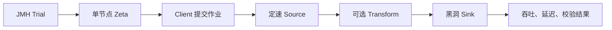

*图 1：同一轮运行中的 JMH 汇总，包括完整 Pipeline 和 SeaTunnelRow 热点操作。*


*图 2：五条 Pipeline 在相同负载下的吞吐、延迟、增长比例与有效样本。*

## 一、先读懂这组结果

这轮测试使用 Java 8、4 GiB 堆、4 个 JVM 可见处理器和 4 个 Pipeline 并行度；每次作业处理 1,000,000 行，计划输入速率为 600,000 行/秒，Payload 为 256 个字符。

结果可以压缩成三点：

1. 五个场景的 Sink 吞吐都在 58.8 万到 59.1 万行/秒，P99 为 100 到 101 ms，Growth 为 0.99 到 1.00，75/75 个样本全部有效，说明当前负载下没有持续积累 backlog；
2. Pipeline JMH Score 的最大差距约为 0.87%，而本轮 Error 为 0.88% 到 1.38%，因此只能说没有观察到可区分的功能开销，不能说某个场景更快或“零开销”；
3. 60 万行/秒是本轮固定负载，不是容量上限。真正的容量评估还需要提高输入速率并持续观察吞吐、P99 和延迟增长。

因此，这组数字首先证明的是基准链路完整、当前负载可持续，并且能够对不同引擎能力进行同口径比较，而不是给 Zeta 下一个脱离环境的绝对性能结论。

## 二、为什么要同时做微基准和完整 Pipeline

SeaTunnel 的基准测试分为两层，两者回答的问题不同。

### SeaTunnelRow 微基准：定位热点

`SeaTunnelRowBenchmark` 关注 Source、Transform 和 Sink 热路径中的基础操作，包括 Row 创建、字段读取、复制、投影、Options 和大小计算。

| 操作 | Score（ops/ms） | CV | 主要含义 |
| --- | ---: | ---: | --- |
| `copyPlainRow` | 22,328.74 | 1.01% | 完整复制普通 Row |
| `copyProjectedPlainRow` | 59,769.89 | 1.57% | 只复制 8 个字段中的 4 个投影字段 |
| `copyProjectedRowWithOptions` | 49,282.32 | 0.59% | 投影复制，同时处理 Options |
| `copyRowWithOptions` | 20,789.92 | 0.22% | 完整复制带 Options 的 Row |
| `copyRowWithTracePayload` | 20,499.68 | 0.27% | 完整复制带 Trace Payload 的 Row |
| `copyThenMutateCopiedOptions` | 7,305.63 | 1.01% | 复制后修改 Options |
| `createRowAndGetBytesSize` | 5,837.52 | 0.68% | 创建 Row 并计算大小 |
| `createRowWithSetField` | 7,668.90 | 0.59% | 逐字段构建 Row |
| `getBytesSizeCached` | 254,677.57 | 1.13% | 读取已经缓存的大小 |
| `readFields` | 28,347.47 | 0.47% | 读取并消费全部字段 |

`ops/ms` 表示每毫秒完成多少次操作，越大越好。例如 `copyPlainRow` 的 22,328.74 ops/ms 约等于每秒 2,233 万次操作。

这些数字主要用于同一方法跨版本比较，或者比较语义相近的操作。不能因为 `getBytesSizeCached` 比 `createRowAndGetBytesSize` 高很多，就直接得出某段完整业务链路快了相同比例：前者只是读取缓存，后者同时包含对象创建和首次大小计算，测量对象并不相同。

在语义接近的复制场景中可以看到，带 Options 的完整复制比普通复制低约 6.9%，加入 Trace Payload 后比普通复制低约 8.2%。这类差异能够提示优化方向，但最终是否影响真实任务，仍要回到完整 Pipeline 验证。

### Zeta Pipeline 基准：验证整体效果

完整 Pipeline 启动真实的单节点 Zeta Master 和 Worker，并通过正常的 Client、配置解析、任务提交和调度链路执行有界作业。



集群在 `Trial` 的 Setup 阶段启动，不进入计时区间。每次 Benchmark invocation 都会提交一个包含 1,000,000 行数据的完整作业，作业配置生成、提交、调度、Source、可选 Transform、Sink 和完成等待都在测量范围内。

这种设计比只调用一个内部方法更接近真实引擎，又通过内存 Source 和黑洞 Sink 去掉了外部系统波动，适合回答“引擎核心链路是否发生变化”。

## 三、完整 Pipeline 是怎么做的

### 1. 用开环 Source 暴露排队时间

Source 根据绝对时间安排每条记录的计划生成时间：

```text
scheduledTime = startTime
              + wholeSeconds × 1000
              + remainder × 1000 / rate
```

如果引擎暂时变慢，计划时间仍然向前推进，不会因为上一条记录处理得慢就暂停计时。记录到达 Sink 后计算：

```text
event-time latency = Sink 接收时间 - 计划生成时间
```

因此，引擎无法及时处理产生的排队会进入 P50、P95 和 P99，而不会被 Source 的自适应变慢隐藏。这避免了性能测试中常见的 Coordinated Omission：系统越慢，测试端发送得越慢，最后反而漏掉最需要测量的等待时间。

### 2. 用确定性组件隔离引擎开销

测试组件尽量不引入随机业务行为：

- Source 生成固定数量、固定 Payload 的内存数据；
- Transform 执行固定次数的 hash 工作，并输出可校验 checksum；
- Sink 不访问外部系统，只统计行数、吞吐、延迟分布和 checksum；
- 每条 Pipeline 都保持相同的数据量、并行度和资源配置，只切换目标能力。

五个场景分别覆盖基础数据链路、Transform、实时忙碌度观测、StainTrace 以及两者组合。这样才能把“功能开销”与“工作负载变化”分开。

### 3. 先验证正确性，再接受性能样本

性能很快但少处理了数据，是无效结果。每次完整作业都会检查：

- `processed_rows` 是否等于 `expected_rows`；
- 基础 Source → Sink 场景的 checksum 是否为 0；
- 含 Transform 的场景 checksum 是否非 0；
- 延迟百分位是否落入统计范围，而不是被 overflow bucket 截断；
- P99 和延迟增长是否满足当前基准的保护条件。

只有数据完整、Transform 确实执行并且延迟可解释，样本才会进入最终报告。

### 4. 用独立 JVM、预热和机器可读结果表达不确定性

公共 JMH 配置使用 3 个 Fork、每个 Fork 3 次预热和 5 次测量。Fork 提供相互独立的 JVM 进程，预热阶段让类加载、JIT 编译和初始化尽量离开最终结果，Measurement 才参与聚合。

每个 Measurement Iteration 内可以完成多次完整 Pipeline invocation，所以图中的 75/75 不是 75 行数据，也不等于 15 个 JMH Iteration，而是这轮 Measurement 阶段实际产生的 75 个 Pipeline 作业样本；预热样本被明确排除。

除了 Markdown 汇总，测试还保留原始 JMH JSON、每次 Pipeline JSON、标准化指标和环境元数据。Commit、JDK、JVM 参数、运行器镜像、CPU、内核、内存和负载参数共同决定一组结果能否与另一组结果比较。

## 四、怎样读懂两套数字

### JMH Score 和 Pipeline Throughput 为什么不同

Pipeline 类声明每次 invocation 包含 1,000,000 个逻辑操作，因此 JMH 会把完整作业耗时换算为 `ops/s`：

```text
JMH Score ≈ 1,000,000 / 完整作业耗时
```

这里的完整作业耗时包括配置生成、提交、调度、Source、Transform、Sink 和结束等待。

Pipeline JSON 的吞吐边界更窄：

```text
Pipeline Throughput
    = processed_rows / (Sink 最后一条接收时间 - 第一条接收时间)
```

它只观察 Sink 实际接收数据的区间，不包含作业提交和收尾固定成本。因此图中 JMH Score 约为 45.4 万到 45.8 万 ops/s，而 Pipeline Throughput 约为 58.8 万到 59.1 万行/秒。这不是两套结果矛盾，而是测量边界不同。

### Score、Error、CV 和 Unit

| 字段 | 含义 | 使用方式 |
| --- | --- | --- |
| `Score` | JMH 对当前方法吞吐的估计值 | 吞吐模式下越大越好 |
| `Error` | 当前运行内部置信区间半宽占 Score 的比例 | 区间可近似理解为 `Score × (1 ± Error%)` |
| `CV` | 样本标准差除以样本均值 | 越低表示本轮样本越集中 |
| `Unit` | 指标单位 | Pipeline 为 `ops/s`，Row 微基准为 `ops/ms` |

`Error` 和 CV 只能描述本次运行内部的波动，不包含不同宿主机、不同 CPU 调度状态和不同系统负载之间的漂移。比较两个版本时，不能只因为 Score 相差 1% 就认定发生了回归。

### P50、P95、P99、Max、Growth 和 Valid

- P50：一半记录的延迟不超过该值，代表典型体验；
- P95 / P99：观察尾部记录，能更早暴露排队、暂停和抖动；
- Max：最慢记录，但对单个异常值更敏感，应和百分位一起看；
- Growth：比较前后半段 P99，判断 backlog 是否持续累积；
- Valid：Measurement 阶段完整、可持续且没有百分位溢出的样本数量。

其中 Growth 的计算方式是：

```text
Growth = (后半段 P99 + 1) / (前半段 P99 + 1)
```

吞吐告诉我们单位时间完成多少工作，延迟告诉我们每条记录等了多久，Growth 告诉我们这种等待是否还在恶化。三者必须结合，任何一个单独使用都可能产生错误结论。

## 五、设计背后的理论依据

这套设计不是从 JMH 注解开始的，而是先回答三个更基础的问题：Java 程序怎样得到可信样本、有限时间应该如何分配重复预算、流处理系统怎样避免把排队时间漏掉。对应的理论基础来自三项性能评估研究。

### 1. Java 性能不是一个固定常数

*Statistically Rigorous Java Performance Evaluation* 讨论的核心问题是：相同 Java 程序在相同机器上重复运行，为什么仍会得到不同结果，以及应该怎样从这些结果中得出可信结论。

JIT 编译时机、GC、线程调度、堆布局和操作系统扰动都会改变一次运行的结果。如果只取多次运行中的最好值，最终得到的只是“最幸运的一次有多快”。重复次数越多，抽到极端好运样本的概率反而越高，因此 `best of N` 不是稳定、可比较的估计方法。

论文进一步区分了启动性能和稳定态性能。启动性能关心 JVM 启动、类加载和初始化的总成本；稳定态性能关心程序完成初始化后的长期执行能力。两者的测量对象不同，不能混在一个数字中。对于稳定态评估，同一个 JVM 内的 Iteration 共享 JIT Profile、堆和 GC 历史，不能简单当成完全独立的实验；独立 JVM invocation 是必须保留的重要层级。

这对应到当前设计中的 3 个 Fork、Warmup 与 Measurement 分离，以及 Score 和 Error 同时输出。它们不是为了让配置看起来复杂，而是避免把一次 JVM 生命周期中的偶然状态当成稳定结论。不过，3 个 Fork 仍只是一期的固定起点，最终需要根据长期方差判断样本数量是否足够。

### 2. 严谨不等于机械地多跑几次

*Rigorous Benchmarking in Reasonable Time* 继续追问：如果 Build、JVM Execution 和 Iteration 都存在波动，有限的实验时间应该花在哪一层？

它把性能实验看成一个分层结构：重新构建可能改变代码布局，重新启动 JVM 会重新经历 JIT 和堆状态变化，同一 JVM 内的 Iteration 又会受到局部运行时扰动。增加内层 Iteration 只能减少这一层的不确定性，无法消除不同 JVM 或不同 Build 之间的差异。如果主要波动来自 Fork，那么把每个 Fork 从 5 次 Iteration 增加到 50 次，收益可能远小于增加独立 Fork。

论文提出先做定标实验：测量各层的方差和时间成本，再把重复预算分配给真正贡献不确定性的层级。这意味着 `3 Fork × 5 Measurement` 不是可以永久照抄的真理，而是一组需要由数据检验的初始配置。

当前框架保留原始 Fork、Iteration 和 Pipeline 样本，也记录环境元数据，就是为了后续分析方差来自哪里。托管运行器上的结果先作为观察信号；当固定机器和历史样本积累起来后，才能进一步决定需要多少重复、什么差异值得重跑，以及什么时候应该输出 `INCONCLUSIVE`，而不是直接判断回归。

### 3. 流处理必须测量被排队的时间

*Benchmarking Distributed Stream Data Processing Systems* 解决的是流处理场景特有的测量边界问题。传统闭环负载生成器通常在上一批数据处理完成后再发送下一批；当系统变慢时，生成器也跟着变慢，真正进入排队等待的请求反而没有被完整测量，这就是 Coordinated Omission。

如果延迟只从 Source 摄入记录后开始计算，外部已经等待数秒的数据可能仍显示为几十毫秒。这个数字在定义上没有算错，却无法反映事件从计划产生到最终完成的真实等待。

论文因此强调开环负载、事件生成时间和可持续吞吐。输入速率应独立于系统完成速度向前推进，延迟应从事件原本计划产生的时间开始计算；容量也不应定义为短时间内出现的最大峰值，而应定义为系统能够长期处理、同时不持续积累 backlog 和 event-time latency 的最高输入速率。

SeaTunnel 的 BenchmarkSource 使用绝对时间调度，每条记录携带计划生成时间。即使 Zeta 暂时跟不上，计划时间仍继续推进，积压会直接反映到 P99 和 Growth 中。Sink 吞吐接近输入速率只能说明完成速度接近目标，只有再结合输出完整性和前后半段 P99，才能判断当前负载是否真正可持续。

### 4. 三篇论文共同支撑了什么

三篇论文分别约束了三层问题：第一篇告诉我们怎样对待 JVM 随机性，第二篇告诉我们怎样分配实验预算，第三篇告诉我们流处理究竟应该测量什么。

它们共同指向一个结论：可信 Benchmark 不是“多跑几次取平均值”，而是先定义正确的测量对象，再识别独立实验层级，最后用吞吐、延迟、完整性和不确定性共同表达结果。统计方法不能修复错误的测量边界，正确的测量边界也不能代替重复与方差分析，两部分必须同时成立。

## 六、设计基准测试的一套方法

我认为第一步不是立即写 JMH 方法，而是先理解什么是基准测试，并阅读成熟研究，弄清启动与稳态、独立样本、分层方差、开环负载和可持续吞吐这些基本概念。之后可以按下面的顺序推进：

1. **定义问题**：要评估热点方法、完整引擎链路、容量边界，还是某项能力的增量开销；
2. **固定边界**：明确计时从哪里开始、在哪里结束，哪些成本包含，哪些被排除；
3. **固定工作负载和资源**：记录数据量、速率、Payload、并行度、CPU、堆、GC、JDK 和系统环境；
4. **设计确定性数据与正确性校验**：先证明处理完整，再讨论快慢；
5. **分离预热与测量，保留独立重复**：根据实际方差决定 Fork、Iteration 和更高层重复预算；
6. **同时输出吞吐、延迟、增长与不确定性**：不取最好值，不用单个指标代替完整证据；
7. **先观察，后门禁**：积累固定机器上的历史分布、误报率和重跑规则，再定义回归阈值。

## 七、当前设计的边界

这套基准已经能为 Zeta 核心链路提供可重复的性能证据，但仍有明确边界：

- 托管运行器会在不同宿主机之间变化，单次结果适合观察，不适合直接阻塞代码变更；
- 4 个 JVM 可见处理器不等于 4 个独占物理核心；
- 单节点模式不包含跨节点传输、网络抖动和分布式调度成本；
- 内存 Source 与黑洞 Sink 不代表真实 Connector 和外部系统性能；
- 当前负载验证的是 60 万行/秒附近的稳定性，不是完整容量曲线；
- Trace 结论只适用于当前采样间隔，改变采样密度后需要重新测量；
- CPU、内存、GC、队列占用、Checkpoint 和状态存储仍需要在后续场景中补齐。

精细版本对比应在同一台空闲机器上交替运行基线与候选版本，避免测试顺序和宿主机差异长期偏向一方。真正的性能门禁还需要固定硬件、长期历史数据、正常波动区间、`INCONCLUSIVE` 状态和人工复核规则。

## 总结

SeaTunnel 基准测试的核心不是“跑出每秒多少行”，而是把性能问题拆成两层：

- SeaTunnelRow 微基准负责发现和定位热路径变化；
- 真实单节点 Zeta Pipeline 负责验证变化是否影响完整引擎链路。

在当前固定配置下，Zeta 可以稳定维持 600,000 行/秒的计划输入，P99 约为 100 ms，五个场景没有观察到可区分的增量开销。更重要的是，这些结论都带有清晰的负载、资源、测量边界、正确性检查和不确定性说明。

可信的性能工程不追求一个永远正确的数字，而是建立一套能够被重复、被质疑、被比较，也知道自己边界在哪里的证据体系。
