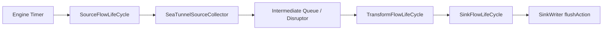
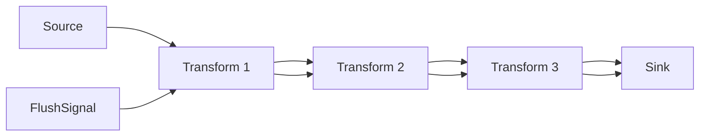
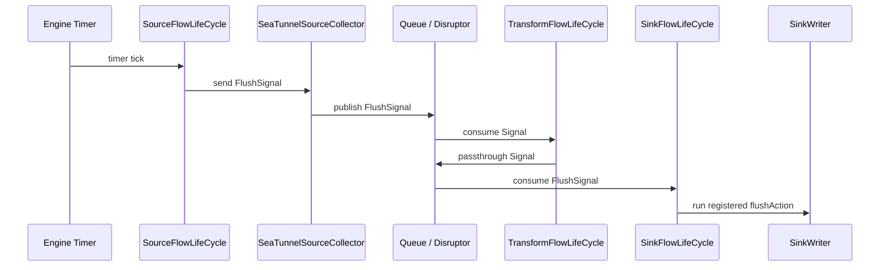

很多时候，深入一个开源项目并不是从“我要读懂整个引擎”开始的。

更真实的路径往往是：先遇到一个具体问题，尝试在局部解决；然后发现局部方案越来越别扭，开始牵扯线程模型、生命周期、checkpoint、异常传播和背压；最后才意识到，这已经不是某个 Connector 能独立解决的问题，而是引擎层能力的缺口。

我这次深入 SeaTunnel Zeta Engine，就是从 JDBC Sink 的一个看似普通的问题开始的：

> `batch_interval_ms` 到底应该怎么实现？

或者说得更准确一点：

> JDBC Sink 如何实现基于真实时间流逝的定时 flush？

这里我不再使用“墙钟”这个词。虽然 wall-clock time 在英文技术语境里很常见，但中文里“墙钟”读起来有点生硬。下文统一用“真实时间”“定时触发”“按时间间隔触发”来表达这个含义。

这篇文章不讲任务提交链路，不讲 JobMaster、PhysicalPlan、SubPlan 的调度主线，只聚焦一个问题：**Flush 信号如何在 SeaTunnel 引擎层实现，以及我是如何从 JDBC 层的定时 flush 问题，一步步深入到 Zeta Engine 的。**

## 问题起点：JDBC Sink 的 batch flush

JDBC Sink 里常见的写入优化方式是 batch。

用户通常会配置类似这样的参数：

```text
batch_size = 1000
batch_interval_ms = 5000
```

这两个参数表达的是两种 flush 条件：

| 参数 | 含义 |
| --- | --- |
| `batch_size` | 缓冲区达到指定条数时 flush。 |
| `batch_interval_ms` | 距离上次 flush 达到指定时间间隔时 flush。 |

`batch_size` 很好理解。每来一条数据，写入 buffer，然后判断 buffer size：

```text
if buffer.size >= batchSize:
    flush()
```

这类逻辑天然发生在 `writeRecord()` 里，因为只有收到数据时，buffer size 才会变化。

但 `batch_interval_ms` 不一样。

它表达的是一种真实时间语义：

```text
即使没有新数据进来，只要时间到了，也应该有机会 flush。
```

这就是问题的核心。

## 第一版思路：在 JDBC Connector 内部起线程

最直觉的方案是：在 JDBC Sink 内部启动一个 `ScheduledExecutorService`。

伪代码大概是这样：

```java
scheduledExecutor.scheduleAtFixedRate(() -> {
    flush();
}, batchIntervalMs, batchIntervalMs, TimeUnit.MILLISECONDS);
```

从功能上看，这样确实可以实现按真实时间触发 flush。

因为它不依赖新数据到来。即使 Source 空闲，即使很久没有调用 `writeRecord()`，后台线程仍然会周期性触发 `flush()`。

但这个方案很快会暴露问题。

### flush 逃逸到了 Connector 自己的后台线程

SeaTunnel Sink 的正常写入链路，应该是在 Task 的运行线程里执行。

而后台线程会让 flush 从主执行链路里“逃逸”出去：

```text
Task Thread:
  writeRecord(record)

Connector Background Thread:
  flush()
```

这样一来，`writeRecord()` 和 `flush()` 可能并发访问同一个 buffer、connection、statement 或 transaction context。

于是你不得不继续处理：

- 锁怎么加；
- flush 和 write 并发怎么办；
- flush 和 checkpoint 并发怎么办；
- flush 和 close 并发怎么办；
- flush 出错时谁感知；
- 任务取消时线程怎么停；
- 任务失败时线程是否还活着。

一个 batch interval 参数，最后变成了 Connector 内部线程模型设计。

这显然不对。

### 异常传播很尴尬

如果 `flush()` 在后台线程里执行时抛异常，异常不会自然出现在 Task 主执行线程里。

这会导致一个很危险的问题：

```text
后台线程 flush 已经失败，
但 SeaTunnel Task 可能还不知道。
```

那么什么时候能知道？

可能要等到下一次：

- `writeRecord()`；
- `prepareCommit()`；
- checkpoint；
- close；
- 或者某个异步状态被主线程轮询到。

这和数据集成任务的 fail-fast 预期不一致。

对于 Sink 来说，写入失败应该尽快暴露给引擎，让任务进入失败或恢复流程，而不是藏在 Connector 私有线程里。

### 生命周期管理不属于 Connector

如果每个 Connector 都为了 `batch_interval_ms` 自己起一个线程，那么每个 Connector 都要重复处理：

- 线程创建；
- 线程命名；
- 线程关闭；
- 异常捕获；
- 任务取消；
- 任务失败；
- classloader；
- close 顺序；
- checkpoint 并发。

这些其实都不是 JDBC 自己的领域问题。

JDBC Connector 应该关心的是：

```text
如何执行 SQL，
如何管理 connection，
如何 batch，
如何 commit / rollback。
```

它不应该为了一个定时 flush，自己维护一套运行时调度系统。

所以第一版“Connector 内部起线程”的方案，从功能上能跑，但从引擎设计上并不干净。

## 第二版思路：在 writeRecord 中同步判断时间

为了避免后台线程带来的并发和异常传播问题，另一个方案是把时间判断放回 `writeRecord()`。

伪代码大概是：

```java
public void writeRecord(Row row) {
    buffer.add(row);

    if (buffer.size() >= batchSize) {
        flush();
        return;
    }

    if (System.currentTimeMillis() - lastFlushTime >= batchIntervalMs) {
        flush();
    }
}
```

这个方案有明显优点：

- 没有额外后台线程；
- `flush()` 和 `writeRecord()` 在同一个线程里执行；
- 异常可以直接抛给 Task；
- 不容易产生并发 race；
- 生命周期更简单。

看起来比第一版好多了。

但它有一个致命问题：

> 如果没有新数据进来，`writeRecord()` 就不会被调用，时间判断也永远不会发生。

这意味着 `batch_interval_ms` 的语义被悄悄改变了。

用户以为它是：

```text
距离上次 flush 超过 5 秒就 flush。
```

但实际变成了：

```text
下一条数据到来时，如果距离上次 flush 超过 5 秒，就顺便 flush。
```

这不是真正的定时触发语义。

在高吞吐场景下，这个差异不明显。因为数据一直来，`writeRecord()` 会频繁触发。

但在低吞吐、分区空闲、CDC 间歇性变更、小表同步等场景下，问题就会变得明显：

```text
buffer 里已经有数据，
但后续没有新数据，
writeRecord 不再被调用，
batch_interval_ms 永远无法触发。
```

这时数据只能等到 checkpoint 或 close 才写出去。

这和用户对 `batch_interval_ms` 的理解是不一致的。

## 真正的矛盾：真实时间触发不属于 Connector 写入路径

走到这里，问题已经很清楚了。

我们有两个方案，但各有硬伤。

| 方案 | 优点 | 问题 |
| --- | --- | --- |
| Connector 内部起线程 | 能按真实时间触发。 | 并发复杂、异常传播差、生命周期难管。 |
| `writeRecord()` 中判断时间 | 单线程、异常传播简单。 | 空闲时无法触发，不是真正的定时语义。 |

这说明 `batch_interval_ms` 需要的是一种运行时能力：

```text
即使没有数据输入，系统也能按真实时间产生一个事件；
这个事件要进入正常 Task 执行链路；
最终在 Sink 的消费线程中触发 flush。
```

这已经不是 JDBC Connector 自己能优雅解决的问题。

它需要引擎提供一种能力：

```text
Engine Timer
  -> 产生 FlushSignal
  -> 沿数据通道向下游传播
  -> Sink 收到后执行 flush
```

也就是说，真正缺失的不是 JDBC 的某段代码，而是 SeaTunnel Engine 缺少一个统一的 timer signal 机制。

这就是 STIP-23 要解决的问题。

## 从 Connector 思维切换到 Engine 思维

一开始我是在想：

> JDBC Sink 要怎么实现 `batch_interval_ms`？

后来问题变成：

> SeaTunnel 中所有 Sink Connector 要怎么安全实现 time-based flush？

再往后，问题继续上升：

> 引擎是否应该提供一种控制信号，让 Source、Transform、Sink 可以在正常数据通道里传递非数据事件？

这个思维切换很关键。

Connector 思维关注的是：

```text
我这个 JDBC Sink 怎么 flush？
```

Engine 思维关注的是：

```text
所有 Sink 都可能有类似需求；
timer、线程、异常、生命周期、checkpoint、背压应该由谁管理？
```

如果每个 Connector 自己实现一遍，那么 SeaTunnel 会出现很多套不一致的逻辑：

- JDBC 一套 timer；
- MongoDB 一套 timer；
- Doris 一套 timer；
- StarRocks 一套 timer；
- 未来其他 Sink 又各写一套。

这不仅重复，而且很难保证行为一致。

所以更合理的边界应该是：

```text
Connector 负责定义 flush 做什么；
Engine 负责决定什么时候触发 flush，以及如何把 flush 事件安全送到 Sink。
```

这就是 Engine-Level Timer Flush 的核心思想。

## STIP-23 的核心设计

STIP-23 可以概括成一句话：

> 引擎层提供定时 FlushSignal，Connector 选择性注册 flushAction，Sink 在收到 FlushSignal 后执行自己的 flush 逻辑。

整体链路如下：



它拆开看主要有几个部分。

## 第一步：引擎配置 sink.flush.interval

既然 timer 是引擎能力，就需要一个引擎级配置控制它。

例如：

```text
sink.flush.interval = 5000
```

这个配置表达的不是某个 JDBC 参数，而是引擎层的 flush signal 周期。

它的语义是：

```text
Engine 每隔指定时间尝试产生一次 FlushSignal。
```

默认值可以是 `0`，表示关闭。

这样设计有几个好处：

- 不影响已有任务；
- 没有显式开启就不产生额外行为；
- 不支持 flushAction 的 Sink 不受影响；
- 由 Connector 自己决定是否 opt-in。

也就是说，引擎提供能力，但不强迫所有 Connector 使用。

## 第二步：SinkWriter.Context 注册 flushAction

引擎不应该知道 JDBC 具体怎么 flush。

JDBC 的 flush 可能是：

```text
statement.executeBatch()
```

MongoDB 的 flush 可能是：

```text
bulkWrite()
```

其他 Sink 可能有自己的 buffer、事务或提交协议。

所以引擎只需要提供一个注册点：

```java
context.registerFlushAction(() -> {
    flush();
});
```

这个设计非常关键。

它把职责切得很清楚：

```text
Connector:
  定义 flush 动作。

Engine:
  定义触发时机和传递方式。
```

这样 JDBC Sink 可以把原来 `batch_interval_ms` 对应的 flush 逻辑注册给引擎。

引擎到了时间，只负责发信号。Sink 收到信号后，再执行自己注册的动作。

## 第三步：Timer 不直接调用 Sink，而是发 FlushSignal

这里有一个非常重要的设计点：

> Timer 线程不应该直接调用 Sink 的 flushAction。

如果 timer 直接调用 Sink：

```text
Timer Thread -> SinkWriter.flush()
```

那问题又回到了最开始的后台线程方案。

它还是会带来：

- flush 和 write 并发；
- flush 和 checkpoint 并发；
- 异常传播复杂；
- 生命周期难管理；
- Sink 内部需要加锁。

所以 STIP-23 没有让 timer 直接调用 Sink，而是让 timer 产生一个控制信号：

```text
FlushSignal
```

然后把这个 signal 注入 SeaTunnel 正常的数据流里。

这一步是整个设计最核心的地方。

它把问题从：

```text
异步线程直接操作 Sink
```

变成了：

```text
引擎产生一个控制事件，让它沿着 Task 数据通道走到 Sink。
```

## 第四步：为什么从 SourceFlowLifeCycle 发信号

FlushSignal 要进入数据流，最自然的位置是 Source 侧。

因为在 SeaTunnel 的运行模型里，数据就是从 Source 往下游流动：

```text
Source -> Transform -> Sink
```

如果 flush 是一个“控制事件”，那它也应该从上游进入，跟随数据通道一路传到 Sink。

所以 timer tick 后，并不是直接找 Sink，而是通知 Source 侧生命周期，让 Source 发出 `FlushSignal`：

```text
Timer tick
  -> SourceFlowLifeCycle
  -> sendFlushSignal()
```

这有几个好处。

### 保持数据通道的一致性

FlushSignal 和普通数据走相似的路径：

```text
Source Collector
  -> Queue / Disruptor
  -> Transform
  -> Sink
```

这意味着它不绕过引擎已有的队列、线程和消费模型。

### 方便和 checkpoint lock 协调

Source 侧本来就是数据、barrier 等事件进入下游的关键位置。

FlushSignal 从这里进入，可以更自然地和 checkpoint 相关锁、状态一致性做协调。

### 不破坏 Sink 的线程模型

Sink 不会被外部 timer 线程直接调用。

它仍然是在自己的消费路径中处理 flush。

这就避免了 Connector 内部起线程带来的并发问题。

## 第五步：SeaTunnelSourceCollector 发送 FlushSignal

SourceFlowLifeCycle 产生 `FlushSignal` 后，需要通过 Source Collector 发往下游。

可以把它理解为：

```text
普通数据：
  collector.collect(record)

Flush 控制信号：
  collector.sendFlushSignal()
```

普通数据和控制信号都进入下游队列，只是类型不同。

这一步带来了一个抽象上的变化：SeaTunnel 数据通道里不再只有业务数据，还可以有控制信号。

```text
StreamElement
  ├── Record
  ├── Barrier
  └── Signal
        └── FlushSignal
```

这说明 SeaTunnel 引擎在表达能力上更进一步了。

它不只是“搬运数据”，也能在数据流中传递运行时控制事件。

## 第六步：Transform 只透传 Signal

FlushSignal 到达 Transform 时，Transform 不应该执行 flush。

因为 Transform 不是最终写出位置。它也不应该理解 JDBC、MongoDB 或其他 Sink 的 flush 语义。

所以 Transform 的正确行为是：

```text
如果收到普通 Record：
    执行 transform 逻辑。

如果收到 Signal：
    原样传给下游。
```

也就是 signal passthrough。

这点看似简单，但非常重要。

它保证了 Source 到 Sink 之间即使有多个 Transform，FlushSignal 也不会丢失。



Transform 不关心 flush 的业务含义，只负责保持控制信号继续向下游传播。

这是一个很干净的分层。

## 第七步：SinkFlowLifeCycle 接收 FlushSignal

最终，FlushSignal 到达 Sink。

SinkFlowLifeCycle 需要区分两类输入：

```text
Record:
  调用 SinkWriter.write(record)

FlushSignal:
  调用 flushAction.run()
```

逻辑上可以理解为：

```java
if (event instanceof Record) {
    sinkWriter.write(record);
}

if (event instanceof FlushSignal) {
    Runnable flushAction = sinkWriterContext.getFlushAction();
    if (flushAction != null) {
        flushAction.run();
    }
}
```

这里最关键的是：`flushAction.run()` 是在 Sink 正常消费线程里执行的。

也就是说，它不是在 timer 线程里执行。

这正好解决了前面 JDBC Connector 内部线程的问题：

| 问题 | Engine-Level FlushSignal 如何解决 |
| --- | --- |
| flush 和 write 并发 | flush 进入 Sink 消费链路，和 write 顺序执行。 |
| 异常难传播 | flushAction 异常直接出现在 Sink 执行路径。 |
| 生命周期难管 | timer 由引擎管理。 |
| Connector 重复造线程 | Connector 只注册 flushAction。 |
| 空闲时不触发 | timer 不依赖新数据输入。 |
| 多 Connector 行为不一致 | 引擎提供统一 signal 机制。 |

这就是 FlushSignal 设计的价值。

## 完整链路复盘

把整个过程串起来，就是：



再用文字描述一遍：

1. 用户配置 `sink.flush.interval`。
2. JDBC Sink 在初始化 Writer 时注册 `flushAction`。
3. Engine Timer 按真实时间周期触发。
4. Timer 不直接调用 JDBC flush，而是通知 SourceFlowLifeCycle。
5. SourceFlowLifeCycle 通过 Collector 发送 `FlushSignal`。
6. `FlushSignal` 进入 SeaTunnel 的中间队列或 Disruptor。
7. TransformFlowLifeCycle 收到 Signal 后透传。
8. SinkFlowLifeCycle 收到 `FlushSignal`。
9. SinkFlowLifeCycle 从 Context 中取出 flushAction。
10. 在 Sink 消费线程中执行 JDBC 的 flush 逻辑。

这样，JDBC Sink 就获得了真正的定时 flush 能力，同时避免了 Connector 自己起线程。

## 为什么这才是真正的定时 flush

回到最初的问题：JDBC 的 `batch_interval_ms` 到底应该是什么语义？

如果只在 `writeRecord()` 中判断时间，它不是严格的定时触发语义。因为没有数据时不会触发。

而 Engine Timer 不依赖数据到来。

即使 Source 暂时没有新数据，timer 仍然会周期触发：

```text
没有新 Record，
但仍然可以有 FlushSignal。
```

这才符合用户对 `batch_interval_ms` 的直觉：

```text
buffer 中只要有数据，到了时间就应该尽快 flush。
```

当然，FlushSignal 不是用户数据，也不是 checkpoint barrier。它是一种周期性控制事件。

所以在背压严重时，它可以采用更宽松的策略，例如非阻塞发送、发送失败时放弃本次 signal，等待下一次 timer tick。

这是合理的。

因为 FlushSignal 的语义不是：

```text
每一个 flush signal 都必须 exactly-once 处理。
```

而是：

```text
引擎周期性提醒 Sink：如果你有 buffer，可以考虑 flush。
```

它是“触发机会”，不是“业务数据”。

## Exactly-Once 下为什么不能强制所有 Sink 使用

虽然 Engine-Level FlushSignal 很通用，但它不能强制所有 Sink 都使用。

原因是不同 Sink 的 flush 语义不同。

对 JDBC XA 来说，flush 可能只是：

```text
executeBatch()
```

数据仍然在当前事务里，真正提交发生在 checkpoint commit 阶段。

这种情况下，timer flush 通常是安全的。

但对某些 Sink 来说，flush 可能意味着：

```text
结束一次 load，
形成一次事务边界，
产生外部可见结果。
```

如果 flush 改变了事务边界，那它就不能随便被 timer 触发。

所以正确设计一定是 opt-in：

```text
Engine 提供 FlushSignal，
Sink Connector 自己决定是否注册 flushAction。
```

如果某个 Sink 不注册 flushAction，那么即使 FlushSignal 到达 Sink，也不会发生额外动作。

这保护了 Connector 自己的事务语义。

## 这个问题让我理解的引擎边界

这次从 JDBC 定时 flush 深入到引擎，我最大的收获不是知道了某几个类怎么改，而是对 Engine 和 Connector 的边界有了更清楚的理解。

### Connector 应该负责什么

Connector 应该负责外部系统相关的语义：

- JDBC 如何 batch；
- SQL 如何执行；
- connection 如何管理；
- XA transaction 如何 prepare / commit / rollback；
- flush 到底做什么；
- flush 是否影响事务；
- 哪些场景可以注册 flushAction。

### Engine 应该负责什么

Engine 应该负责运行时能力：

- timer 如何创建；
- timer 生命周期如何管理；
- 任务失败时 timer 如何清理；
- 控制信号如何进入数据流；
- signal 如何穿过 Transform；
- Sink 如何在正确线程中消费 signal；
- 异常如何传播；
- 背压下 signal 如何处理；
- checkpoint lock 如何协调。

如果把 Engine 的职责放到 Connector，就会出现每个 Connector 各自起线程、各自处理异常、各自处理生命周期的问题。

如果把 Connector 的职责放到 Engine，引擎又会错误假设不同外部系统的事务和 flush 语义。

所以最合理的分层是：

```text
Engine 提供 timer + FlushSignal 机制，
Connector 提供 flushAction。
```

这就是 STIP-23 设计里最值得学习的地方。

## 从一个参数走向引擎进阶

回头看，这条路径其实很典型。

一开始只是一个参数：

```text
batch_interval_ms
```

然后变成一个问题：

```text
低吞吐或空闲时，JDBC Sink 如何按真实时间 flush？
```

再往下变成线程模型问题：

```text
Connector 自己起线程是否安全？
```

继续往下变成异常传播问题：

```text
后台线程 flush 失败后，Task 如何 fail-fast？
```

再往下变成生命周期问题：

```text
任务 cancel / fail / close 时，timer 谁来停？
```

最后变成引擎抽象问题：

```text
SeaTunnel 是否需要一种统一的 runtime control signal？
```

这就是我理解的“引擎进阶之路”。

不是一上来就读完整个引擎，而是从一个真实问题出发，顺着问题边界不断往下挖。

当你发现局部代码越来越别扭，通常说明问题的抽象层级放错了。

JDBC 的定时 flush 问题就是这样。

它表面上是 JDBC Sink 的 batch flush 问题，实际上是 SeaTunnel Engine 缺少 timer signal 能力的问题。

## 总结

Engine-Level FlushSignal 的核心价值，可以总结成三句话。

第一，它让 `batch_interval_ms` 拥有真正的定时触发语义。

不再依赖下一条数据到来，timer 可以在空闲时主动产生 flush signal。

第二，它避免了 Connector 自己维护后台线程。

Connector 不再需要自己处理 timer、并发、异常传播、生命周期。

第三，它把 flush 触发放回 SeaTunnel 正常数据通道。

FlushSignal 从 Source 注入，穿过 Transform，最终在 Sink 消费线程里执行 flushAction。

完整链路是：

```text
Engine Timer
  -> SourceFlowLifeCycle
  -> SeaTunnelSourceCollector
  -> Queue / Disruptor
  -> TransformFlowLifeCycle
  -> SinkFlowLifeCycle
  -> SinkWriter.flushAction
```

这条链路背后体现的是 SeaTunnel 引擎设计的一条重要原则：

```text
Connector 负责外部系统语义，
Engine 负责运行时机制。
```

对我来说，这次真正的收获不是解决了一个 JDBC 参数，而是通过这个参数，看到了 SeaTunnel Zeta Engine 如何处理运行时控制事件。

这也是我理解的 SeaTunnel 引擎进阶：

从写 Connector，
到理解 Task 运行时，
再到理解数据通道里的控制信号，
最后理解 Engine 和 Connector 的能力边界。
