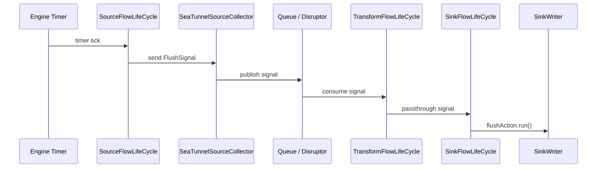

我一开始只是想解决 JDBC Sink 里的一个参数：`batch_interval_ms`。

这个参数看起来很简单：buffer 里的数据攒到一定时间就 flush。但真正做下去会发现，它并不是一个 JDBC Connector 自己能优雅解决的问题。

因为它背后牵扯的不是 JDBC 怎么执行 SQL，而是：

- 定时任务由谁管理；
- flush 应该在哪个线程执行；
- flush 失败后异常怎么传给 Task；
- checkpoint、close、cancel 时如何避免并发问题；
- Source 空闲时，是否还能按时间触发 flush。

这篇文章就从这个小问题出发，聊聊我是如何从 JDBC `batch_interval_ms` 一步步看进 SeaTunnel Zeta Engine 的，以及 STIP-23 里的 Engine-Level `FlushSignal` 为什么是一个更合理的设计。

## 从 JDBC batch_interval_ms 开始

JDBC Sink 常见的 batch 写入通常有两个触发条件：

```text
batch_size = 1000
batch_interval_ms = 5000
```

`batch_size` 很直接。每来一条数据，放入 buffer，然后判断 buffer 数量是否达到阈值。

```text
if buffer.size >= batchSize:
    flush()
```

这个判断天然适合放在 `writeRecord()` 里，因为只有新数据到来时，buffer size 才会变化。

但 `batch_interval_ms` 不一样。它表达的不是“来了新数据再顺便看一下时间”，而是：

```text
即使暂时没有新数据，只要距离上次 flush 达到指定时间，也应该有机会触发 flush。
```

为了避免“墙钟”这个词带来的阅读负担，后面我统一用“真实时间”“定时触发”来描述这个语义。

## 方案一：Connector 内部起线程

最直接的想法是在 JDBC Connector 里起一个 `ScheduledExecutorService`。

```java
scheduledExecutor.scheduleAtFixedRate(() -> {
    flush();
}, batchIntervalMs, batchIntervalMs, TimeUnit.MILLISECONDS);
```

这个方案确实能做到定时触发。即使 Source 暂时空闲，后台线程也会按时间调用 `flush()`。

但问题也很明显：flush 从 SeaTunnel Task 的正常执行链路里“逃逸”出去了。

```text
Task Thread:
  writeRecord(record)

Connector Background Thread:
  flush()
```

这样会带来几个麻烦：

- `writeRecord()` 和 `flush()` 可能并发访问同一个 buffer；
- flush 可能和 checkpoint、schema evolution、close 同时发生；
- 后台线程里的异常不能自然传递到 Task 主执行路径；
- 任务 fail、cancel、close 时，还要额外保证线程被正确停止；
- 每个 Sink Connector 都可能重复实现一套类似的 timer 逻辑。

也就是说，JDBC 为了实现一个时间参数，开始被迫维护运行时线程模型。

这不是 Connector 应该承担的职责。

## 方案二：在 writeRecord 里判断时间

为了避免后台线程，另一个方案是把时间判断放回 `writeRecord()`。

```java
public void writeRecord(Row row) {
    buffer.add(row);

    if (buffer.size() >= batchSize) {
        flush();
        return;
    }

    if (System.currentTimeMillis() - lastFlushTime >= batchIntervalMs) {
        flush();
    }
}
```

这个方案的优点很明显：

- 没有额外线程；
- flush 和 write 在同一个执行路径；
- 异常可以直接抛给 Task；
- 生命周期更简单。

但它有一个致命问题：**没有新数据时，`writeRecord()` 根本不会被调用。**

所以它实际表达的不是：

```text
每隔 5 秒 flush 一次。
```

而是：

```text
下一条数据到来时，如果距离上次 flush 已经超过 5 秒，就顺便 flush。
```

在高吞吐场景下，这个差异不明显。因为数据一直来，`writeRecord()` 会频繁触发。

但在低吞吐、CDC 间歇变更、小表同步、Source 分区暂时空闲等场景下，buffer 里可能已经有数据，却迟迟等不到下一条数据。此时 `batch_interval_ms` 就失去了真正的定时语义。

## 真正的问题不在 JDBC

到这里可以看到，两个方案都不完美：

| 方案 | 优点 | 核心问题 |
| --- | --- | --- |
| Connector 内部起线程 | 能按真实时间触发 | 并发、异常传播、生命周期都变复杂 |
| `writeRecord()` 里判断时间 | 单线程、fail-fast | Source 空闲时无法触发 |

这说明问题不在 JDBC 代码本身，而在抽象层级。

`batch_interval_ms` 需要的是一种引擎能力：

```text
即使没有新数据输入，引擎也能按时间产生一个控制事件；
这个事件不直接操作 Sink，而是进入正常数据通道；
最终由 Sink 在自己的消费线程里执行 flush。
```

也就是：

```text
Engine Timer -> FlushSignal -> Sink flushAction
```

这就是 STIP-23 想解决的问题。

## Engine 和 Connector 的边界

这次问题让我重新理解了 Engine 和 Connector 的职责边界。

Connector 应该负责外部系统语义，比如：

- JDBC 如何 batch；
- SQL 如何执行；
- transaction 如何 prepare / commit / rollback；
- flush 到底做什么；
- 当前 Sink 是否允许定时 flush。

Engine 应该负责运行时机制，比如：

- timer 生命周期；
- Task 线程模型；
- 控制信号如何进入数据流；
- signal 如何穿过 Transform；
- Sink 如何在正确线程消费 signal；
- 异常、背压、checkpoint lock、cancel、close 如何协调。

所以更合理的设计不是让 JDBC 自己起线程，而是：

```text
Connector 注册 flushAction；
Engine 负责定时产生 FlushSignal，并把它送到 Sink。
```

## STIP-23 的设计核心

STIP-23 的核心可以压缩成一句话：

> 引擎提供定时 `FlushSignal`，Connector 选择性注册 `flushAction`，Sink 收到信号后在消费线程里执行自己的 flush 逻辑。

这个设计里有三个关键点。

### 1. sink.flush.interval 是引擎配置

定时触发由引擎管理，所以需要一个引擎侧配置：

```text
sink.flush.interval = 5000
```

它表达的是：引擎每隔指定时间尝试产生一次 `FlushSignal`。

默认值可以是 `0`，表示关闭。这样不会影响已有任务，也不会强制所有 Connector 改行为。

### 2. Connector 只注册 flushAction

引擎不应该知道 JDBC 具体怎么 flush。

JDBC 可能是：

```text
statement.executeBatch()
```

其他 Sink 可能是 bulk write、stream load、事务 buffer 刷新，甚至根本不适合定时 flush。

所以 Connector 只需要通过 Context 注册动作：

```java
context.registerFlushAction(() -> {
    flush();
});
```

是否注册，由 Connector 自己决定。

### 3. Timer 不直接调用 Sink

这是整个设计最重要的一点。

如果 timer 线程直接调用 Sink 的 `flush()`，那就回到了 Connector 后台线程方案：并发、异常传播、生命周期问题依旧存在。

所以 STIP-23 选择让 timer 产生 `FlushSignal`，并把这个 signal 放进 SeaTunnel 正常的数据通道里。

```text
错误方向：Timer Thread -> SinkWriter.flush()

正确方向：Timer -> FlushSignal -> data path -> SinkFlowLifeCycle -> flushAction
```

## FlushSignal 的核心链路

完整链路可以用一张图表示：



这张图里最重要的不是调用步骤有多少，而是三个原则。

第一，timer 不直接碰 Sink。  
它只负责触发控制事件，避免把 Sink flush 放到 timer 线程里执行。

第二，`FlushSignal` 走正常数据通道。  
它从 Source 侧注入，经由 Collector、Queue / Disruptor、Transform，最终到达 Sink。

第三，flush 在 Sink 消费线程里执行。  
这样 flush 和普通 record 的处理路径保持一致，异常也能沿 Task 执行路径暴露出来。

## 为什么从 Source 侧注入

FlushSignal 需要进入数据流，而 SeaTunnel 的数据流方向本来就是：

```text
Source -> Transform -> Sink
```

所以从 SourceFlowLifeCycle 侧注入 signal 是比较自然的选择。

这样有几个好处：

- 不绕过已有的数据通道；
- 可以和 Source 侧的 checkpoint lock 协调；
- Transform 不需要理解 flush 语义，只要透传 Signal；
- Sink 最终在自己的消费路径中处理 flush。

换句话说，`FlushSignal` 不是一个外部线程强行插进来的动作，而是一个沿着引擎内部数据流向下游传递的控制事件。

## Transform 为什么只透传

Transform 不应该执行 flush。

它既不知道下游是不是 JDBC，也不知道这个 flush 会不会影响事务边界。Transform 只需要识别这是一个 Signal，然后继续传给下游。

```text
Record -> 执行业务转换
Signal -> 原样透传
```

这个设计让 FlushSignal 可以穿过任意数量的 Transform，而不会把 Sink 语义泄露到 Transform 层。

## SinkFlowLifeCycle 做什么

最终，FlushSignal 到达 SinkFlowLifeCycle。

Sink 侧只需要区分两类事件：

```text
Record      -> sinkWriter.write(record)
FlushSignal -> flushAction.run()
```

如果 SinkWriter.Context 中没有注册 flushAction，那么收到 FlushSignal 也不会产生额外行为。

这就是 opt-in 的意义：引擎提供能力，但不替 Connector 决定语义。

## Exactly-Once 下为什么必须 opt-in

定时 flush 看起来通用，但不能强制所有 Sink 使用。

因为不同 Sink 的 flush 语义不同。

对 JDBC XA 来说，flush 可能只是 `executeBatch()`，数据仍然留在当前事务里，真正提交发生在 checkpoint commit 阶段。

但对某些 Sink 来说，flush 可能意味着结束一次 load、形成一次事务边界，甚至让数据对外可见。

如果引擎强行对所有 Sink 执行定时 flush，就可能破坏 Connector 自己的 Exactly-Once 或事务语义。

所以正确方式一定是：

```text
Engine 提供 FlushSignal；
Connector 自己决定是否注册 flushAction。
```

## 从一个参数走向引擎进阶

回头看，这条路径其实很典型。

一开始只是一个 JDBC 参数：

```text
batch_interval_ms
```

然后问题逐层上升：

```text
低吞吐时为什么不 flush？
Connector 自己起线程安全吗？
后台线程异常怎么 fail-fast？
任务 cancel / close 时 timer 谁来停？
这个能力是不是应该放到 Engine？
```

当一个局部方案越来越别扭，通常说明问题被放在了错误的抽象层级。

JDBC 定时 flush 就是这样。

它表面上是 JDBC Sink 的 batch 参数问题，实际上是 SeaTunnel Engine 缺少 runtime control signal 的问题。

## 总结

Engine-Level FlushSignal 的价值，不是简单地“加一个定时器”。

它真正解决的是三个问题：

1. `batch_interval_ms` 不再依赖下一条数据到来，空闲时也有机会触发 flush；
2. Connector 不再需要自己维护后台线程；
3. flush 回到 SeaTunnel 正常数据通道，并在 Sink 消费线程里执行。

最终形成的边界是：

```text
Connector 负责 flush 的外部系统语义；
Engine 负责 timer、Signal、线程和生命周期。
```

对我来说，这就是一次从 Connector 开发走向引擎设计的过程。

不是为了读源码而读源码，而是从一个真实问题出发，一层层追到引擎真正应该提供的能力。
