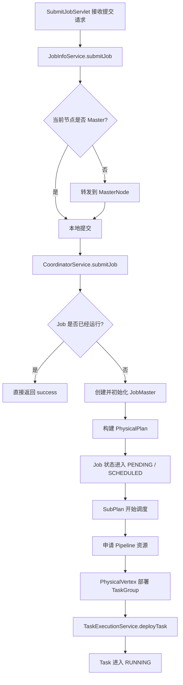
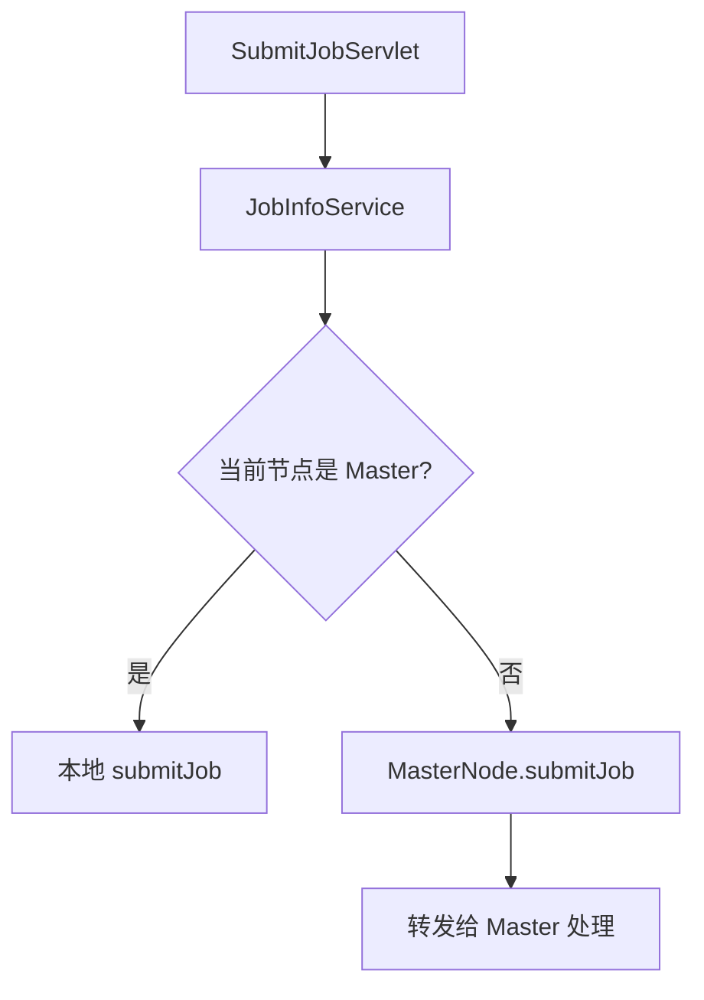
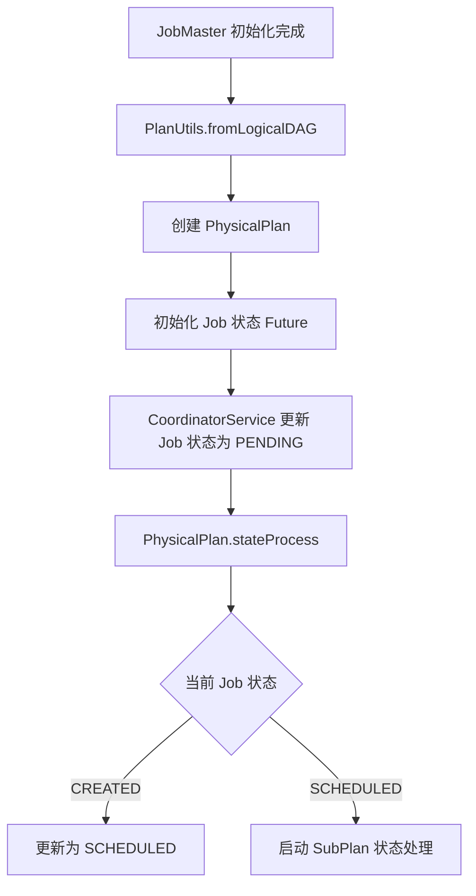
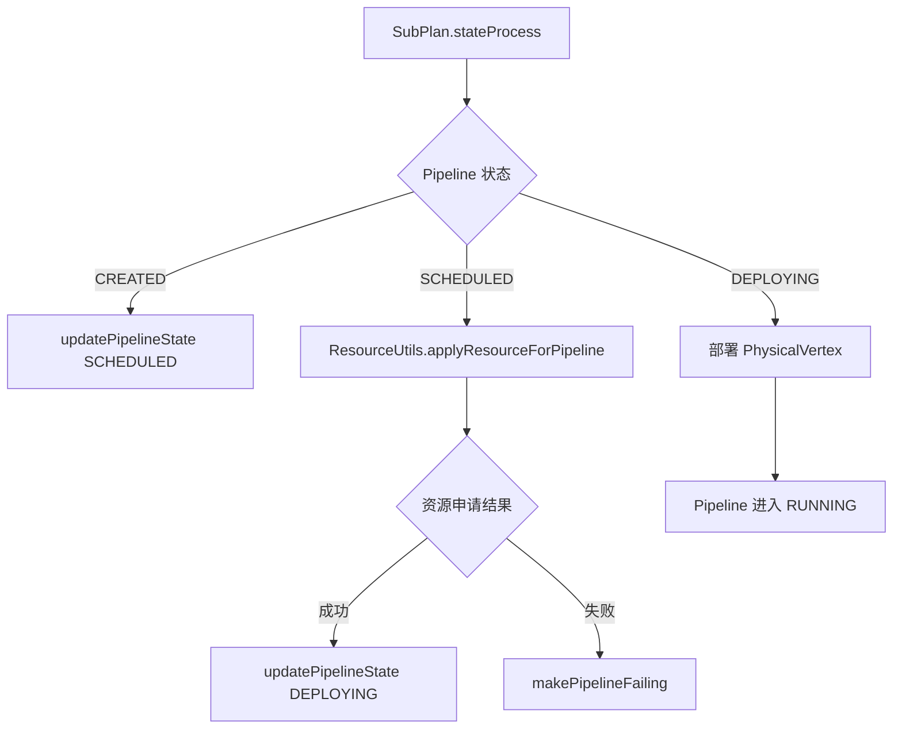
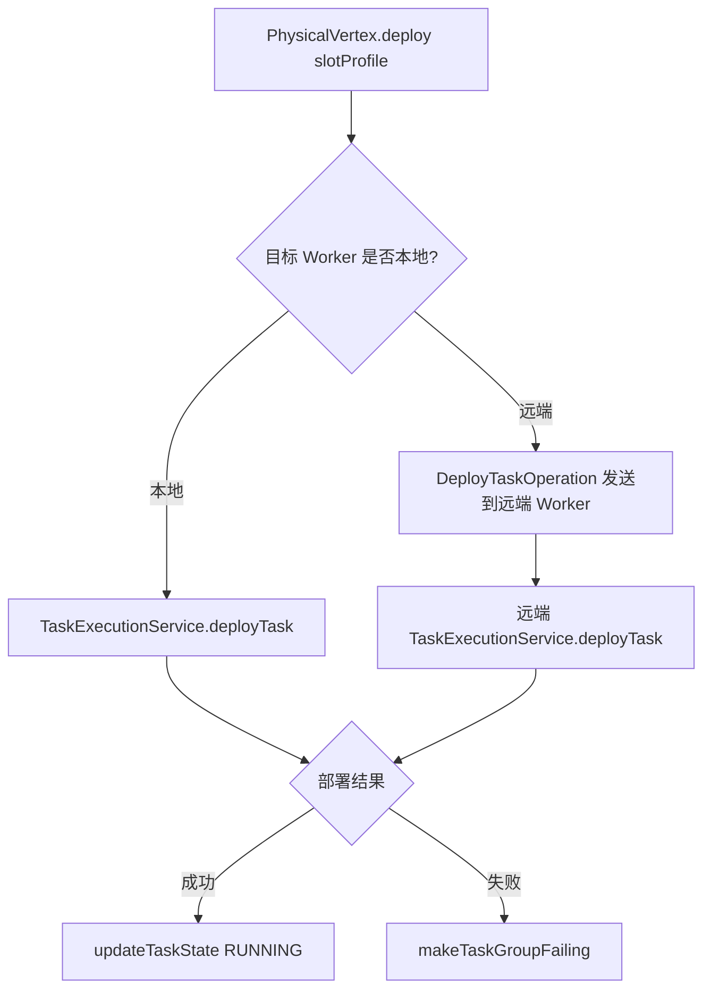
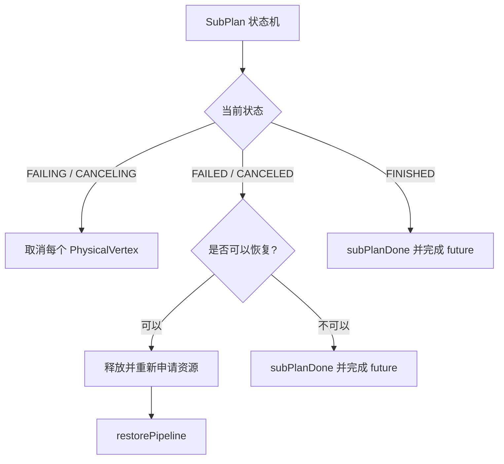
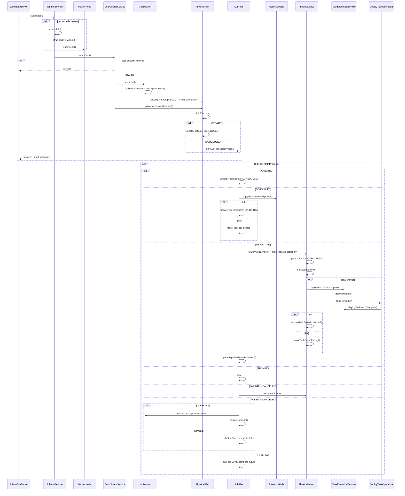

一次 SeaTunnel 任务提交，看起来只是一次 `submitJob` 请求；但在 Server 内部，它会经过 Master 判断、任务协调、`JobMaster` 初始化、物理执行计划构建、Pipeline 资源申请、TaskGroup 部署等多个阶段。

这篇文章基于我整理的 submitJob 时序，先聚焦一条主线：**任务从提交请求进入 SeaTunnel Server，到最终调用 `TaskExecutionService.deployTask()` 部署 TaskGroup，中间都经过了什么。**

本文暂不展开 `TaskExecutionService` 内部的线程模型、Task 运行细节和数据流转，重点放在任务提交与调度部署链路上。

## 核心角色

在进入流程之前，先看 submitJob 主链路里几个关键对象分别负责什么。

| 角色 | 职责 |
| --- | --- |
| `SubmitJobServlet` | 接收外部提交任务请求，是 Server 侧入口之一。 |
| `JobInfoService` | 处理任务提交入口逻辑，判断当前节点是 Master 还是 Worker。 |
| `MasterNode` | 当前节点不是 Master 时，将任务提交请求转发给 Master。 |
| `CoordinatorService` | 任务协调入口，判断任务是否已经运行，并创建 / 管理 `JobMaster`。 |
| `JobMaster` | 单个 Job 的运行控制中心，负责初始化运行上下文、classloader、checkpoint 配置等。 |
| `PhysicalPlan` | 从逻辑 DAG 构建出的物理执行计划，负责驱动 Job 级别状态流转。 |
| `SubPlan` | Pipeline 级别的调度单元，负责资源申请和 Pipeline 状态推进。 |
| `ResourceUtils` | 为 Pipeline 申请运行资源。 |
| `PhysicalVertex` | 更细粒度的物理执行节点，负责 TaskGroup 部署。 |
| `TaskExecutionService` | 最终接收并部署 TaskGroup 的执行服务。 |

## 总体流程

先用一张简化流程图看全局链路。



这条链路可以压缩成一句话：

```text
SubmitJobServlet
  -> JobInfoService
  -> MasterNode / CoordinatorService
  -> JobMaster
  -> PhysicalPlan
  -> SubPlan
  -> PhysicalVertex
  -> TaskExecutionService
```

下面按阶段拆开看。

## 第一阶段：请求进入 JobInfoService

任务提交入口首先进入 `SubmitJobServlet`，随后交给 `JobInfoService` 处理。

这里的关键点不是马上启动任务，而是先判断：**当前接收请求的节点是不是 Master。**



如果当前节点就是 Master，`JobInfoService` 可以继续本地提交；如果当前节点是 Worker，则需要通过 `MasterNode.submitJob()` 转发给 Master。

这个设计保证了任务提交最终由 Master 统一协调，避免多个节点各自独立创建 Job 调度上下文。

## 第二阶段：CoordinatorService 接管任务

请求进入 Master 后，会继续调用 `CoordinatorService.submitJob()`。

`CoordinatorService` 在这里主要做两件事：

1. 判断这个 Job 是否已经存在或正在运行。
2. 如果是新任务，则创建并初始化对应的 `JobMaster`。

如果任务已经运行，SeaTunnel 不需要重复创建调度上下文，可以直接返回提交成功。如果是一个新任务，就会进入 `JobMaster` 初始化流程。

也就是说，`submitJob` 到这里已经从“接口请求处理”进入了“调度系统处理”。

## 第三阶段：JobMaster 初始化

`JobMaster` 可以理解为一个 Job 的运行控制中心。

创建 `JobMaster` 后，会完成一些运行前准备工作，例如：

- 构建任务运行所需的 classloader。
- 初始化 checkpoint 相关配置。
- 准备从逻辑 DAG 构建物理执行计划所需的上下文。

这一阶段还没有真正部署 Task，它更像是在为后续调度准备运行环境。

## 第四阶段：从逻辑 DAG 到 PhysicalPlan

`JobMaster` 初始化后，会基于逻辑 DAG 构建 `PhysicalPlan`。



这里有一个重要概念：**SeaTunnel 不是一次性把任务全部启动，而是通过状态机逐步推进。**

在 Job 级别，核心状态推进可以简化理解为：

```text
CREATED -> SCHEDULED -> startSubPlanStateProcess
```

`PhysicalPlan` 负责 Job 级别状态流转，而真正的 Pipeline 调度会继续下沉到 `SubPlan`。

## 第五阶段：SubPlan 申请资源并进入部署

到了 `SubPlan` 这一层，SeaTunnel 关注的粒度已经从整个 Job 下沉到 Pipeline。

`SubPlan.stateProcess()` 会根据当前 Pipeline 状态执行不同逻辑：



这一层的重点是：

- `CREATED` 状态下，Pipeline 会先推进到 `SCHEDULED`。
- `SCHEDULED` 状态下，开始通过 `ResourceUtils.applyResourceForPipeline()` 申请资源。
- 资源申请成功后，Pipeline 进入 `DEPLOYING`。
- 如果资源申请失败，则进入 `makePipelineFailing(e)`。

因此，Pipeline 不是被立即部署的；它必须先具备运行资源。

## 第六阶段：PhysicalVertex 部署 TaskGroup

当 Pipeline 进入 `DEPLOYING` 后，`SubPlan` 会开始启动内部的 `PhysicalVertex`。

`PhysicalVertex` 会先把 Task 状态更新为 `DEPLOYING`，然后根据分配到的 `slotProfile` 执行部署。

部署时有一个关键分支：目标 Worker 是本地还是远端。



如果目标 Worker 就是当前节点，可以直接调用本地 `TaskExecutionService.deployTask(taskGroupInfo)`。

如果目标 Worker 是远端节点，则需要通过 `DeployTaskOperation` 把部署请求发送过去，最终仍然会在目标 Worker 上进入 `TaskExecutionService.deployTask(taskGroupInfo)`。

部署成功后，`PhysicalVertex` 会把 Task 状态更新为 `RUNNING`；如果失败，则进入 `makeTaskGroupFailing()`。

当 Pipeline 内部的 TaskGroup 部署完成并进入运行态后，`SubPlan` 也会推进到 `RUNNING`。

## 失败、取消与恢复分支

除了正常提交和部署，`SubPlan` 状态机里还需要处理失败、取消和恢复。

可以简化成下面这张图：



这也是为什么前面的状态机设计很重要：

- 正常路径可以推进部署和运行。
- 失败路径可以进入 failing / failed。
- 取消路径可以进入 canceling / canceled。
- 如果满足恢复条件，还可以释放资源后重新申请并恢复 Pipeline。

换句话说，状态机不是为了让流程复杂，而是为了让任务生命周期可控。

## 完整时序图

最后，把主流程用时序图串起来，方便对照整体调用顺序。



## 总结

SeaTunnel 提交任务后的核心逻辑，并不是“收到请求后直接启动任务”。

它大致会经过下面这条主链路：

```text
SubmitJobServlet
  -> JobInfoService
  -> MasterNode / CoordinatorService
  -> JobMaster
  -> PhysicalPlan
  -> SubPlan
  -> PhysicalVertex
  -> TaskExecutionService
```

其中：

- `JobInfoService` 负责处理提交入口，并判断是否需要转发到 Master。
- `CoordinatorService` 负责接管任务协调，避免重复提交，并创建 `JobMaster`。
- `JobMaster` 负责初始化 Job 运行上下文。
- `PhysicalPlan` 负责 Job 级别状态推进。
- `SubPlan` 负责 Pipeline 级别的资源申请和调度。
- `PhysicalVertex` 负责 TaskGroup 部署。
- `TaskExecutionService` 是最终执行 TaskGroup 部署的入口。

理解这条链路之后，再去看 SeaTunnel 的 Task 执行线程模型、数据流转和 checkpoint 机制，就会更容易把各个模块放到正确的位置上。
